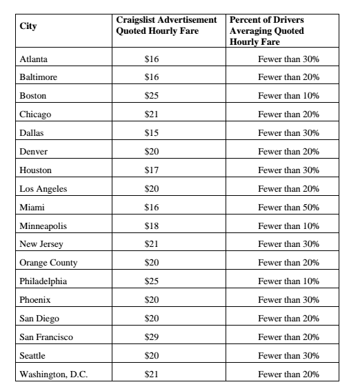

# 优步解决了联邦贸易委员会的诉讼，声称其在薪酬问题上误导了司机

> 原文：<https://web.archive.org/web/https://techcrunch.com/2017/01/19/uber-settles-ftc-lawsuit-claiming-it-misled-drivers-about-pay/>

# 优步解决了联邦贸易委员会的诉讼，声称其在薪酬问题上误导了司机

优步今天解决了美国联邦贸易委员会提出的索赔 2000 万美元的诉讼。该诉讼称，这款叫车应用通过误导司机关于他们可以通过该应用赚取的金额以及他们可以通过优步的车辆解决方案计划获得的汽车融资交易来招募司机。

[诉讼](https://web.archive.org/web/20230328032840/https://www.documentcloud.org/documents/3382260-FTC-v-Uber.html)称，优步做出了“关于司机收入及其车辆解决方案项目的虚假、误导或未经证实的声明”联邦贸易委员会称 t，尽管优步广告称司机每小时可以赚 16 到 29 美元，这取决于他们开车的城市，但只有一小部分司机真正赚到了广告上的钱。

根据联邦贸易委员会的数据，在波士顿、明尼阿波利斯和费城，不到 10%的司机赚到了广告宣传的钱。在其他几个城市，这个比率要高一点——在达拉斯、菲尼克斯和西雅图，不到 30%的司机达到了广告上的比率。

优步还将车辆解决方案计划作为司机购买车辆的低成本方式进行推广，称司机将获得“最佳融资选择”并拥有“无限里程”联邦贸易委员会在诉讼中声称事实并非如此——事实上，优步的这些陈述“没有依据”。联邦贸易委员会称，优步提供的价格通常高于市场上可获得的价格。

通过和解，优步没有承认指控。优步发言人告诉 TechCrunch，“我们很高兴与联邦贸易委员会达成协议。在过去的一年里，我们对驾驶员体验进行了许多改进，并将继续致力于确保优步成为那些希望按照自己的时间表赚钱的人的最佳选择。”

据代表优步司机的独立司机协会称，联邦贸易委员会将把 2000 万美元的和解金返还给司机。

“作为拼车司机的现实与这些应用描述的美好前景相去甚远，看到联邦贸易委员会对他们进行批评并向司机退款令人鼓舞。独立司机协会创始人小吉姆·科尼利亚罗说:“像优步这样的公司在未能提供许多美国人认为理所当然的基本福利时，会将成本、风险和负担转移到司机和纳税人身上。司机应该得到承诺的公平报酬，像服务经济中的其他工人一样获得小费，以及关于拼车收入和支出的公正数据。”