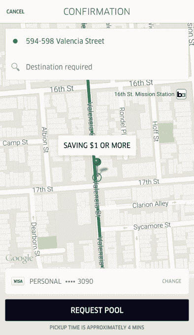

# 优步测试公交式打折“智能路线”

> 原文：<https://web.archive.org/web/https://techcrunch.com/2015/08/24/uber-smart-routes/>

优步让我们用金钱换取时间。但是乘坐费用越便宜，使用优步的人就越多。这就是为什么它在测试一种方法，让你花更少的钱获得更少的便利和更少的时间。我最近在旧金山的 UberPool 发现了一个新的选项，优步现在证实它正在测试它所谓的“智能路线”

UberPool 的地图显示了一条覆盖在附近一条主干道上的绿线，而不是将一辆优步直接开到你家门口。如果你愿意把你的取车地点设在这些智能路线上的任何地方，优步会补偿你比正常优步价格低 1 美元或更多的折扣。在某些情况下，这意味着步行几个街区到你的接站。少一点方便，多一点便宜。

[优步](https://web.archive.org/web/20221006151821/https://www.uber.com/)告诉我:

> “我们已经开始测试一项新功能，以简化乘客和司机的 uberPOOL 体验。这项名为“智能路线”的实验性功能旨在通过鼓励乘客在旧金山的特定路线上请求搭车来简化接送。智能路线是我们不断努力的一部分，旨在提高司机和伙伴在路上的时间效率，同时帮助司机节省时间和金钱。"

对于司机来说，智能路线可以减少浪费时间和汽油的弯路。这意味着他们可以更快地完成一系列 UberPool 骑行，并获得更多车费，从而为他们和优步赚更多钱。理论上，让乘客步行到智能路线最终会让优步盈利，即使在发放折扣之后。

智能路线类似于乘车共享服务 [Loup](https://web.archive.org/web/20221006151821/https://beta.techcrunch.com/2015/03/17/leap-buses/#.c09dfs:X7hu) ，它付钱给人们驾驶他们的汽车，并在城市中类似公共汽车的路线上搭载人们，以及[战车](https://web.archive.org/web/20221006151821/https://beta.techcrunch.com/2014/11/10/chariot/)，它做同样的事情，但使用大型货车。这也让人想起 Lyft 的热点功能，乘客可以走到特定的角落，获得打折的公平。优步智能路线从本质上延长了这些热点，使它们跨越热门旅行的过程，而不仅仅是沿途的一个点。

智能路线并不是优步正在测试的唯一替代接送选项。[优步的“永久乘车”和 Lyft 的“三重比赛”](https://web.archive.org/web/20221006151821/https://beta.techcrunch.com/2015/07/29/lyft-line-gets-into-perpetual-ride-territory-with-new-triple-match-service/)都是实验，允许司机在有空座位时连续搭载乘客，而不是在完成一组 UberPool 或 Lyft 线路乘车后再开始下一次。Lyft 还试图给你打折，如果你愿意先等 10 分钟再排队的话。

优步最近也开始测试[“建议搭载点”](https://web.archive.org/web/20221006151821/https://beta.techcrunch.com/2015/07/08/uber-suggested-pickup-points/#.c09dfs:uwN5)，我写的[可以推荐搭载点](https://web.archive.org/web/20221006151821/https://beta.techcrunch.com/2015/07/05/recommended-pickup-location/)，在那里你的司机可以更快地到达。这个想法不是打折，而是绕过街角或穿过街道可以节省你、司机和优步的时间。

目前，优步正在三藩市的至少两条走廊上测试智能路线:一条穿过位于第 15 街和第 26 街之间的 Valencia St .上的 Mission district，另一条沿着 Fillmore St .从 Haight St .到 Marina 的 Bay ST ., Bay Area 的 BART 服务不包括这条路线。

如果智能路线受到乘客的欢迎，对司机来说也很有效，优步可以将这一功能推广到更多地方。优步越便宜，它就能招募到越多的预算内骑手。我最近的智能路线 UberPool 售价 4.19 美元，不到公共汽车票价的两倍。