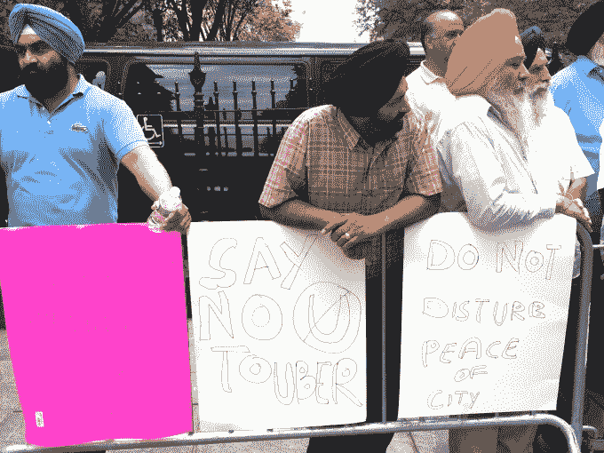
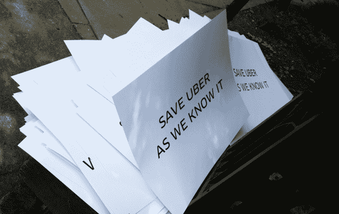

# 优步在纽约市政厅抗议限制新司机注册的法案

> 原文：<https://web.archive.org/web/https://techcrunch.com/2015/06/30/uber-stages-protest-at-nyc-city-hall-against-bill-throttling-new-driver-signups/>

今天，优步在纽约市政厅外举行了一场抗议活动，纽约市议会交通委员会的成员正在提交一项法案，要求出租车和豪华轿车委员会(TLC)限制新出租汽车牌照的发放。

该法律意味着优步在未来一年只能增加约 200 名新司机。更具体地说，运输公司将被限制以相当于纽约市每家公司平台上当前司机数量的百分之一的速度增加新司机。

这一上限将严重限制纽约市运输公司的发展，对出租车行业来说将是一大胜利。

提议的法律将持续一年，直到 TLC 完成一项关于出租汽车行业增长影响的研究(在[配套法案](https://web.archive.org/web/20230202062223/http://legistar.council.nyc.gov/LegislationDetail.aspx?ID=2364031&GUID=87C7D249-891A-43BC-8127-6617FB856429&Options=&Search=)中提出)。具体来说，该委员会建议将研究重点放在该行业对交通、空气质量和噪音的影响上。

Lyft 也将受到新法律的影响，它与 TechCrunch 分享了他们的代表将在今天的听证会上发表的证词。该公司认为，即使几乎禁止新司机注册的禁令同样适用于优步和 Lyft，但由于其较低的市场份额，后果对 Lyft 要大得多。

> 这就是为什么该委员会的提议将保持并扩大优步对市场的控制。优步保持着 90%的市场份额，而 Lyft 目前的市场份额约为 7%。Lyft 公司的 Diana Dellamere。

换句话说，这项法律将对低市场份额的提供商产生更坏的影响，因为游乐设备公司将能够保持其现有的车队。例如，Lyft 和优步将面临类似的增长上限，尽管 Lyft 在市场份额上远远落后于优步。

另一方面，一名优步代表告诉我，该公司计划今年在平台上增加 10，000 名新司机，这当然远远高于该法案将对优步施加的 200 名新司机的上限。该公司目前在该市拥有约 26000 名活跃合作伙伴，包括 UberT 司机(在该平台上开出租车的合作伙伴)。

优步拉力赛通过电子邮件和一些用户的应用程序弹出窗口向车手和司机做广告。优步还向用户提供免费的 UberPOOL 乘车服务，让他们从城市的任何地方往返于示威现场。大约 60 人参加了集会，但似乎大多数人都是优步的成员。

虽然我们确实与在场的一些司机交谈过，但大多数司机似乎都是优步员工或优步员工的朋友。该公司为所有与会者提供了预先印制的标志、T 恤衫和午餐。

YellowCab 也参加了抗议活动，大约有 10 名司机手持手工制作的标志。然而，与在市政厅台阶上举行的优步抗议活动(通过金属探测器安全检查站)不同，出租车司机被迫呆在外面的人行道上。

据出席活动的公司发言人说，今天讨论的法案是上周二提出的，这是优步第一次发现它。

[gallery ids="1177597，1177575，1177607，1177585，1177617，1177619，1177602，1177572，1177573，1177606，1177609，1177618"]