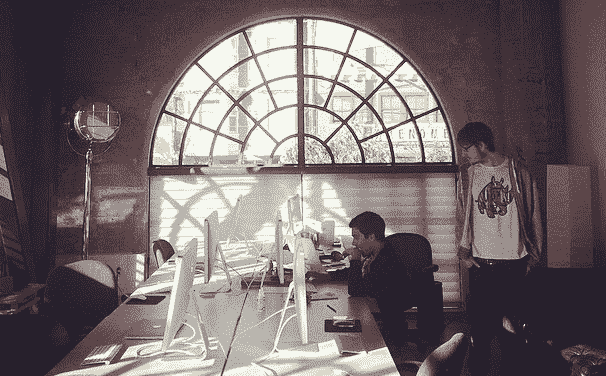
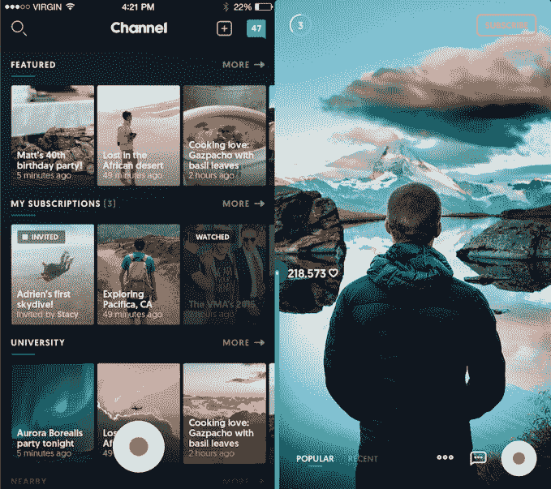

# 优步 acqui-hires 社交应用工作室 Swipe Labs 

> 原文：<https://web.archive.org/web/https://techcrunch.com/2017/07/14/uber-swipe-labs/>

为什么优步会收购一个培养 Snapchat 竞争对手的团队？让它的驱动程序更人性化。优步已经收购了由 Marwan Roushdy 运营的 T2 社交产品工作室 Swipe Labs。他和从这家十几个人的初创公司中挑选的工程师将加入优步，在司机收入团队中研究司机体验。一位来自风险投资行业的消息人士向 TechCrunch 描述了这笔交易，称其为“绝对成功”。他们的现金快用完了”，而不是一笔有利可图的收购。

在过去的四年里，[已经筹集了 820 万美元](https://web.archive.org/web/20221208105552/https://www.crunchbase.com/funding-round/5f06473885a52fdda9e68d4ca9a1d815)，并开发了四款分享照片、视频和群发短信的应用。尽管收购条款没有披露，但这笔交易的估值几乎肯定远低于 Swipe Labs 在 2014 年末从 First Round、Lowercase、Sherpa 和现已名誉扫地的 Binary Capital 获得的 5600 万美元的估值。这就是投资早期社交初创公司的风险:它们很难抓住瓶子里的闪电并迅速壮大。

Swipe Labs 联合创始人 Marwan Roushdy 和 Addison Hardy(左起)

Swipe 的创始人 Roushdy 和 Addison Hardy 是在现已倒闭的社交地图应用 Connect 工作时认识的。他们开始创办一家名为 Fonzy 的家具租赁初创公司，但以失败告终。两人设法筹集了一轮种子资金，为与朋友们私下分享照片建立标签，但也从未获得关注。

但是二人组采纳了这些想法，并将它们内置到 Swipe 中，让你可以将照片和视频与其他用户的内容一起发布到朋友的 Swipe 主屏幕上。它在最初几周内增长到超过 100 万用户，吸引了 560 万美元的融资和高昂的估值。然而，随着 Snapchat 继续流行，Swipe 逐渐淡出，Hardy 最终离开了公司。

Swipe Labs 的应用频道

刷卡不停的摆动。它建立了 Channel，这是 Snapchat 故事和 YouTube 的混合体。它的最后一个支点 Chitchat 是一个自发的群聊应用，就像一个发短信的家庭聚会。不过，最终 Swipe Labs 的工程团队将证明比其产品更有价值。

在首席执行官特拉维斯·卡兰尼克因性别歧视丑闻、谷歌的 T2 诉讼和 T4 广泛的文化问题辞职后，优步处境艰难。这些问题可能会让优步在竞争激烈的硅谷就业市场上更难招到人。像 Swipe Labs 这样的招聘公司让它一下子聚集了一批优秀人才。

随着公司[推出小费](https://web.archive.org/web/20221208105552/https://beta.techcrunch.com/2017/07/06/uber-tipping-is-rolling-out-to-121-u-s-and-canadian-cities-today/)，优步的司机赚钱经历正在发生重大转变。Swipe Labs 团队可以让司机更容易赚更多的钱，了解他们在赚什么，并获得他们支持自己和家人所需的支出。希望优步不会试图推出自己的 Snapchat 克隆版。但在这艰难的时刻，它可以用人情味来保持司机的忠诚。