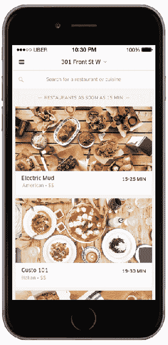

# UberEATS 的独立送餐应用首次在美国城市推出 

> 原文：<https://web.archive.org/web/https://techcrunch.com/2016/03/15/ubereats-standalone-food-delivery-app-launches-in-its-first-u-s-cities/>

UberEATS 是一款更新的独立应用，面向优步的餐厅送餐业务，今天将在美国的第一个市场推出:芝加哥、休斯顿、洛杉矶和旧金山。今年早些时候，当应用程序[在多伦多](https://web.archive.org/web/20221206154302/https://beta.techcrunch.com/2016/01/20/ubers-standalone-food-delivery-app-is-coming-to-the-u-s/)首次亮相时，美国的扩张就已经宣布了。优步表示，更多的市场也计划在不久的将来上线新的应用程序，包括亚特兰大、奥斯汀、达拉斯、墨尔本、纽约、巴黎、西雅图和华盛顿特区

纽约将是 UberEATS 应用下一个上线的地方；它计划最早于下周发射。

当优步在 2014 年首次扩展到食品配送领域时，它的旗舰应用程序上的用户可以切换滑块，从订购 UberBLACK 或 UberX 等汽车，转而选择 UberEATS。但该公司意识到这没有意义——要求搭车和食物是不同的体验。这就是它决定推出 UberEATS 作为独立移动应用的原因。

优步告诉我们，在如何向用户推销应用程序方面，他们受到了脸书的启发。当脸书决定将 Messenger 作为自己的应用程序时，当用户导航到应用程序的“聊天”部分时，它会将用户从主应用程序引导到 Messenger 的应用程序商店下载。同样，优步的主要应用程序也被用来引导人们到 UberEATS 的应用程序商店下载。

当这款应用在多伦多推出时，这一策略被证明相当成功。我们被告知，它在发布当天就在食品区排名第四。

随着它在美国城市的到来，客户将能够从数百家餐馆的完整菜单中订购外卖，或者他们可以选择从即时配送菜单中更快地获得一些东西，这涉及可以更快订购的精选菜单。

美国的芝加哥、休斯顿、洛杉矶和旧金山以及多伦多都有完整的菜单。该公司解释说，UberEATS 即时配送上线的其他城市的用户今天仍然可以下载 UberEATS 应用程序，但只能看到即时选项，直到他们的城市完全上线。

这个独立的应用程序，对于那些能够利用它的人来说，可以让你浏览当地餐馆的受欢迎的菜肴，或者按菜肴和膳食(早餐、午餐、晚餐)进行搜索。如果你知道应用程序支持，你也可以按名称搜索餐厅。当你浏览时，该应用程序会显示你的订单预计需要多长时间才能到达，一旦下单，你就可以在地图上查看你的司机的进度，就像在优步市区一样。

这款应用可以在[苹果应用商店](https://web.archive.org/web/20221206154302/https://itunes.apple.com/us/app/uber/id1058959277?mt=8)和 [Google Play](https://web.archive.org/web/20221206154302/https://play.google.com/store/apps/details?id=com.ubercab.eats&referrer=mat_click_id%3Df3e13bffec9a5bbe276eb867317019f9-20160309-7336) 免费下载。