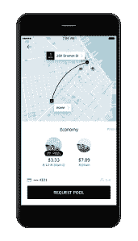

# UberPOOL 简化了配对、接送和司机端功能 

> 原文：<https://web.archive.org/web/https://techcrunch.com/2016/12/12/uberpool-streamlines-matchmaking-pickups-and-driver-side-features/>

优步正在对 uberPOOL 在引擎盖下的运营方式进行一些改变，旨在使乘客和司机之间的联系更容易，从而实现更简化的整体体验。这些变化对骑手来说大多是隐藏的，因为它们涉及路由和匹配的后端升级，以及面向司机的修复，以使管理拼车变得更容易，但最终结果应该是服务关键领域的改进。

我与 uberPOOL 产品经理布莱恩·托尔金(Brian Tolkin)和南·兰索霍夫(Nan Ransohoff)讨论了新的更新，其中包括改进的匹配，即使在搭车匹配完成后，仍会不断尝试将最佳位置的司机与最佳骑手联系起来。两人都表示，虽然 uberPOOL 已经是一项受到用户欢迎的服务，但人们也不断发现一些常见的挫折，可以通过产品改进来解决。

## UberPOOL 起源

托尔金指出，uberPOOL 的起源始于两年多前，当时它看到，在其运营的任何一个城市的数十万次出行中，许多乘客都在同一时间前往相同的地方。虽然拼车在 20 世纪 70 年代和 80 年代曾作为一种时尚出现，但实际上从那以后，拼车作为一种趋势已经普遍衰落，因为不得不在你组织的一群人中自己做出这些安排的混乱局面是一大贡献者。优步有办法解决这些障碍，并根据共同的出发地和目的地优化出行者群体，而不是共享的朋友群体、办公室共用或其他社会共享环境。

“我们审视了我们的生态系统，我们说……我们也许能够扭转这一趋势，并说我们可以让拼车重新兴起，我们可以帮助人们更有效地在他们的城市中出行，”托尔金告诉我。“当时这是一个相当大的赌注。我们不知道它将如何工作，我们不知道从根本上来说，人们是否会与他人分享汽车，我们不知道他们是否会对稍微超出他们的方式感到酷，我们当然不知道经济是否可行。”

Tolkin 说，幸运的是，在过去的两年里，所有这些问题的答案都被证明是“一个响亮的‘是’”，但他们也“学到了很多关于如何让这个产品运转起来的东西”，这就是为什么他们一直在努力进行这些改变。

## 配对魔法

首先是改进的匹配，包括自动旅行升级和预测匹配。自动行程升级仅仅意味着，如果优步的系统发现司机和骑手之间有更好的配对，即使在最初的匹配已经完成后，它也会立即做出改变，并通过推送通知提醒骑手和司机，以确保他们保持在循环中。

“我们可以匹配两个人的次数，以及这些匹配的质量使我们能够保持低价格，并为乘客节省时间，”Ransohoff 解释说，这推动了不断寻求优化 uberPOOL 乘坐的技术的发展，以找到最佳路线，即司机在他们的路线上挑选最有意义的人，即使新乘客欢呼 POOL 和其他司机在线上有其他更合适的路线。

基本上，它的工作原理如我下面的惊人的艺术家渲染图所示:

除了这些后台升级之外，优步还实现了 POOL 的预测匹配，基本上是查看历史数据，并对给定路线上的乘客的未来请求进行有根据的猜测。Ransohoff 解释说，这意味着如果优步的系统认为在不久的将来会有更好的匹配，它会暂时等待将你与当前的骑手进行匹配，这些骑手在给你提供最直接的路线方面不是最理想的。

## 提醒准时

为了确保接送其他乘客尽可能少地增加 uberPOOL 行程的额外时间，该公司还增加了两个与缩短接送时间有关的新功能，包括乘客的状态通知和司机的新倒计时定时器。骑车人的提示包括“在外面准备好”、“马上去见你的司机”等温和的提示，以及“马上离开”警告，用于在骑车人被允许离开之前需要更紧急的速度。

在司机方面，该应用程序现在显示一个倒计时定时器，一旦司机到达指定的上车点，两分钟后开始计时。这个想法是，司机不必自己设法保持跟踪，并准确知道他们何时可以继续前往下一个目的地，同时还可以根据优步对迟到乘客的政策收取缺席费。

“这可能看起来是一个小变化，但最终对我们的车手和司机来说，每一秒都很重要，”Ransohoff 说。“所以我们希望这是一种培养这种观念的方式，即……尊重你的同伴，尊重你的司机。”

## 减轻驾驶员的工作量

最后，在司机端，也有一些更新，旨在改善导航和 nix 跟踪司机从任何给定的行程中实际赚了多少所需的数学。

“我们如何让 POOL 变得更容易，让他们驾驶起来毫不费力，因为这是一款比 X 更难驾驶的产品，”Ransohoff 表示，并解释了他们为什么专注于驾驶员侧的这些特定领域。

[这有点像在你选择的 GPS 应用程序上有关于即将到来的旅程步骤的附加指示，Ransohoff 说这应该有助于减轻司机的潜在担忧或压力。](https://web.archive.org/web/20221224144609/https://techcrunch.com/wp-content/uploads/2016/12/pool-map.png)

一个非常不同的新驱动程序功能有一个非常相似的目标；uberPOOL trips 以前在司机工资报表中将一次旅行的单个行程作为单独的乘坐项目列出，但现在整个旅行将被汇总为一个单项，将整个旅行时间、所走距离和任何激增奖金考虑在内，并提供司机从整个拼车中获得的最终记录。这对司机来说意味着更少的额外支出，并有望让他们更好地了解 POOL 如何为他们带来收入。

Tolkin 表示，在优步让交通变得像自来水一样方便可靠的总体使命中，游泳池是一个关键因素，旨在服务于那些即使每天乘坐 uberX 也负担不起的市场。考虑到这一点，它将继续寻求优化体验，以便供应和需求在路由和匹配方面尽可能完美地匹配，因此期待更多的改进。