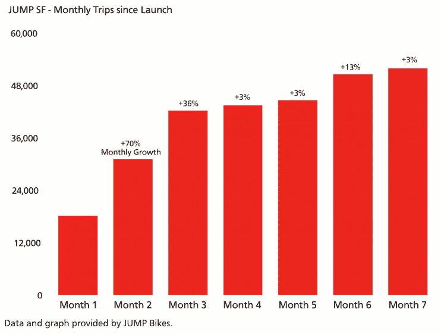
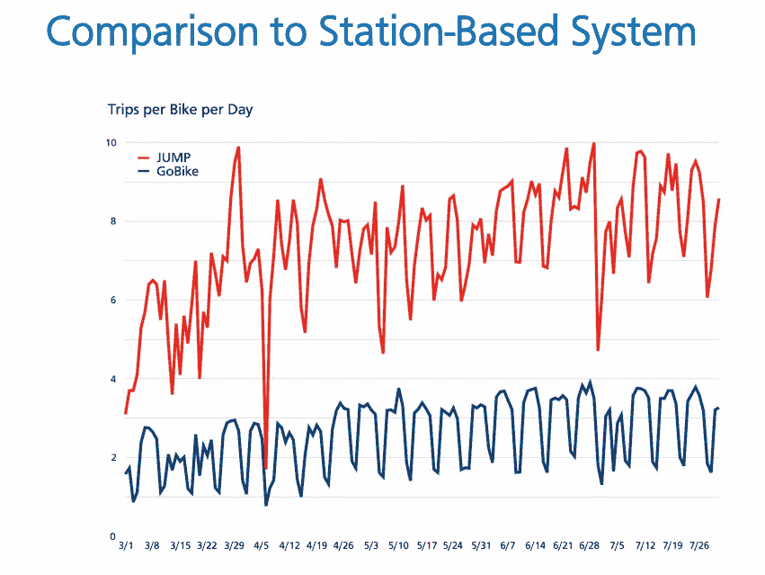

# 在 SF TechCrunch，优步的跳跃自行车车队可能很快会翻倍

> 原文：<https://web.archive.org/web/https://techcrunch.com/2018/10/01/ubers-jump-bike-fleet-may-soon-double-in-size-in-sf/>

如果你住在旧金山，预计在未来几周会在路上看到更多亮橙色的电动自行车。优步拥有的电动自行车共享服务在旧金山为期 18 个月的自行车共享试点项目已经进行了一半，可能会在旧金山增加 250 辆自行车。[试点项目最初启用 JUMP](https://web.archive.org/web/20221025222706/https://techcrunch.com/2018/01/09/jump-will-be-the-first-stationless-e-bike-sharing-startup-to-launch-in-sf/) 部署 250 辆自行车，如果前九个月进展顺利，还有可能再部署 250 辆。

下周，旧金山市交通局局长预计将围绕扩建做出正式决定。然而，[SFMTA 的工作人员建议该市允许 JUMP 再部署 250 辆自行车](https://web.archive.org/web/20221025222706/https://www.sfmta.com/blog/san-franciscos-stationless-bikeshare-pilot-reaches-mid-point-milestone)。

**2011 年 10 月更新:**[SFMTA 将其正式化](https://web.archive.org/web/20221025222706/https://www.sfmta.com/blog/jump-next-level)，并允许 JUMP 在该市运营多达 500 辆自行车。

自 1 月份部署自行车以来，JUMP 已经记录了 38，000 名不同骑手的超过 326，000 次总行程，每个工作日约有 2，250 次行程。与此同时，普通的跳跃自行车每天被使用 8 到 10 次，平均行程长度为 2.6 英里。

跳跃自行车与 Motivate 的福特 GoBike 系统协同工作，该系统包括常规踏板和踏板辅助自行车。根据 SFMTA 的初步结论，对共享电动自行车的需求很高。此外，根据 SFMTA 的说法，它们似乎服务于不同的行程长度、起点和目的地。

在旧金山，有 1200 辆福特 GoBikes，约 5500 名活跃的骑手。每个工作日，大约有 6000 次出行。每辆跳跃自行车一天大约行驶 8 到 10 次，而一辆福特 GoBike 大约行驶 1 到 4 次。下面，你可以看到 JUMP 的共享、无码头电动自行车比福特 GoBike 的共享、基于站点的自行车更受欢迎。

由 SFMTA 提供

从一开始，即在收购优步之前，JUMP 就一直专注于服务传统上服务水平低下的社区。虽然 55%的跳跃旅行开始或结束于这些地区，这些地区被 SFMTA 确定为“城市中最弱势的社区”，但仍有一些社区报告缺乏服务。展望未来，SFMTA 表示，它将与 JUMP 合作，“改善地理公平和分布。”