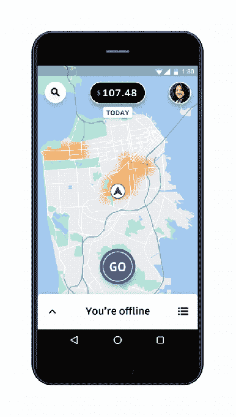

# 优步的新司机应用程序识别票价最优惠的地区 

> 原文：<https://web.archive.org/web/https://techcrunch.com/2018/04/10/ubers-new-driver-app-identifies-areas-with-the-best-fares/>

优步从今天开始为司机推出一款新的应用程序。三名优步司机应用程序产品负责人上周告诉 TechCrunch，重新设计的希望是让司机更容易获得他们最需要的信息，同时确保应用程序不会在开车时分散注意力。例如，收入和激励对司机来说很重要。

“我们想用新应用做的事情之一就是认识到这是对你来说最重要的事情，并把它放在前面和中心，”优步驾驶体验集团经理 Yuhki Yamashita 上周在优步的总部告诉我。

有了这个新的应用程序，优步让司机可以很容易地识别电涌、升压和激励区域的位置。

山下说:“假设你在一个慢车道上。“实际上，我们可能会建议去一个地方，因为那里要热闹得多。通过这种方式，你可以获得更多关于你周围发生的事情的信息。我们可以回答一些问题，比如‘你下一步应该做什么？’你知道这感觉就像应用程序了解你的现状。"

其他值得注意的新增功能包括剩余行驶距离(以前，只需到达时间)和对骑手的一键响应。因此，如果司机遇到交通堵塞，他们可以快速点击“交通堵塞”来通知乘客。另一个是离线模式功能，它解决了当司机没有良好的互联网连接时会发生什么的问题。

山下说:“他们必须做的是开车直到有网络，然后开始旅行，然后结束旅行。”。“这有时意味着，在某些市场，你要一直开到下一个城镇才能真正结束旅程，这让旅程看起来真的很长。”

现在，优步将记录车手的全球定位系统，一旦车手恢复连接，优步将能够做出任何适当的调整。这是[优步 180 天变革](https://web.archive.org/web/20221206023337/https://techcrunch.com/tag/180-days-of-change/)的一部分，旨在弥补公司过去所犯的错误。

“虽然 180 天是为了纠正过去的失误，但我们也需要考虑更长远的问题，显而易见的是从司机应用程序开始，”优步首席执行官达拉·科斯罗萨西在一篇博客文章中写道。“它位于驾驶员体验的中心，但经过两年前的重新设计，它已经显示出它的年龄。我们知道我们不能采取我们过去采取的方法:根据我们认为司机想要的重新设计应用程序，启动它，然后抱最好的希望。相反，我们需要倾听司机告诉我们他们需要什么，并与他们一起开发新应用。”

优步已经在全球七个城市的 470 名司机中测试了这款司机应用，并在测试过程中收集了他们的反馈。

优步 UX 的研究员比约恩·休伯特-瓦伦德告诉 TechCrunch:“所以我们在测试期间所做的是，我们实际上派出了开发者团队，即开发该应用的团队，进入这七个城市的每一个城市，与这些城市的司机和更好的司机花大量时间交谈。”。

在这个过程中，优步意识到，虽然司机喜欢能够快速看到他们的收入，“但他们对它在屏幕上如此明显的想法感到有点不舒服，休伯特-维兰德说。他们表示担心路人或乘客知道他们的生意。

**“甚至其他人也不一定真的能看到他们的收入，”休伯特-瓦伦德在谈到埃及的一些司机时说。“这是一种想法，就像他们让他们的收入和好运可见一样。这真的会招来厄运，所以这样做感觉不太好。”**

 **作为对这一反馈的回应，优步增加了一个隐私设置，这样司机们就可以隐藏他们的收入。

优步最初将在洛杉机和亚特兰大，以及其他国家的 9 到 10 个城市推出新的司机应用程序。逐步推出的希望是，优步将能够看到该应用程序是否会在市场上产生任何涟漪效应。

例如，随着新应用程序将司机指引到有激励措施的地方，其他人口较少的地区可能会出现司机短缺，导致乘客等待时间更长。作为优步市场测试的一部分，它将在选定的一些城市全面推出司机应用程序，并观察当每个人都有它时会发生什么。

“我们将看看它是否会产生那样不理想的行为，并与姐妹城市进行比较，”山下说。“我们正在慢慢了解各种副作用。”**