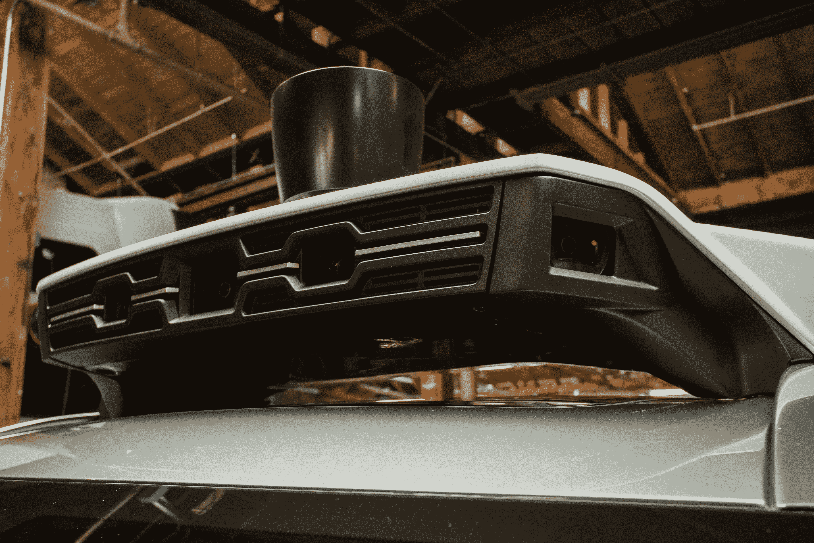
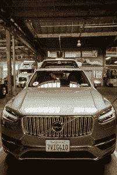
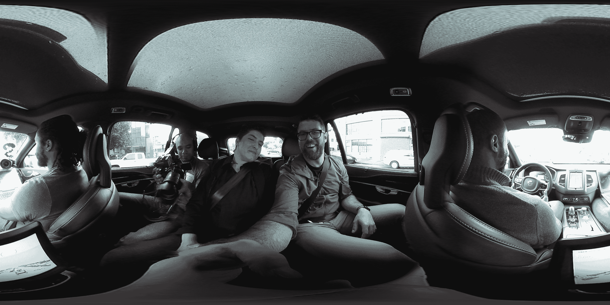
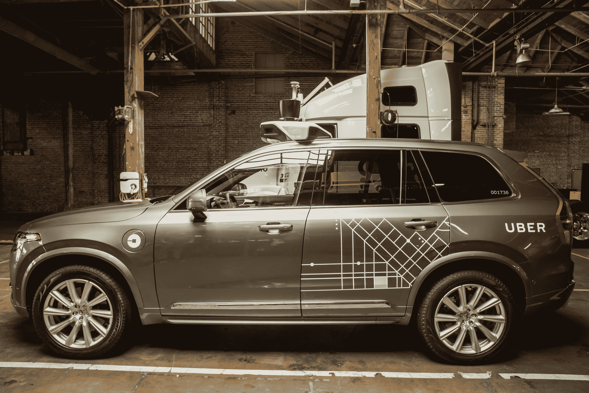

# 优步的自动驾驶汽车开始在三藩市载客 

> 原文：<https://web.archive.org/web/https://techcrunch.com/2016/12/14/ubers-self-driving-cars-start-picking-up-passengers-in-san-francisco/>

优步的无人驾驶汽车正在向旧金山转移，这是其无人驾驶汽车试点项目的新扩展，配备传感器和超级计算机的沃尔沃 SUV 将开始在旧金山搭载乘客。

自动驾驶汽车暂时不会完全无人驾驶——就像在[匹兹堡一样，优步今年秋天在那里推出了自动驾驶的福特福克斯汽车](https://web.archive.org/web/20220930001701/https://beta.techcrunch.com/2016/09/14/1386711/)，每辆 SUV 都将有一名安全司机和优步测试工程师在车上，在需要时处理手动驾驶并监控测试进展。但这些汽车仍将搭载普通乘客——任何使用标准面向消费者的移动应用程序请求 uberX 的客户都有资格乘坐优步先进技术集团(ATG)运营的新款 XC90s。

## 第三代自治

除了地理因素，这里还有一个不同之处。这是优步的第三代自动驾驶汽车，与匹兹堡试点项目中使用的第二代福特汽车截然不同。优步与沃尔沃有着更直接的关系，即将其新款 XC90s 改造成具有自主功能的汽车；福特汽车基本上是从生产线上购买的股票，而优步与沃尔沃的合作伙伴关系意味着它可以在将自己的传感器阵列集成到车上现有的传感器阵列方面做得更多。

优步 ATG 公司的产品负责人马特·斯威尼(Matt Sweeney)在一次采访中告诉我，这种第三代汽车实际上比匹兹堡道路上的福特汽车使用的传感器更少，尽管装载的汽车仍然包括传统的光学相机、雷达、激光雷达和超声波探测器。他说，需要更少的传感器，部分是因为从匹兹堡的首次展示和他们研究上一代车辆的工作中吸取了教训；有了 autonomy，你通常会从把你能想到的所有东西都扔向问题开始，然后你会根据什么是特别有用的，什么是不必要的来缩小范围。尽管如此，从沃尔沃传感器套件收集的数据得到的融合世界图像并不缺乏细节。

这是旧金山街道上的新优步自动驾驶沃尔沃在传感器方面的包装。

“你将[图像和激光雷达]结合在一起，最终得到一张你非常清楚地知道距离信息的图像，所以它就像这个美丽的物体，你可以在移动时探测到它，”Sweeney 向我解释道。“通过一些更好的工程集成，我们在正面后面的前后保险杠上安装了一些雷达。”

这些雷达阵列提供的不仅仅是观察的能力，即使在恶劣的天气条件下，用光学方法观察也有困难；Sweeney 指出，他们使用的雷达装置实际上可以从道路表面、前方车辆下方或周围反射信号，以便寻找并报告潜在事故或危险的信息，而不是在自治的优步本身的正前方。

## 沃尔沃带来了什么

这些自动驾驶的优步是基于第一批使用该公司新车辆平台的沃尔沃汽车制造的。

“汽车是我们对这一合作感到兴奋的原因之一，这是一辆非常棒的车，”斯威尼说。“这是沃尔沃的新 SPA，可扩展的平台架构——他们全新的第一款汽车，采用全新的车辆架构，因此您可以获得全新的机械、电气和计算。”

优步没有盲目地选择合作伙伴——Sweeney 说，他们找到了一家拥有近百年坚实的工程、制造和致力于在这些领域不断改进的声誉的公司。

“我们在其上建造的汽车，我们对此非常有意，”Sweeney 说，并指出像这样的汽车是专为安全而设计的，这不是当今大多数汽车事故的主要故障点——这个角色是为方向盘后面的人类司机保留的。

优步的贡献主要是在传感器盒和后备箱的计算堆栈中，这占了存储空间表面积的一半左右，Sweeney 说这是“一种刀片式架构，一整套 CPU 和 GPU，我们可以在那里交换，”尽管他没有具体说明是谁在提供这些组件。它所代表的巨大计算能力是识别物体的关键，在更高的容量下这样做，并在复杂的城市街道环境中更好地寻路。

> 我们正在建造的汽车，我们是有意为之的。马特·斯威尼，优步·ATG 的产品主管

## 乘坐

对于真正的骑手，车辆后部有一个基于 iPad 的互动显示器，一旦你真正进入车辆并准备开始骑行，它就会接管移动应用程序。显示屏会引导您开始旅程的各个步骤，包括确保系好安全带、检查您的目的地，然后开始旅程。

在我们的演示中，实际离开路边并融入交通的行为由车上的安全驾驶员处理，但在最终完全部署这些汽车时，车辆将处理甚至是棘手的任务。当你处于主动自动驾驶模式时，iPad 会向你显示，当它被解除，转向由方向盘后面的人来控制时，iPad 也会向你显示。该屏幕还向您显示了自动驾驶汽车本身“看到”的简化版本，在白色背景上显示了基于颜色编码的点和线的物体和车辆周围世界的初级版本。运动中的物体在这个实时虚拟世界中移动时会显示轨迹。

基于 iPad 的显示器还可以让你自拍和分享骑行中的图像，这无疑有助于优步宣传其努力，同时也有助于 iPad 本身寻求实现的另一个关键目标——让骑行者觉得这项技术既可知又正常。公众认知仍然是自动驾驶需要克服的最高障碍之一，此外还有技术问题和监管，自拍似乎是合法解决这一问题的一种肤浅方式。

那么我在骑行过程中感觉如何？在最初的兴奋消退后，我通常会像在任何优步骑行中一样兴奋——也就是说，大部分时间都很无聊。我乘坐的汽车不得不应对一些繁忙的交通，大量的建筑和非常不可预测的旧金山南部市场的司机，因此确实以相当的频率脱离。但它也能泰然自若地快速处理长时间的开放路段，并在走走停停的情况下与更密集的交通保持距离。总的来说，它感觉像是一个在学习方面取得良好进展的系统——但在没有人类看护人员的情况下，它还有很长的路要走。

360 度全方位了解乘坐自动驾驶优步的感受，优步首席监管员雷切尔·马兰(Rachel Maran)将为您带来精彩体验。

我在后座的同伴是优步的值班主任雷切尔·马兰，她以前在匹兹堡的优步自动驾驶试点中担任过司机。她解释说，任何新的驾驶环境中的不可预测性和多样性将是优步自动驾驶系统必须克服的最大挑战之一。

## 寻求安全阶跃变化

据该公司称，优步在旧金山的试点将仅限于市中心地区，并将涉及“少量”车辆，目的是从那里开始。匹兹堡的自动驾驶汽车也将继续与旧金山的部署同时运行。匹兹堡为测试提供了一系列天气条件和其他环境变量，旧金山将为优步的自动驾驶技术带来新的挑战，包括更密集、往往更混乱的交通，以及更窄的车道和道路。

> 安全非常重要，这就是我们这么做的原因。马特·斯威尼，优步·ATG 的产品主管

该公司表示，该公司不需要加州车管所的许可才能在该州运营，因为这些汽车不符合该州法律规定的完全自动驾驶，因为车上总是有安全操作人员。从法律上讲，在当前的监管规则下，它更类似于一辆配备自动驾驶功能的特斯拉，而不是自动驾驶的 [Waymo 汽车](https://web.archive.org/web/20220930001701/https://beta.techcrunch.com/2016/12/13/googles-self-driving-car-unit-spins-out-as-waymo/)。

根据 Sweeney 的说法，最终，优步 autonomy 的目标是创造更安全的道路，同时改善城市规划和空间问题，这些问题源于车辆所有权模式，即大多数汽车在近 95%的时间里处于闲置和未使用状态。我向 Sweeney 询问了司机和公众对自动驾驶技术在真实道路上的安全性的担忧。

“这辆车可以在车辆周围 360 度不间断地进行厘米级的距离测量，前后各 20 米，”斯威尼说，并指出，尽管自主决策仍然是“一个真正的大挑战”，但传感器本身所取得的进步以及“它们持续的注意力和超人的感知能力[……]使我们能够自安全气囊以来首次真正显著降低汽车死亡率。”

“我认为这是我们真正把它降到零的地方，”斯威尼补充说。“人们把它当作生活中的一个事实；那只是因为我们已经习惯了。我们可以做得比这更好。”

*约翰·穆里略摄影*