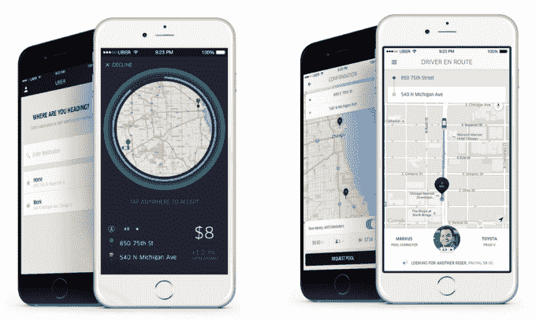

# 优步正在测试一种新的公共交通工具 

> 原文：<https://web.archive.org/web/https://techcrunch.com/2015/12/08/ubers-testing-a-new-mass-transit-alternative/>

# 优步正在测试一种新的大众运输系统

根据今天优步的一篇博客文章，优步正准备在西雅图试点一种新的拼车服务，名为 uberHOP，试图让“更多的屁股进入更少的汽车后座”。优步已经有了 uberPOOL，它几乎占了优步在旧金山的一半份额，但该公司称这是“第一步”

通过 uberHOP(如上图)，该应用程序将为你匹配一名司机以及其他与你同路的人。你会收到在哪里上车的指示，然后在预定的地点下车。据 [GeekWire 报道](https://web.archive.org/web/20221208235214/http://www.geekwire.com/2015/uber-test-new-carpooling-service-uberhop-seattle-ubercommute-chicago/)，uberHOP 将于 12 月 10 日周四开始在西雅图上下班时间的特定路线上提供，固定费用为 5 美元。

在芝加哥，优步将开始为优步司机试点一项名为 uberCOMMUTE 的新计划，该计划将于周一至周五早上 6 点至晚上 10 点提供。这似乎是面向那些还没有开车去优步，但希望在上下班途中赚点外快的人。想用 uberCOMMUTE 打车的乘客需要选择 uberPOOL，然后选择“通勤者”选项。我想通勤者选项会比标准池选项更便宜，但我在等待优步的更多细节。

“这两个试点是每天都在发生的事情的应用版本，”优步在其博客上写道。随意拼车在华盛顿州、DC 和北加州的东湾已经开始流行起来。对于临时拼车，通勤者在预先安排的地点排队。司机把车停下来，车窗上有一个标志显示他们的目的地，去同一个地方的乘客跳进车里。通过使用技术，我们可以使这个过程更方便、更可靠、更安全。”