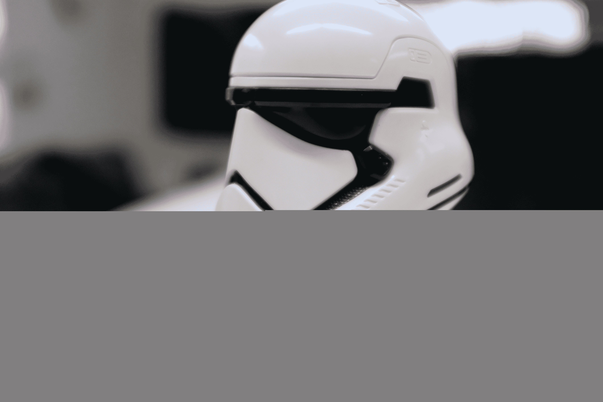

# UBTECH 的机器人一阶冲锋队巡逻 AR 战场

> 原文：<https://web.archive.org/web/https://techcrunch.com/2017/12/20/ubtechs-robotic-first-order-stormtrooper-patrols-ar-battlefields/>

周五，UBTECH 的冲锋队错过了《原力》和《最后的绝地武士》的上映——这并不奇怪，真的。总的来说，机器人玩具移动得相当慢。也许这是一个把事情做好的问题，也许这是第一次处理如此高调的许可证的痛苦。无论如何，这家中国机器人初创公司刚刚揭开了今年《星球大战》的最后一项技术——这太棒了。

与 Sphero 的各种机器人等其他“原力星期五”科技玩具不同，冲锋队是一个传统的人形机器人。这是一个完整的玩具，可以根据命令行走——或者更确切地说，真的有点慢。这套盔甲基于《最后的绝地武士》的设计，与《原力觉醒》中的一阶制服相比有一些细微的变化。当然，对于机器人初创公司来说，帝国冲锋队是一个有趣的选择。

毕竟，正如你的书呆子朋友们会告诉你的，帝国抛弃了机器人，转而使用克隆人，而第一秩序依赖于从出生起就被训练的人来执行它的命令。但 UBTECH 自己的硬件专业使这些角色比 BB-8 或 R2-D2 更适合。

“我们专注于人形机器人，”该公司的一位发言人告诉 TechCrunch。“这涉及到四肢和行走。这是我们擅长的事情。帝国冲锋队是全球公认的。你在动漫展上看到的帝国冲锋队可能比其他任何角色都多。”

[https://web.archive.org/web/20221208041410if_/https://www.youtube.com/embed/PBCxZ5DLpe0?feature=oembed](https://web.archive.org/web/20221208041410if_/https://www.youtube.com/embed/PBCxZ5DLpe0?feature=oembed)

视频

C-3PO 显然在竞争中，但这个角色的超薄设计会让产品的比例比现在更大。事实上，它有一个有点卡通化的大脑袋。

这个机器人有一系列的机载传感器，包括一个光监视器，陀螺仪加速度计和一个内置在它脚上的红外探测器，帮助它防止越过桌子的边缘——因为帝国冲锋队是愚蠢的，但不是那么愚蠢。一旦机器人探测到边缘，它会掉头返回轨道。

头盔内置摄像头，用户可以通过连接的 iPad 应用程序透过机器人的眼睛观看。还有三个板载麦克风，可以在某些时候发出语音命令。

[gallery ids="1576333，1576334，1576335，1576336，1576337，1576338，1576339，1576340"]

在此期间，控制所有发生在应用程序中的事情。该公司显然与迪士尼密切合作——它拥有你所期望的所有花哨功能，甚至包括熟悉的约翰·威廉姆斯配乐。它有许多简单动作的可执行命令，如行走和拔出他的激光枪。更有趣的是，该应用程序还具有 AR 联系功能，冲锋队可以在《星球大战》的不同地点执行更长的任务。

售价 299 美元，这是一份极其昂贵的最后礼物。在我看到机器人运行的短暂时间里，它似乎没有 Sphero 的即时可爱的星球大战玩具那样的可播放性，尽管这在很大程度上取决于未来的软件更新。对于那些有闲钱的人来说，这款机器人于 12 月 15 日上市销售，并非巧合，这也是新电影上映的同一天。