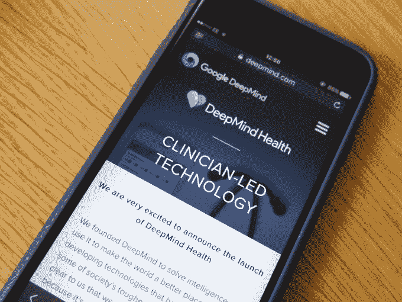

# 英国报告敦促采取行动打击人工智能偏见 

> 原文：<https://web.archive.org/web/https://techcrunch.com/2018/04/16/uk-report-urges-action-to-combat-ai-bias/>

需要多样化的开发团队和真正有代表性的数据集，以避免偏见被融入人工智能算法，这是英国上议院今天发表的一份冗长的上议院委员会报告的核心建议之一，该报告调查了人工智能的经济、伦理和社会影响。

“解决这种偏见的主要方法是确保开发人员来自不同的性别、种族和社会经济背景，并了解和遵守道德行为准则，”该委员会写道，同时引用了大量关于算法问责制的现存评论。

委员会主席， Lord Clement-Jones 在一份声明中补充道:“伦理在人工智能的开发和使用中占据中心位置是至关重要的。“英国有一个独特的机会，为了公众的利益积极塑造人工智能，并在人工智能的道德发展方面领导国际社会，而不是被动地接受其后果。”

 [报告](https://web.archive.org/web/20221103004833/https://www.parliament.uk/business/committees/committees-a-z/lords-select/ai-committee/news-parliament-2017/ai-report-published/)还呼吁政府采取紧急措施，帮助促进“审计和测试训练数据集的权威工具和系统的创建，以确保它们能够代表不同的人群，并确保当它们用于训练人工智能系统时，它们不太可能导致偏见性的决定”——建议发起一项公共资助的挑战，以激励能够审计和询问人工智能的技术的发展。

该委员会补充说:“数据伦理和创新中心(T9)应与艾伦图灵研究所(T11)、电气和电子工程师协会(T13)、英国标准协会(T15)和其他专家机构协商，就人工智能系统的可理解性要求提供指导。”。“人工智能开发部门应该在人工智能委员会的支持下，寻求采用这种指导，并就与他们工作的部门相关的标准达成一致”——后者是一个拟议中的行业机构，它希望建立该机构以帮助确保“人工智能的透明度”。

该委员会还建议制定一部跨部门人工智能法规，试图将发展引向积极的、对社会有益的方向——尽管这不会被编纂成法律(建议是，如果确定 有必要，它可以“为法定监管提供基础)。

在他们建议作为自愿准则起点的五项原则中，人工智能应该为“人类的共同利益和利益”而发展，并且它应该在“可理解和公平的原则”上运行。

尽管如此，在报告的其他地方，该委员会指出，理解一些人工智能技术做出的决定对人类来说可能是一个挑战——继续暗示可能有必要避免在某些类型的用例中使用某些人工智能技术，至少在算法问责制能够得到保证之前。

“我们认为，部署任何可能对个人生活产生重大影响的人工智能系统都是不可接受的，除非它能够对它将做出的决定做出全面而令人满意的解释，”它在讨论“可理解的人工智能”的一节中写道。“在深度神经网络等情况下，还不可能对所做的决定做出彻底的解释，这可能意味着在找到替代解决方案之前，推迟它们在特定用途上的部署。”

该委员会表示，它希望在拟议的自愿准则中纳入的第三项原则是:“人工智能不应被用来削弱个人、家庭或社区的数据权或隐私”。

尽管这是一个奇怪的狭隘定义——为什么不推动人工智能不减少权利呢？

“就好像‘遵守法律’很难说一样，”患者数据隐私倡导组织[医学机密](https://web.archive.org/web/20221103004833/https://medconfidential.org/2018/response-to-the-house-of-lords-ai-select-committee-report/)的协调员萨姆·史密斯在讨论这份报告时评论道。

他补充道:“不像其他人工智能‘伦理’标准，它们试图创造一些如此薄弱的东西，以至于没有人反对它，现有的法治标准和惯例是众所周知和充分理解的，并提供了对决策的真实和有意义的审查，假设一个实体相信法治。”。

从整个科技行业来看，很难得出这样的结论:自我定义的“伦理”似乎对商业玩家的数据处理和人工智能活动提供了很多有意义的检查。

一个典型的例子:脸书一直声称数百万人的信息与亚历山大·科岗教授共享并没有什么不妥。人们[“明知故犯地提供他们的信息”](https://web.archive.org/web/20221103004833/https://newsroom.fb.com/news/2018/03/suspending-cambridge-analytica/)是该公司的辩护主张。

然而，科岗从脸书收集个人数据的绝大多数人显然不知道在其平台条款下会发生什么——直到 2015 年，该平台允许一个用户“同意”分享他们所有的脸书朋友。(因此，大约 27 万科岗应用程序的下载者能够传递多达 8700 万脸书用户的数据。)

因此，脸书自我定义的“道德准则”已经被证明是毫无价值的——完全符合其商业需要，而不是支持用户保护他们的隐私。(正如一位美国国会议员上周令人难忘地指出的那样，它的条款和条件旨在[保护自己的“后端”](https://web.archive.org/web/20221103004833/https://techcrunch.com/2018/04/10/sen-kennedy-to-mark-zuckerberg-your-user-agreement-sucks/)，而不是明确告知人们他们的权利。)

“在脸书被美国国会批评一周后，这份报告中唯一提到的法治是关于免除公司违反法律的责任，”史密斯在《T4 医学机密》对上议院报告的回应声明中补充道。“公共机构必须遵守法治，出售给它们的任何工具都必须符合这些法律义务。公共部门的这一标准将推动可被所有人重用的工具的产生。”

## 健康数据“不应轻易共享”

该委员会在长达半年多的调查中，将来自谷歌旗下 DeepMind 的证据作为众多专家证人之一，批评了人工智能公司与英国国民健康服务信托基金的现有合作关系。

其中第一项始于 2015 年，涉及与谷歌旗下公司共享约 160 万名患者的医疗记录，与英国数据保护监管机构陷入困境。英国信息专员去年夏天得出结论皇家免费 NHS 信托与 DeepMind 的协议不符合英国数据保护法。

DeepMind 使用患者的医疗记录开发了一款临床任务管理应用，该应用围绕现有的 NHS 算法，用于检测一种称为急性肾损伤的疾病。这款名为 Streams 的应用已经在皇家自由医院推出，并配有公关宣传。但是仍然不清楚共享患者数据有什么法律依据。

该委员会警告称:“保持公众对其数据安全使用的信任，对于人工智能的成功广泛部署至关重要，没有比个人健康数据更好的典范了。”“皇家自由伦敦 NHS 基金会信托基金和 DeepMind 之间的争议不能再重复了。如果有，在 NHS 中部署人工智能的好处将不会被采纳或实现，创新可能会被扼杀。”

该报告还批评了英国国民医疗服务信托基金(NHS Trusts)与人工智能开发者(T4)共享数据所采取的“当前零敲碎打”的方法——称这有“无意中低估数据”和“NHS 信托基金暴露于不充分的数据共享安排”的风险。

“英国国民健康服务体系掌握的数据可以被认为是国家价值的独特来源。该委员会写道:“不应该轻易分享，但如果分享，应该以一种允许收回价值的方式进行。”

牛津大学的约翰·贝尔爵士去年夏天在英国政府委托的生命科学部门[的](https://web.archive.org/web/20221103004833/https://techcrunch.com/2017/08/31/building-health-ais-should-be-uk-ambition-says-strategy-review/)[产业战略评论](https://web.archive.org/web/20221103004833/https://www.gov.uk/government/news/sir-john-bell-to-unveil-industry-led-proposals-to-build-uks-status-as-world-leader-in-life-sciences)中提出了类似的观点——不允许公共资助的 NHS 数据集中蕴含的巨大潜在价值被外部力量廉价剥离。

尽管有类似的担忧，该委员会还呼吁在今年年底前公布共享 NHS 数据的框架，并推动 NHS 信托公司以“一致的格式”数字化他们当前的做法和记录——目标截止日期为 2022 年——以便人工智能开发者可以更容易地访问人们的医疗记录。

但令人担忧的是，考虑到让敏感的健康数据更容易被第三方访问的总体趋势，该委员会似乎没有非常精细地掌握健康背景下的数据保护——例如，鉴于通常涉及的详细程度，数据集可能非常难以真正匿名。

尽管他们至少呼吁相关的数据保护和患者数据机构参与提供共享 NHS 数据的框架，以及已经与 DeepMind 合作的信托公司(在一个案例中受到了 ICO 的轻微处罚[)。](https://web.archive.org/web/20221103004833/https://ico.org.uk/about-the-ico/news-and-events/news-and-blogs/2017/07/royal-free-google-deepmind-trial-failed-to-comply-with-data-protection-law/)

他们写道:

> 我们建议英国国民保健服务系统(特别是英国国民保健服务数字系统)应在 2018 年底之前制定并发布一个共享英国国民保健服务数据的框架，并在 ICO[信息专员办公室]和已经有此类安排经验的临床医生和英国国民保健服务信托基金(如皇家自由伦敦和穆尔菲尔德眼科医院国民保健服务基金会信托基金)以及 Caldicott Guardians[英国国民保健服务系统的患者数据倡导者]的支持下，制定国家健康和护理数据监护人。该框架应明确规定以适当的匿名形式共享患者数据时需要考虑的事项、这样做时需要采取的预防措施，以及对该数据的价值和使用方式的认识。它还必须考虑到需要确保中小企业获得国民保健系统的数据，并确保病人知道他们的数据的使用，并给予选择退出。

正如脸书-剑桥分析公司丑闻所清楚表明的那样，单靠选择退出不能保护人们的数据或他们的合法权利——这就是为什么即将出台的欧盟数据保护规则( [GDPR](https://web.archive.org/web/20221103004833/https://techcrunch.com/2018/01/20/wtf-is-gdpr/) )强化了同意要求，要求明确的肯定。(不言而喻，在涉及数据如此敏感的医疗背景下，选择退出尤其令人担忧——然而，至少在 DeepMind 与[陶顿和萨默塞特 NHS 信托](https://web.archive.org/web/20221103004833/https://techcrunch.com/2017/06/22/deepmind-health-inks-another-5-year-nhs-app-deal-in-face-of-ongoing-controversy/)的合作中，患者似乎甚至没有能力对他们正在处理的数据说不。)

数据共享的选择退出(即，而不是选择加入系统)和自定义/自愿的“道德”准则显然对保护人们在数字数据方面的合法权利没有什么作用——即使是真的，例如，正如公司高管所建议的那样，脸书对其能够*理论上*对数据做的事情进行了检查(考虑到他们被[抓住试图操纵](https://web.archive.org/web/20221103004833/https://techcrunch.com/2014/06/29/facebook-and-the-ethics-of-user-manipulation/)，人们想知道他们自愿避免什么样的事情)。

依靠消费者悟性来监管商业数据共享的更大风险是，受过教育、了解技术的少数人可能能够锁定——或[减少](https://web.archive.org/web/20221103004833/https://techcrunch.com/2018/04/14/how-to-save-your-privacy-from-the-internets-clutches/)——对他们信息的访问；但是主流的大多数人不知道他们需要什么，甚至不知道这怎么可能。为精英阶层提供数据保护听起来不太公平。

与此同时，至少就该委员会对人工智能的态度而言，开发者和商业实体受到了有利的鼓励——通过一个自愿(而且非常基本)的人工智能道德准则的概念——而不是被强烈提醒他们需要遵守法律。

鉴于目前人工智能驱动的凉鞋的范围和规模，这可能会让委员会看起来很幼稚。

虽然政府已经将人工智能作为战略重点，而促进和加速数据共享以推动技术发展的政策是其数字和工业战略的重要组成部分。因此，需要在更广泛的背景下阅读这份报告。

该委员会确实对法律责任是否/如何与自动化决策相融合的问题发表了意见——写道，是否需要“法律责任和补救的新机制”需要“澄清”。

“我们建议法律委员会考虑现有立法是否足以解决人工智能的法律责任问题，并在适当的情况下，向政府建议适当的补救措施，以确保法律在这一领域是明确的，”它在这一点上说。“至少，这项工作应该为问责制和可理解性建立明确的原则。这项工作应该尽快完成。”

但这并不是最前沿的评论。例如，上个月，政府宣布了一项为期三年的监管审查，重点是自动驾驶汽车和法律。责任问题已经广为人知——至少在自动驾驶汽车的案例中，现在它的轮胎在英国被广泛踢了一脚。

政府圈子里较少具体讨论的是人工智能如何明显地对现有法律施加压力。如果有的话，应该做些什么来解决这些人工智能引发的问题。(例外:通过在线平台传播的恐怖主义内容多年来一直受到谴责，政府部长们非常乐意让平台和技术成为他们的替罪羊，甚至强化法律；最近，网络平台上的仇恨言论也成为欧洲各国政府的主要政治目标。)

委员会在关于人工智能对“社会和政治凝聚力”的影响的一节中简要谈到了其中一些社会压力点，注意到向其提出的关于过滤泡沫和人工智能被用来操纵选举的风险等问题的关切。【T】这里的 是对公众理解和 参与人工智能的快速增长的需求，以与技术本身一起发展。在接下来的几个月和几年里，对数据的处理将会是公众理解和讨论的一个关键领域。

然而，它几乎没有什么火药味——只是建议委托研究“人工智能对传统和社交 媒体渠道的可能影响”，并调查“作为紧急事项，可能抵消使用人工智能误导或扭曲公众舆论的 的措施”。

在报告的其他地方，它还对数据垄断提出了一个有趣的担忧——指出“大型海外科技公司在英国经济中的投资正在“增加少数人的权力和影响力”，它认为这有可能损害英国本土的人工智能初创行业。

但同样，它的回应也没有多少实质内容。除了呼吁“强有力的”竞争框架之外，该委员会似乎还没有形成自己的想法，即政府需要如何甚至是否需要解决数据将权力集中在大型科技公司手中的问题。这种缺乏说服力的情况归因于从证人那里听到的关于这个问题的混杂信息。(尽管这也可能与调查关注的经济部分有关。)

“数据垄断表明，英国需要强有力的道德、数据保护和竞争框架，监管机构也需要继续保持警惕，”报告总结道。“我们敦促政府以及竞争和市场管理局积极主动地审查在英国运营的大型科技公司对数据的使用和潜在垄断。”

该报告还提出了对英国人工智能创业公司获得资金的担忧，以确保他们能够继续扩大国内业务——建议英国商业银行(British Business Bank)的 25 亿英镑投资基金中的一大部分“保留作为中小企业的人工智能增长基金，具有实质性的人工智能成分，并专门用于帮助这些公司扩大规模”。英国商业银行是英国政府在 2017 年秋季预算中宣布的。

没有一个支持创业事业的人会反对努力获得更多的资金。但是，如果数据访问被科技巨头封锁，那么世界上所有的扩大资金都不会帮助国内人工智能初创公司突破算法上限。

还谈到了:英国退出欧盟的潜在影响，该委员会呼吁政府“在我们离开欧盟后，承诺为欧洲研究和创新项目提供资助，并在必要时取代这些资助”。这可以归结为英国退出欧盟后要求替代资金的一长串呼吁中的另一个哨子。

监管机构的资金是另一个问题，有人警告说，ICO 必须“有足够和可持续的资源”——这是该委员会预计 AI 会给现有监管机构带来额外负担的结果。

这个问题也引起了英国数字部长马特·汉考克的注意，他已经表示他正在考虑 ICO 可能需要的额外资源，比如强迫个人作证的权力。(尽管 ICO 本身之前已经提出了担忧，部长和他的数据保护法案正在[冒着削弱她的权威的风险](https://web.archive.org/web/20221103004833/https://techcrunch.com/2018/01/08/concerns-raised-over-new-ethics-regime-for-uk-public-sector-data-processing/)。)就目前而言，该机构将如何武装自己，以应对人工智能数据处理器产生和扩大的无数挑战，仍有待观察。

“在现阶段，针对人工智能的全面监管是不合适的，”该报告补充道。“我们认为，现有的特定行业监管机构最适合考虑任何可能需要的后续监管对其行业的影响。我们欢迎数据保护法案和 GDPR 似乎解决了我们的证人对处理个人数据的许多担忧，这是人工智能发展的关键。人工智能政府办公室与数据伦理和创新中心需要确定现有监管可能不充分的差距(如果有的话)。人工智能政府办公室还必须确保利用现有监管机构的专业知识，为未来可能需要的任何潜在监管提供信息。"

该委员会为他们的自愿人工智能代码制定的最后两项原则旨在强调这里的道德标准是多么低——归结为:人工智能不应该被允许取消我们孩子的免费学校，也不应该被允许杀死我们——这本身可能是人类不总是能够清楚地确定人工智能如何做它做的事情或它可能对我们做什么的另一个后果。