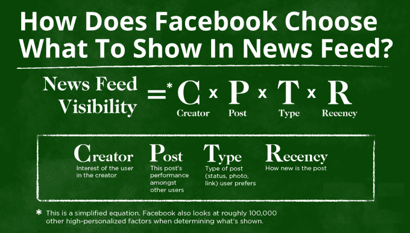
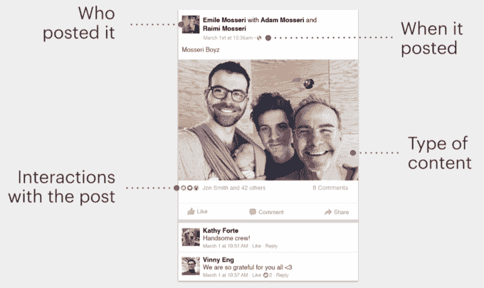
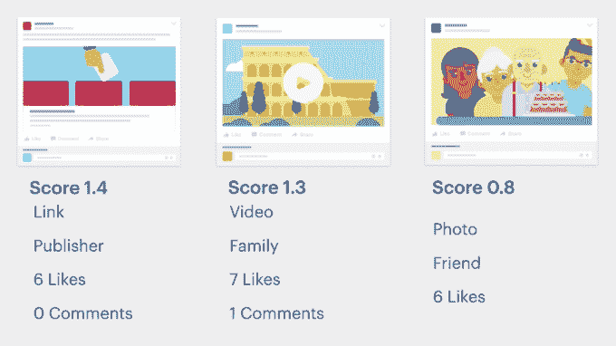
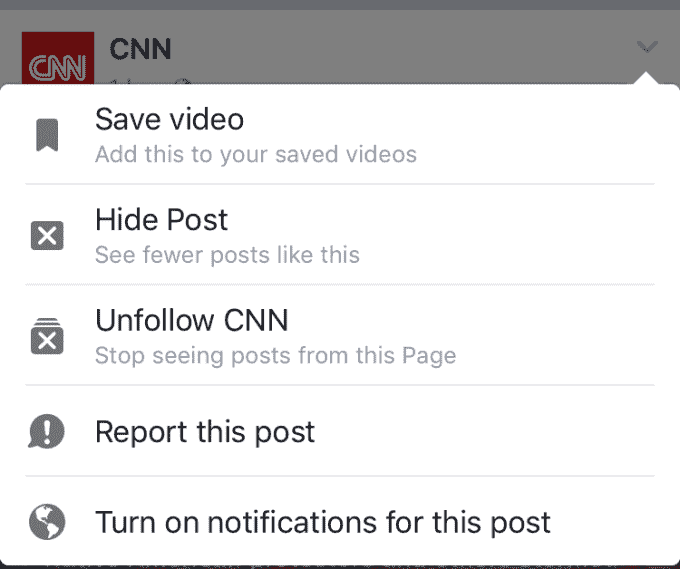
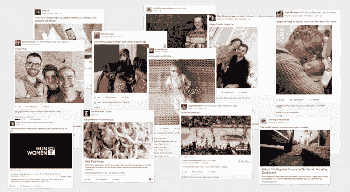

# 脸书新闻如何运作

> 原文：<https://web.archive.org/web/https://techcrunch.com/2016/09/06/ultimate-guide-to-the-news-feed/>

这是关于脸书如何选择在你的新闻订阅中显示什么，以及如何让更多人看到你的内容的终极指南。

理解新闻提要是如何工作的很难，因为算法总是在变化。因此，TechCrunch 为今天的 News Feed 十周年启动了这个研究项目，采访了脸书的团队成员，汇编了该公司的公告，并回顾了我们十年的报道。结果是这个有用的解释器，我们会随着新的变化不断更新，所以它总是准确的。

## 新闻提要的目标

脸书的目标是选择最相关和最吸引人的故事来显示在新闻提要中。它希望从每天可能出现在你的新闻订阅中的几千个潜在故事中选择最好的内容，并把它们放在你实际浏览的前几十个位置。

这些故事按照重要性排序显示，从你的兄弟姐妹结婚或你 10 个朋友分享的新闻，到品牌分享的网站链接，再到无聊的故事，比如一个远方的熟人回复一个事件。

脸书优先考虑你会喜欢、评论、分享、点击和花时间阅读的故事，我们称之为“参与”。脸书还开展在线调查和线下焦点小组，以获得更多关于人们认为应该出现什么故事的反馈。

内容越吸引人，你回脸书的次数就越多，它就能更好地完成联系人们的使命，同时也能从新闻提要中的广告中获得收入。

## Reach 的自然下降

随着时间的推移，越来越多的人和页面加入脸书，分享更多的内容，对新闻供稿中有限可用空间的竞争也越来越激烈。虽然过去 10 年人们花在新闻订阅上的时间增加了，但收视率的增长速度却赶不上分享的故事数量。

这导致发布到新闻订阅源的内容的覆盖范围自然下降，这是根据有资格看到某个故事的每个人当中看到该故事的人的百分比而言的。这就是为什么脸书网页看到他们的追随者看到他们的内容随着时间的推移而减少的百分比。这是人们更频繁分享的必然结果，而不是脸书强迫企业购买广告的某种阴谋。

对你来说，抵消这种对你自己内容的可及性下降的最好方法是了解脸书的算法更喜欢什么。

## 影响你所见的主要因素

那么脸书的算法是如何选择以什么顺序出现的呢？它给每个故事分配一个个性化的相关性分数，每个人看这个分数是不同的，并把最相关的故事放在最前面。该算法考虑了数千种不同的信号。但是这里有四个[主要因素](https://web.archive.org/web/20230405220115/https://newsroom.fb.com/news/2016/04/news-feed-fyi-from-f8-how-news-feed-works/)，它们决定了一个故事的个性化相关性分数，因此也决定了它对用户的可见性。

**谁发布的**–你过去与帖子的作者互动得越多，脸书就越觉得你会对他们未来的帖子感兴趣。这种互动可以是参与，如喜欢或评论，也可以点击或放慢速度来阅读他们的帖子，访问他们的页面或个人资料，在帖子或照片中标记他们或被标记在一起，以及脸书上的许多其他行为。这就是为什么你看不到老朋友的帖子或多年没有联系的页面。

**其他人如何参与这个职位——其他人参与某个职位越多，脸书也越有可能向你展示这个职位。有时，人们和页面会发布一些很少互动的无聊内容，所以这让他们变得默默无闻。但是，如果一开始看到一个帖子的人有很高比例参与进来，脸书知道它很有趣，并继续向更多人展示它。**

 **不同的人喜欢不同的职位。我可能喜欢读新闻，你可能喜欢看视频。脸书将人们与帖子类型相匹配，所以如果你从不看视频，你不会看到很多。

**发布时间**——一个故事发布的时间越近，你就越有可能看到它。然而，脸书还会检测你最后一次查看新闻源的时间，如果你在帖子发布后没有登录过，也没有看过，它会把旧的好帖子排在更高的位置。每隔几分钟或几小时检查一次，脸书会优先考虑最近的帖子。离线一周，脸书可能会曝光一个大新闻，比如你最好的朋友生孩子了，即使它是 5 天前发布的。

综合起来，这些因素对一篇文章在新闻订阅源中的位置有很大影响。随着时间的推移，当你与新闻源互动时，脸书会了解你关心什么，如果你的行为发生变化，它也会理解你。

还有其他几个重要因素决定了你在新闻提要中看到什么，尽管没有上面那些因素那么重要

**有多少人发布了同样的内容**——当许多朋友或页面发布同样的内容时，脸书会创建排名靠前的帖子聚合。如果十几个朋友都发布了相同的新闻文章或视频，脸书会认为这是一件大事，并在新闻提要的更高位置显示“乔希·康斯坦和其他 11 个朋友分享了……”的故事。

**新的脸书产品**——当脸书发布一款新产品，比如实时视频或幻灯片，该公司需要测试有多少人想与之互动。它最初可能会显示太多或太少关于产品的新闻提要故事，直到它收到足够的反馈来了解适当的可见性级别。

## 广告是如何插入的

脸书还在新闻订阅中植入广告。这些不会取代任何自然可见的帖子，而是被注入到它们之间，推动后面的帖子。

脸书使用一种类似但独立的排名算法来确定你是否可能对某个页面或企业的广告感兴趣。脸书限制你看到的广告数量，因此希望最大限度地增加广告引起你共鸣或让你点击的可能性，因为这是它赚更多钱的方式。

脸书对你了解得越多，广告就越有意义。如果你填写了你的个人资料，并喜欢你所关心的页面，脸书的广告将变得更加个性化和相关，告诉你你真正感兴趣的产品、应用、事件等。

## 控制您的新闻提要

脸书给你含蓄和明确的方法来教你想看的新闻。

隐含的信号来自你在脸书的正常行为。如果你一直喜欢某个朋友或某个特定话题的故事，你会看到更多。如果你总是浏览别人的帖子，或者从不点击页面上分享的故事，你会看得更少。这就是为什么真正喜欢你喜欢的东西很重要，而不是仅仅为了对某人好而同情你并不真正关心的东西。

脸书还提供了明确的工具，可以直接告诉新闻提要你想看什么和不想看什么。每个故事的右上角都有一个小小的下拉箭头，让您可以:

*   隐藏一篇文章，这样你就不会再看到它，也不会再看到类似的文章
*   取消关注作者，这样你就不会再看到他们的帖子了
*   把这个故事留到以后吧，它会告诉脸书给你看更多类似的帖子
*   打开通知，这样您就会收到该作者未来帖子的提醒

在新闻订阅设置中还有一个“先看”选项。这可以让您选择您总是希望在新闻源顶部看到其帖子的人或页面，这对于了解您所爱的人、最好的朋友、最喜欢的品牌或您自己的业务非常有用。

## 新闻订阅源算法更改的更新列表

脸书不断调整新闻内容。它适应防止人们游戏或欺骗系统，拥抱新的媒体类型，并纠正导致人们看到他们不关心的东西的缺陷。脸书发布新闻提要参考消息[博客文章](https://web.archive.org/web/20230405220115/https://newsroom.fb.com/news/category/news-feed-fyi/)来公开这些变化。

这篇文章也会改编。随着脸书发布更多的参考信息，我们会将它们添加到这个列表中，并简要总结每个信息的含义。这样你就可以继续引用这篇文章，并与不了解新闻订阅工作方式的朋友或同事分享。以下是迄今为止所有的新闻订阅源变更公告:

**页面的高质量帖子——及时、相关，来自你信任的来源，你会分享或推荐它，真正有趣而不是试图玩弄新闻提要，不是低质量或模因，不会抱怨，不会隐藏，完整的页面配置文件，粉丝群与其他高质量页面重叠。**

 **[**更多相关广告**](https://web.archive.org/web/20230405220115/https://newsroom.fb.com/news/2013/09/news-feed-fyi-more-relevant-ads-in-news-feed/)——其他人隐藏的广告更少，与他们已经隐藏的广告相似的广告更少

[**来自好友的更多状态更新**](https://web.archive.org/web/20230405220115/https://newsroom.fb.com/news/2014/01/news-feed-fyi-what-happens-when-you-see-more-updates-from-friends/)–来自好友的更多文本状态更新，来自页面的更少文本状态更新，来自页面的更多链接分享故事，来自页面的更少嵌入链接的文本更新

****【更多关于你喜欢的话题的故事】标记另一个页面的帖子可能会显示给被标记页面的关注者****

 ****[**清理垃圾新闻**](https://web.archive.org/web/20230405220115/https://newsroom.fb.com/news/2014/04/news-feed-fyi-cleaning-up-news-feed-spam/)——减少明确要求人们点赞、评论或分享的页面帖子。更少的页面帖子已经被该页面分享，更少的垃圾链接使用不准确的语言或格式来欺骗人们点击

[**专注于明确分享的故事**](https://web.archive.org/web/20230405220115/https://newsroom.fb.com/news/2014/05/news-feed-fyi-giving-people-more-control-over-when-they-share-from-apps/)**——更多明确分享来自第三方应用的故事，较少隐式或自动分享故事**

 **[**展示更好的视频**](https://web.archive.org/web/20230405220115/https://newsroom.fb.com/news/2014/06/news-feed-fyi-showing-better-videos/)**——人们观看并长时间观看的视频越多，观看视频的人观看的视频越多，跳过视频的人观看的视频越少**

 **[**战斗点击诱饵**](https://web.archive.org/web/20230405220115/https://newsroom.fb.com/news/2014/08/news-feed-fyi-click-baiting/)**——较少的链接不能告诉人们他们正在点击的内容，较少的链接指向人们不会花太多时间直接回到脸书的网页，较多的链接指向人们会花很多时间的网页，较多的链接指向人们在访问后谈论的网页，较少的链接指向人们在访问后不会谈论的网页，较多的链接以链接格式共享的故事，较少的链接指向照片或视频的描述或标题的故事。**

 ****[更及时的报道](https://web.archive.org/web/20230405220115/https://newsroom.fb.com/news/2014/09/news-feed-fyi-showing-more-timely-stories-from-friends-and-pages/)**——引用当前热门话题的报道越多，如果人们在发布后很快就喜欢它们，但随后就不喜欢了，那么在发布后不久就会显示更多的报道

 ****[减少促销页面帖子](https://web.archive.org/web/20230405220115/https://newsroom.fb.com/news/2014/11/news-feed-fyi-reducing-overly-promotional-page-posts-in-news-feed/)**——更少的帖子只会促使人们购买产品、安装应用程序、参加抽奖，或者重复使用广告中完全相同的内容。

**[尽量减少恶作剧](https://web.archive.org/web/20230405220115/https://newsroom.fb.com/news/2015/01/news-feed-fyi-showing-fewer-hoaxes/)**——更少的帖子被人们标记为恶作剧或在发布后删除，因为它们是骗局或故意制造的假消息

**[显示更多来自朋友的内容](https://web.archive.org/web/20230405220115/https://newsroom.fb.com/news/2015/04/news-feed-fyi-balancing-content-from-friends-and-pages/)** 更多来自朋友的帖子而不是页面，更少关于朋友喜欢或评论帖子的故事，更多来自相同来源的新用户的帖子，而他们的新闻订阅中没有太多内容

**[你花更多时间阅读的故事](https://web.archive.org/web/20230405220115/https://newsroom.fb.com/news/2015/06/news-feed-fyi-taking-into-account-time-spent-on-stories/)**——其他人在他们的新闻订阅中花更多时间阅读的故事比其他故事多得多。

 ******[整合视频上的动作](https://web.archive.org/web/20230405220115/https://newsroom.fb.com/news/2015/06/news-feed-fyi-taking-into-account-more-actions-on-videos/)**——更多的视频，人们打开声音，全屏观看，或者高清观看。

 ****[融入反应](https://web.archive.org/web/20230405220115/https://newsroom.fb.com/news/2015/10/news-feed-fyi-how-the-reactions-test-will-impact-ranking/)**——更多与你反应相似的故事(就像喜欢一样)

**[减少低质量病毒式报道的调查](https://web.archive.org/web/20230405220115/https://newsroom.fb.com/news/2015/12/news-feed-fyi-using-surveys-to-better-understand-viral-stories/)**——调查显示人们宁愿不看的病毒式报道减少

 ****[整合定性反馈](https://web.archive.org/web/20230405220115/https://newsroom.fb.com/news/2016/02/news-feed-fyi-using-qualitative-feedback-to-show-relevant-stories/)**——调查和定性研究显示，人们可能会对更多的故事给予高度评价并参与其中

**[匹配反应和故事](https://web.archive.org/web/20230405220115/https://newsroom.fb.com/news/2016/02/news-feed-fyi-what-the-reactions-launch-means-for-news-feed/)**——随着时间的推移，脸书希望向人们展示更多与他们以某种方式做出反应的故事相似的故事，因此经常使用“哈哈”反应的人会看到更多有趣的故事

**[在视频直播时显示视频](https://web.archive.org/web/20230405220115/https://newsroom.fb.com/news/2016/03/news-feed-fyi-taking-into-account-live-video-when-ranking-feed/)**–在视频直播时显示更多视频直播

 ****[把朋友和家人放在第一位](https://web.archive.org/web/20230405220115/https://newsroom.fb.com/news/2016/06/news-feed-fyi-helping-make-sure-you-dont-miss-stories-from-friends/)**——更多来自你关心的人的故事，更少来自企业和新闻媒体的故事

**[惩罚误导或隐瞒信息的点击诱饵标题](https://web.archive.org/web/20230405220115/https://newsroom.fb.com/news/2016/08/news-feed-fyi-further-reducing-clickbait-in-feed/)**——越来越少的新闻报道通过省略或夸大核心细节来有意欺骗人们点击

 ******[解决骗局和假新闻](https://web.archive.org/web/20230405220115/http://newsroom.fb.com/news/2016/12/news-feed-fyi-addressing-hoaxes-and-fake-news/)**——被用户标记的流行的、病毒式的假新闻故事将被[发送给第三方事实检查员](https://web.archive.org/web/20230405220115/https://techcrunch.com/2016/12/15/facebook-now-flags-and-down-ranks-fake-news-with-help-from-outside-fact-checkers/)进行评估。被确认为虚假的报道将在新闻提要中排名靠后，并被贴上有争议的警告标签。通过域名欺诈伪装成合法出版商的假新闻网站，以及人们阅读后很少分享的文章也会在 Feed 中排名下降

 **[**推广真实、实时的内容**](https://web.archive.org/web/20230405220115/http://newsroom.fb.com/news/2017/01/news-feed-fyi-new-signals-to-show-you-more-authentic-and-timely-stories/)—[“真实”的、非误导性的、耸人听闻的、垃圾的或经常隐藏的帖子](https://web.archive.org/web/20230405220115/https://techcrunch.com/2017/01/31/facebook-authentic-news/)将在新闻订阅中推广。与某个主题相关的帖子目前正在实时传播，因为许多人都在发布该主题，或者关于该主题的页面帖子正在获得大量参与，当该主题仍然热门时，该帖子将在提要中显示得更高

**[减少低质量网站的链接](https://web.archive.org/web/20230405220115/https://techcrunch.com/2017/05/10/facebook-fights-foot-fungus-ads/)**——几乎不含实质性内容且被弹出窗口覆盖的网站；间隙的；和侵略性的，令人震惊的，性的，或误导性的广告将在新闻提要中排名下降，并且不允许脸书购买广告

**[降低 Clickbait 在另外 9 种语言中的排名](https://web.archive.org/web/20230405220115/https://techcrunch.com/2017/05/17/facebook-anti-clickbait/)**——带有隐瞒或夸大信息的 clickbait 标题的链接帖子将出现在新闻提要的较低位置，脸书现在可以检测到除英语之外的 9 种语言。

**[降级垃圾邮件发送者过度分享的低质量链接](https://web.archive.org/web/20230405220115/https://newsroom.fb.com/news/2017/06/news-feed-fyi-showing-more-informative-links-in-news-feed/)**—[积极分享链接(通常每天超过 50 个)的人分享的链接在新闻提要中不会那么突出](https://web.archive.org/web/20230405220115/https://techcrunch.com/2017/06/30/facebook-spammers/)，因为这些链接通常是点击诱饵、虚假新闻或耸人听闻的。

**[显示相关文章以对抗骗局和两极分化](https://web.archive.org/web/20230405220115/https://techcrunch.com/2017/08/03/facebook-related-articles/)**——脸书上很多人都在谈论的链接，或者已经被第三方事实审查员审查过的链接，会在被点击之前显示相关文章。这些相关文章将展示不同新闻来源对同一主题的不同观点，或者来自事实核查人员的真实性报告。

优先链接到加载速度更快的移动网站——包括脸书的即时文章在内的快速加载的移动网站的链接会在新闻提要中出现得更突出。

 ******[降低虚假视频和播放按钮的排名](https://web.archive.org/web/20230405220115/https://techcrunch.com/2017/08/17/facebook-fake-play-buttons/)**——发布者在预览缩略图中链接播放按钮的页面，使帖子看起来像原生视频或作为视频上传的静态图像，他们的帖子将向更少的人显示。

[**阻止从分享假新闻的页面购买广告**](https://web.archive.org/web/20230405220115/https://techcrunch.com/2017/08/28/facebook-fake-news-ads/)——反复分享被脸书外部事实审查员标记为假新闻的文章链接的页面将不再能够购买任何脸书广告。

**[显示关于出版商的信息按钮](https://web.archive.org/web/20230405220115/https://techcrunch.com/2017/10/05/facebook-article-information-button/)**–新闻文章的链接现在将包括一个信息按钮，可以点击该按钮查看维基百科关于出版商的条目，以帮助人们避免分享来自假冒或不名誉渠道的故事。

[**发布出版商指导方针**](https://web.archive.org/web/20230405220115/https://techcrunch.com/2017/10/24/facebook-publisher-guidelines/)–**新闻媒体现在可以参考脸书的出版商指导方针，学习如何在新闻订阅中取得成功，包括分享准确、有意义和安全的内容。**

 ****[**添加暂停按钮**](https://web.archive.org/web/20230405220115/https://techcrunch.com/2017/12/15/facebook-adds-a-snooze-button-for-muting-people-groups-and-pages-for-30-days/)–用户现在可以点击新闻订阅源故事上的下拉箭头中的暂停按钮，在 30 天内隐藏该故事的作者，作为永久取消关注他们的替代方法。

**[降级参与诱饵](https://web.archive.org/web/20230405220115/https://techcrunch.com/2017/12/18/facebook-is-clamping-down-on-posts-that-shamelessly-beg-for-your-engagement/)**——无耻地要求点击的帖子，如“与朋友分享以赢得免费旅行”或“如果你是白羊座，就喜欢”将在新闻提要中获得较少的可见性。

[**用相关文章替换有争议的旗帜**](https://web.archive.org/web/20230405220115/https://techcrunch.com/2017/12/20/facebook-will-ditch-disputed-flags-on-fake-news-and-display-links-to-trustworthy-articles-instead/)——被第三方事实检查员标记为虚假的新闻文章将不再显示实际上可能巩固人们被误导的信念的红旗，而是显示来自其他来源的相关文章，以给用户提供更准确的替代观点。

——在对新闻订阅算法的大规模改革中，脸书现在将显示更多人们通过评论和分享(如朋友的帖子)积极讨论的内容，并显示更少人们被动消费的内容，包括公开分享的出版商内容、新闻链接和视频。脸书的目标是增加花费时间和福祉，即使在短期内以总花费时间和广告浏览量为代价。

 **—

随着更多新闻源的发布，我们将添加它们，以保持此列表的最新状态。

## 新闻订阅策略

出现在新闻提要中的最佳策略非常简单:分享有趣的、真实的、能引起观众共鸣的东西。这通常意味着视觉上引人注目的媒体、有趣或感性的内容，以及吸引广大观众的重要新闻。

避免过度自我推销的垃圾邮件、枯燥或冗长的内容，以及只吸引一小部分观众的乏味的媒体。

所以在你发帖之前，问问你自己，这对其他人来说是有趣的还是娱乐性的？或者你只是徒劳地吹嘘你的生活或贪婪地营销你的业务？

脸书的新闻订阅算法很复杂，但它服务的人群仍然很简单。我们都只是想受到刺激。做到这一点，脸书会分享你要说的话。

******************************************