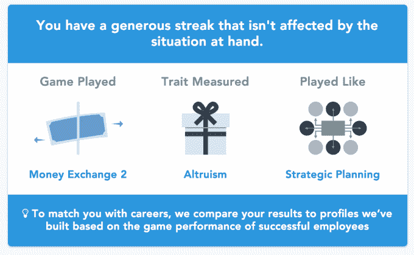
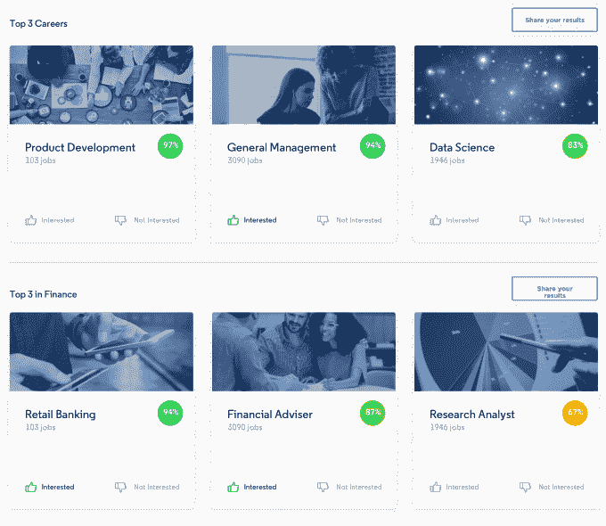

# Pymetrics 抨击人工智能招聘和招聘游戏中的歧视 

> 原文：<https://web.archive.org/web/https://techcrunch.com/2017/09/20/unbiased-hiring/>

找出你的优秀员工的特点，雇用像他们一样的人，但是不要有传统招聘的歧视偏见。这是人工智能初创公司 Pymetrics 的承诺，该公司今天在 TechCrunch Disrupt SF 的舞台上宣布了 800 万美元的新资金。Pymetrics 的目标是通过消除招聘歧视，如性别歧视、种族歧视、年龄歧视和阶级歧视，“让世界变得更加公平”。

任何人都可以[玩 Pymetrics 测试游戏](https://web.archive.org/web/20221010220709/https://www.pymetrics.com/results/careers/top/)，在不同的可雇佣特征上得分，还能看到他们擅长的工作类型的建议。你可以在下面观看我对 Pymetrics 首席执行官弗里达·波利的采访:

它是这样工作的。一家公司的全明星员工玩 Pymetrics 的一套游戏，评估记忆、情绪检测、冒险、公平和专注等事项。Pymetrics 确定哪些特质等同于公司特定职位的高绩效。

然后，招聘候选人参加同样的测试，由人工智能而不是人类评分，因此一个人的姓名、性别、皮肤、肤色、年龄或简历不会被考虑在内。最后，Pymetrics 建议公司雇佣那些内在与最佳员工相似的人，但不一定是外在相似的人。

其结果是，招聘过程不会像招聘人员一样优先考虑来自精英学校、曾在帆船队的白人。相反，它会找到最适合这份工作的人，不管他们的背景如何。这让公司发现了那些因为长相或者因为上过社区大学或者没有在热门公司工作过而被忽视的优秀人才。

波利说:“简历是招聘过程中最具偏见的信息。”。普通的简历被扫描六秒钟，大部分只是表面上看起来不错的名牌经历，而不是使一个人擅长一份工作的因素。Polli 告诉 TechCrunch:“谷歌对简历和表现测试分数进行了著名的研究，发现相关性极小。”

Pymetrics 的见解可以让公司更好地招聘人才，因为人才是成功和失败的重要区别。这就是为什么 JAZZ Venture Partners 领投了 800 万美元的这轮融资，其合伙人扎克林奇(Zach Lynch)将加入这家初创公司的董事会。这一轮还包括科斯拉风险投资公司、任仕达创新基金和 BBG 风险投资公司的回报支持。Pymetrics 还从洛克菲勒基金会获得了一笔赠款，该基金将为使用该软件雇佣高潜力风险青年的公司提供访问该软件的资金。

随着 Pymetrics 寻求签署更多的国际客户，这笔新资金将使 Pymetrics 的总资金达到 1700 万美元，并将用于扩大 py metrics 的伦敦和新加坡销售办公室。它已经与 50 家企业客户合作，包括埃森哲(Accenture)和联合利华(Unilever)这样的大公司，联合利华最近让 25 万名员工参加了 Pymetrics 测试游戏。Polli 表示，该公司大幅提高了面试候选人的质量，聘用他们的可能性增加了 100%。它还雇佣了新类型的人，比如以前从未坐过飞机的人。

但 Polli 强调，目标不是用人工智能取代招聘人员，或让公司更有效率，以便他们可以解雇员工。相反，它的目标是让雇主将他们的招聘人员从随意的简历扫描重新分配到拓展，这样他们就可以改善他们的候选人库。同样，Pymetrics 认为，雇主可以让员工解决更困难的问题，以提高企业的收入，而不是减少更有技能的员工。

挑战将是让招聘人员接受这种大胆的新招聘模式，并克服他们对被淘汰的恐惧。

我尝试了 Pymetrics 的一系列游戏，它们不仅有趣，而且让我评估我可以改善自己的哪些特质。是时候让我们不再用常春藤联盟的学位、过去的幸运和歧视性的模式匹配来给人们的职业分类了。我们有了解人们潜在技能的技术。有了看不到种族、性别或昂贵西装的人工智能，优点就能显现出来。