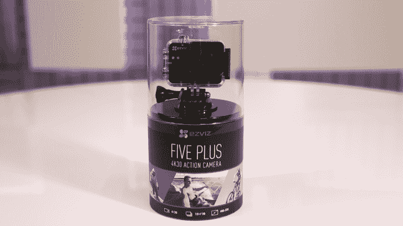
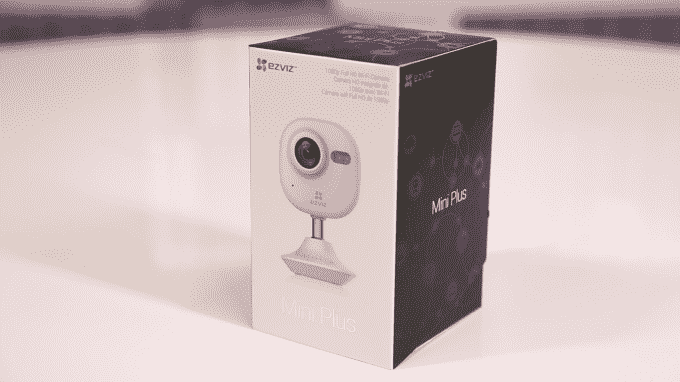
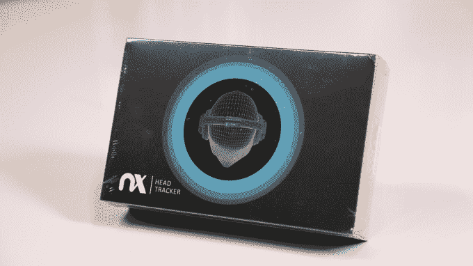
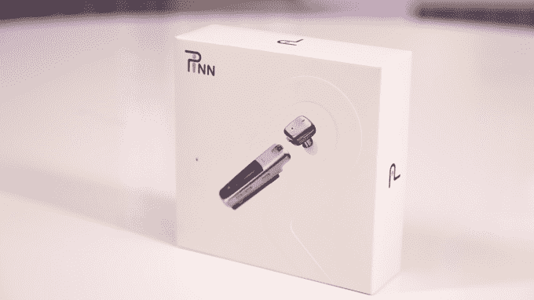
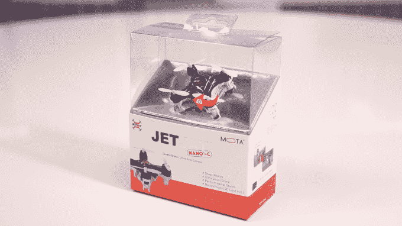
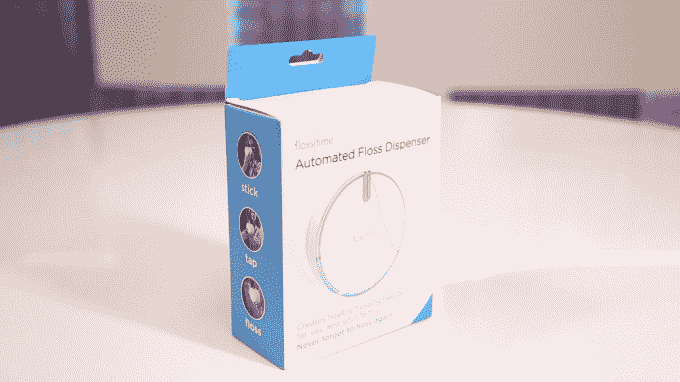

# 从 CES 2017  拆箱六个小工具

> 原文：<https://web.archive.org/web/https://techcrunch.com/2017/01/19/unboxing-six-gadgets-from-ces-2017/>

# 从 CES 2017 上拆箱六个小工具

亲爱的妈妈:

我在拉斯维加斯的 CES 2017 上度过了一段美好的时光——每隔一段时间，我都会溜出去逛一逛，看看有什么好吃的。在这里走一走，在外面检查一下。有时候我会在桌子底下睡着…这是动物的天性。有时人们想让我检查他们的产品，但我不能马上这么做(无论是时机、匆忙、在桌子下睡着——这可能是很多事情)。有些人真的想让我看看他们的“东西”，并告诉我有时间的时候拿着它去试试。所以我就这么做了。观看上面的拆箱视频，或者，如果你想无聊，看看下面六个项目的照片。

爱你，你最爱的儿子。

另外，如果你要做巧克力曲奇，请不要烤焦它们

## 

[ez viz Mini Plus](https://web.archive.org/web/20230330185627/https://us.ezvizlife.com/item/18.html?from=&position=tab)

[电波 Nx](https://web.archive.org/web/20230330185627/http://www.waves.com/nx)

[Pinn](https://web.archive.org/web/20230330185627/http://mypinn.com/)

[Mota Nano C 型无人机](https://web.archive.org/web/20230330185627/https://www.mota.com/jetjat-nano-c/)

[花期](https://web.archive.org/web/20230330185627/http://www.flosstime.com/)

演职员表:
**制片、编剧、主持:** [铁托·哈姆泽](https://web.archive.org/web/20230330185627/https://twitter.com/titoyooo)
**制片、拍摄、剪辑:**格里高利·马纳洛

Credits:
**Produced, Written, Hosted:** [Tito Hamze](https://web.archive.org/web/20230330185627/https://twitter.com/titoyooo)
**Produced, Shot, Edited:** Gregory Manalo