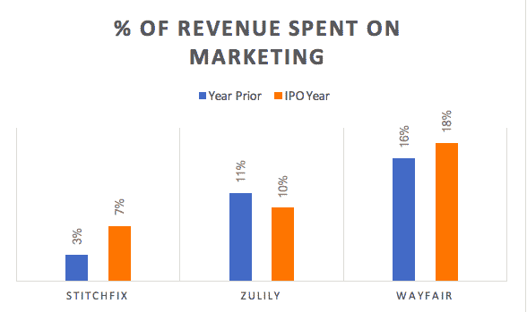
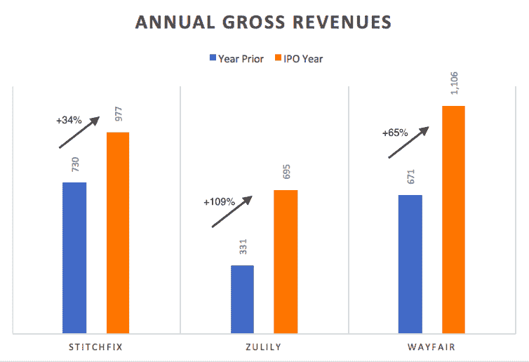
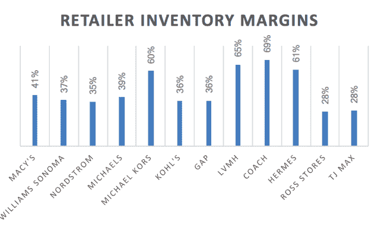
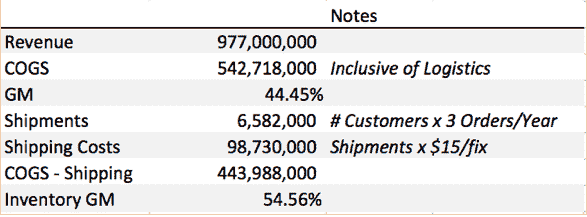
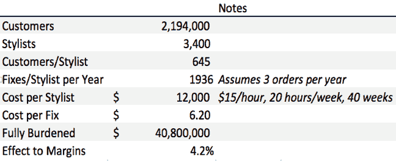

# 拆箱缝合修复 S-1 

> 原文：<https://web.archive.org/web/https://techcrunch.com/2017/10/22/unboxing-stitchfixs-s-1/>

More posts by this contributor

当 Zulily 在 2013 年上市时，它引发了人们对原本滞后的电子商务市场的兴趣。Zulily 很快实现了 80 亿美元的市值——公司估值超过收入的 10 倍——成为 flash 销售热潮的典型代表。

在接下来的几个月和几年里，策划式商务、对话式商务、闪购、情境式商务、[数字原生垂直品牌](https://web.archive.org/web/20230123194021/https://medium.com/@dunn/the-emerging-encyclopedia-of-digitally-native-vertical-brands-dnvbs-74bfd0e581bb)、订阅式商务和辅助式商务等概念成为初创企业词汇中的一个常见部分。

但在所有这些电子商务领域中，有一个领域遥遥领先:辅助商务。原因很简单。随着亚马逊吞噬越来越多的在线购物经济，他们的利润结构迫使他们在人力服务上投资不足。

这在垂直行业留下了一个漏洞，需要通过购买漏斗获得专家指导——这一漏斗在移动设备上往往变得越来越难服务。这一机会的受益者包括服装行业的 Stitch Fix 和 Trunk Club，以及家具行业的 Havenly 和 Laurel & Wolf。[18 个月前，我在 T2 的 TechCrunch 上引用了其他原因，中间人反击。]

对于消费科技爱好者来说，Stitch Fix 的 S1 代表了自 Snap 以来最令人兴奋的 IPO，也是历史上现金效率最高的电子商务独角兽之一背后的罕见一瞥。重要的是要记住，S1 的文件实际上比一般的 A 轮融资文件包含的数据和细节更少，Stitch Fix 的文件可能是我读过的最不详细的招股说明书——所以这份文件留给我们的问题多于答案。但仍有一些奇妙的见解，我们将在下面展开:

**对有机成长的热爱**

自现代脸书营销时代开始以来，Stitch Fix 可能是现金效率最高的电子商务营销机器。这是笑点:

Stitch Fix 的数据——特别是 2016 财年(可能更早)——远远超出了正态分布，以至于它们看起来更像是一个病毒式社交应用的增长，而不是一家商业公司。我个人的猜测是，Stitch Fix 凭借其差异化和创新性的体验，仍然在很大程度上受益于脸书——但围绕脸书的标签功能建立了一种秘方，使他们能够利用脸书的社交图实现高速增长，而不依赖于其所有的成本。

然而——随着 Stitch Fix 产品的新奇感减弱——这种病毒式传播和客户兴奋似乎正在转向更传统的营销组合。营销成本在 2017 年增长了近两倍，但该公司仅增长了 34%，这意味着每一美元的效率都大大降低了。这种效率上的变化意味着他们有史以来第一次面临付费营销的逆风。它还大致证实了 Stitch Fix 利用非传统渠道实现早期高速增长，现在必须培养更传统、更可持续的营销设施。

该公司的 S1 故意混淆分析师可能关心的所有其他营销指标:每年获得的客户数量，每年的平均订单数量，甚至他们的客户获得成本。然而，我们可以做一些粗略的假设:

该公司告诉我们，他们在过去 12 个月(2017 年)拥有 220 万活跃购买客户，高于 2016 年的 167.5 万活跃客户。然而，他们没有给我们任何关于每年流失或客户重叠的信息。它们确实提供了一个有些模糊但令人信服的统计数据:2017 财年 86%的收入是由现有客户(指在 2012 年至 2016 年期间购买了修复的客户)推动的。

如果是这样的话，我估计该公司的营销组合如下:

*   2017 年获得 280，000 名新客户[1]
*   280 美元的混合客户获取成本
*   2017 年群组投资回收期:约 3 年[2]

上述分析的问题在于，它将公司生活中的任何先前客户都视为现有客户，即使是五年前只订购过一次的客户。如果我们想要采取更慷慨的方法，将任何客户——无论是全新客户还是从 2016 年之前重新激活的客户——视为新客户，我们只需通过减去其 2017 年声明的活跃客户减去其 2016 年声明的活跃客户即可。假设 2016 年的部分活动在 2017 年没有订购也是合理的——我们将使用 30%作为占位符。如果是这样的话，该公司 2017 年的营销组合应该是这样的:

*   938，000 名新客户+2016 年未激活的重新激活
*   混合客户获取成本:75 美元
*   2017 年平均群组支出:500 美元[3]
*   2017 年群组回报:<6 months [2]

It’s an imperfect science, but a 9 month payback for any business, especially one at Stich Fix’s scale would be extraordinary. I suspect the truth is somewhere in the middle – but anything under 18 months would still be very healthy of a business above a billion dollars in revenue.

**但增长放缓**

Stitch Fix 即将进行首次公开募股，成为电子商务同行中增长最慢的一家:

与此同时，正如上面的市场营销部分所反映的，公司有意识地选择了利润而不是增长。

从某种意义上说，增长是一种虚荣心的衡量标准，因为它可能被不可持续地夸大。尽管 Stitch Fix 的 2017 年表明，它正在与不断上涨的营销成本作斗争，但该公司正在打赌，公共市场将奖励深思熟虑的高效增长，而不是高消耗的超高增长。

但投资者需要判断，这些选择是出于谨慎小心的经营，还是因为在男装和大码时装等更具竞争力的类别中，不可持续的系统性顾客获取条件。如果新付费客户的实际收购成本接近我们的第一个估计，那么我会对 Stitch Fix 的短期经济状况感到紧张，因为他们正在与各种资金极其充足的竞争对手争夺新兴类别的市场份额[更多内容见下文。]

**单位经济学**

辅助商务实际上是一项相当复杂的业务，具有多层次的成本，具体来说:

1.  产品的成本
2.  专家(在这种情况下是造型师)的费用
3.  物流成本

与传统电子商务不同的是与(a)专家和(b)退货运费相关的成本。电子商务公司通常会有 20-25%的退货率，而辅助商务公司的退货率大约为 80%——这是有道理的，因为他们会给你发送各种各样的商品，只需要一件不需要的商品就可以保证“退货”。

也就是说，Stitch Fix 的文件再次有意将这些数据混合在一起，但我们将尽最大努力剥离这些层。

让我们从他们的毛利率开始:Stitch Fix 拥有 45%的毛利率，与传统零售利润率一致，但明显落后于成熟的电子商务公司，特别是那些广泛从独立商家采购的公司—(通常在 55-65%之间)。

但 Stitch Fix 的利润率计算很棘手——不仅仅是库存零售利润率，因为它们还考虑了所有运输/退货和重新进货成本的净影响。如上所述，辅助商务的这些成本比传统电子商务的要高，因为(部分)返回修复的百分比大约是 80%。

现在，同样，Stitch Fix 不报告其物流或退货背后的成本，因此有两种方法可以估算:

*   首先是简单地看看其他可比的公司。对于大多数商业公司来说，运费、退货和重新进货的人工成本在 15-20 美元之间。Stitch Fix 是一家成熟、有规模的公司，理应处于这个范围的低端。
*   许多公司会为保留整批货物提供折扣。这实际上是相当直观的，因为完全保留实际上抵消了退货和重新进货成本(8-12 美元)，此外还提高了平均订单价值。一个典型的固定价格是 275 美元的零售价([平均 55 美元/件](https://web.archive.org/web/20230123194021/https://support.stitchfix.com/hc/en-us/articles/204222994-What-is-Stitch-Fix-How-Does-it-Work-FAQ))，所以他们的 25%折扣抵消了约 55 美元的收入(55 x 4 件 x 25%)——可能有约 15 美元的边际贡献。由于他们在第 5 件^(和最后一件商品上赚取了额外的利润，如果这能减少(或更好地)他们的退货+重新进货成本，这对公司来说是一笔划算的交易。这也意味着退货和重新进货的成本在这个范围内。)

如果我们对物流成本范围的低端——15 美元——给予 Stitch Fix 信用，并对他们的订购频率做一些简单的假设，他们的库存利润率看起来如下:

55%的毛利润是该品类应有的水平。同类产品中最好的是 65%+，但是如果 Stitch Fix 实际上比我猜测的更受欢迎，并且典型的客户实际上每年订购 4 次甚至 5 次 Fix，那么它的利润范围接近 60%+并且接近同类产品中最好的。

这就剩下最后一个不确定因素:所有造型师的劳动成本是多少？

该公司将这些信息隐藏并混合到他们的销售、一般和管理(SG&A)成本中，这是合理的，尽管知道他们从零工经济中获得了多少杠杆也是很好的。根据 Glassdoor 的数据，现在有 3400 名活跃的缝补造型师，他们通常兼职远程工作，按小时计酬，平均每小时 15 美元。

如果这一细分是正确的，Stitch Fix 将毫无疑问地成为同类产品中的佼佼者，并从他们的造型师模型中获得大量杠杆，仅降低 4%的净利润率，以换取客户忠诚度、个性化和真实性的大幅提升。老实说，我怀疑这些估计很低——但即使准确——也证明了为什么这是亚马逊难以大规模效仿的模式，因为他们今天的净零售利润率只有 2%左右。

**还有什么没说的**

很不幸，太多了。这份文件含糊不清。虽然我对那些希望自己的秘密保密的公司很敏感，特别是当与亚马逊的利害关系如此之高时，但分析师在评估公司时应该要求一些指标。

1.  **LTV:CAC 比率**–这应该是相当明显的，虽然 Stitch Fix 试图让我们深入了解他们的终身价值分析，但如果不知道真实的 CAC，也不知道边际贡献，这基本上是没有用的。
2.  **保持率**–这是类别中要跟踪的指标，在历史上很难继续前进。它的计算方法是[[客户保留的项目数/修复中发送的项目数，] Stitch Fix 确实向我们展示了他们能够在 2 年内将这一指标提升 22%的证据——但我们不知道是从哪个基数开始的。

在我看来，这个数字对 Stitch Fix 来说具有双重重要性，这家公司在 Eric Colson 的领导下，不断通过其数据科学能力来定义自己，并经常在网站上发布他们的个性化算法。

他们不公布自己的保持率让我哭笑不得，尤其是因为这可以在不泄露任何商业秘密的情况下完成。此外，Stitch Fix 正在寻求大幅提高其收入，希望被视为一家技术公司，而非零售商。但在拥有 3400 名造型师的情况下，它需要证明其数据科学正在以其他人无法复制的方式发挥作用——这让人感觉有点尴尬，有点类似于“商店助理”。数据是护城河。人，很不幸，在这种情况下，不是。

3.  **按类别分类**–这可能看起来很高级，不太必要，但在我看来，可以回答很多问题。在过去的 24 个月里，Stitch Fix 推出了针对男性、大码、娇小和孕妇的产品。这些类别中的每一个都是一个风险投资机会，正如 Trunk Club(男性)和 Dia and Co(加规模)的相对规模所证明的那样。

Stitch Fix 的增长在 2017 年大幅放缓，营销效率明显降低，这有点令人惊讶，因为他们实际上增加了他们能够瞄准的利基市场的数量。投资者需要能够看到这些新兴类别的表现，以便更好地评估 Stitch Fix 最终是否会成为一项以女性为主的服务，或者他们是否有机会在所有辅助服装类别(从男装到大码)中占据一席之地。

我的猜测是，随着 Stich Fix 进入这些新的类别，它们第一次面临与 Trunk Club(由 Nordstrom 提供资金)和 Dia & Co(由红杉的雄厚资金支持)相比在客户获取成本方面的阻力，而它们在女性类别中的扩张相对较少。这是一场战斗，我认为其他人不会轻易放弃。

**离别的思念**

我的一位教授曾经观察到，亚马逊是世界上第一家没有获得巨额利润就实现规模化的大型零售商。在这方面，Stitch Fix 看起来像是反亚马逊，历史上实现了强劲的 EBITDA 业绩，并依靠自身的自由现金流快速增长。

管理层、投资者、员工和董事会值得称赞，因为他们建立了一家几乎史无前例的企业——可能是十年来现金效率最高的电子商务公司，并在短短 6 年时间里，在实收资本不到 5000 万美元的情况下，将收入从零增加到 10 亿美元。

虽然我希望 Stitch Fix 的成功将带来新一轮电子商务投资和兴趣，但更好的结果是，它迫使运营商和投资者全面更仔细地考虑亚马逊世界的商业模式，并专注于建立能够提供亚马逊无法提供的基本价值的业务。

注意事项:

[1]计算方法是将 2017 年收入* (1-86%)除以 2016 年 1 年群组支出(作为基线)。这是一个不完美的分析。

[2]边际贡献应定义为毛利润减去销售、客户服务、设计师、内容创作和所有订单履行的管理成本。不幸的是，我们没有这个数字的真实指示，因为这些成本中的大部分被混合并隐藏在一个更广泛的 SG&A 中。为了这个分析的目的，并基于同行公司的可比管理成本加上设计师管理费用的负担，我估计边际贡献为 25%。

[3]估计为 500 美元，略高于 2016 年的 1 年群组支出，因为 2017 年的 6 个月支出趋势略高于 2016 年。