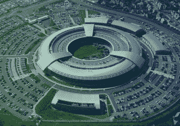
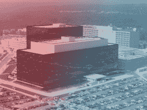

# 揭秘梯队:美国国家安全局/国家通信总部的绝密项目一直在监视你的一生

> 原文：<https://web.archive.org/web/https://techcrunch.com/2015/08/03/uncovering-echelon-the-top-secret-nsa-program-that-has-been-watching-you-your-entire-life/>

如果历史是由胜利者书写的，政府监控机构将会有一个非常长的引用来源列表。

国内数字监控往往似乎是社交媒体一代主要承受的威胁，但细节不断涌现，让我们想起了美国国家安全局和其他机构数十年来复杂的自动化间谍活动。

在政府[通过我们的网络摄像头](https://web.archive.org/web/20230306170417/http://www.wired.com/2014/03/webcams-mics/)、[通过 GPS](https://web.archive.org/web/20230306170417/https://www.washingtonpost.com/news/the-switch/wp/2013/12/04/the-nsa-says-it-obviously-can-track-locations-without-a-warrant-thats-not-so-obvious/) 、[跟踪我们的脚步、感受我们输入的每一个按键](https://web.archive.org/web/20230306170417/https://techcrunch.com/2013/07/31/nsa-project-x-keyscore-collects-nearly-everything-you-do-on-the-internet/)以及聆听和观看我们在网上建立的整个人格的复杂数据集之前，仍然有初步的数据需要收集。在过去的 50 年里，ECHELON 项目让英国和美国(以及其他五只眼的成员)有能力追踪他们国家内外的敌人和盟友。在此期间，范围从截获的传真中的关键字提升发展到目前的无所不包的数据收集。

在今天发表在《The Intercept》杂志上的一篇文章中，终身隐私倡导者邓肯·坎贝尔描述了他过去几十年追踪难以捉摸的项目 ECHELON，“有史以来第一个自动化的全球大规模监控系统。

在斯诺登将美国国家安全局和其他政府间谍机构的全部能力公之于众之前，ECHELON 在很大程度上只是阴谋论者笔记本上的另一个代号。

坎贝尔在他 1988 年的一篇名为 *[某人的监听](https://web.archive.org/web/20230306170417/http://cryptome.org/jya/echelon-dc.htm)* 的文章中首次提到了这个项目，他详细描述了一个能够“仅在英国一年就能监听 10 亿个电话”的项目

坎贝尔[描述了他在那篇文章发表前与一位消息人士的对话](https://web.archive.org/web/20230306170417/https://firstlook.org/theintercept/2015/08/03/life-unmasking-british-eavesdroppers/)。

> 她描述的手术规模让我大吃一惊(记住，那是 1988 年)。国家安全局和它的合作伙伴已经安排好了我们交流的所有东西都被抓取并进行潜在的分析。

据报道，该计划利用大型地面无线电天线拦截包含数百万数字通信的卫星传输。然后，它依靠其内容敏感的关键字和短语字典来搜索通信中的相关信息。

2000 年 2 月,《60 分钟》发表了一份报告，详细介绍了 ECHELON 的存在和范围。迈克·弗罗斯特(Mike Frost)是加拿大国家安全局(NSA)下属 CSE 的前间谍，他告诉主持人该计划的覆盖范围有多大，“梯队涵盖了任何给定时刻全球范围内的一切辐射。”

弗罗斯特还讲述了一个关于这个程序是如何被使用的故事。

> 当我在 CSE 的时候，一个经典的例子:一位女士前一天晚上去看了学校的戏剧，她的儿子在学校的戏剧中，她认为他做了一个——糟糕的工作。第二天早上，她和她的朋友通电话，她对她的朋友说了这样的话，“哦，丹尼昨晚真的很失败，”就这样。电脑显示了那段对话。看着它的分析师不太确定 w-指的是什么，所以为了谨慎起见，他在数据库中将那位女士和她的电话号码列为可能的恐怖分子。

坎贝尔和《60 分钟》报道后的几个月里，梯队的细节激怒了欧洲人。2000 年夏天，欧洲议会任命了一个特别特设委员会，花了一年时间调查 ECHELON，一些人认为，美国对欧洲通信进行间谍活动，违反了欧洲人权公约。除了投票承认该项目的存在外，委员会几乎没有取得任何进展。

继 2005 年发现布什政府在没有授权的情况下窃听美国人的电话之后，一些人猜测政府可能一直在使用 ECHELON 作为工具。

从那时起，该项目主要通过政府监控/阴谋论坛上的帖子向公众展示，解密文件中的参考资料有限，以指导那些质疑该项目全部潜力的人。

它在很大程度上已经从公众意识中消失，特别是随着其更强大的后代的细节被曝光，但重要的是将自动政府监控视为我们一生的问题，而不是短视地将其影响局限于主流互联网的出现。

由于斯诺登泄露的内部[文件，现在已经非常清楚，这个项目是存在的，但不清楚这意味着什么。PRISM 和 XKeyscore 无疑代表了对我们以数字方式呈现的信息的更令人震惊的入侵，但 ECHELON 向我们表明，我们的通信隐私确实一直受到攻击。](https://web.archive.org/web/20230306170417/https://www.documentcloud.org/documents/2189964-sid-article-nsa.html)

这些政府监控的例子被几十年来在多届政府下不同的“威胁”所证明是合理的，这些政府一再承诺“在不损害安全的情况下优先考虑隐私”，而我们都被当前的叙事所误导。

随着破碎的唱片继续播放，进一步检查 ECHELON 表明回顾过去以记住听起来熟悉的东西的重要性。