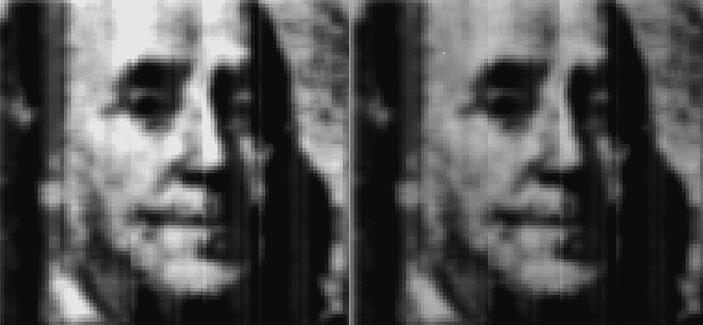

# 不到一毫米宽，由光驱动，这些微型相机几乎可以藏在任何地方

> 原文：<https://web.archive.org/web/http://techcrunch.com/2018/04/06/under-a-millimeter-wide-and-powered-by-light-these-tiny-cameras-could-hide-almost-anywhere/>

# 不到一毫米宽，由光驱动，这些微型摄像机几乎可以藏在任何地方

似乎这个世界上的相机还不够多，研究人员创造了一种新型的微型自供能相机，使其可以嵌入任何地方并永久工作。这无疑是很酷的技术，但它也可能会导致锡纸销售的飙升。

工程师们以前曾研究过用照射在相机传感器上的相同光线为其供电的可能性。毕竟，光伏电池基本上只有两个不同的功能——一个*存储*落在它上面的能量，而另一个*记录有多少*能量落在它上面。

问题是，如果你让一个细胞做一件事，它就不能做另一件事。因此，如果你想要一个特定大小的传感器，你必须将一定量的空间用于收集能量，或者在执行两项任务之间快速交换电池。

密歇根大学的 Euisik Yoon 和博士后 Sung-Yun Park 提出了一个解决方案，避免了这两个问题。原来光敏二极管并不是完全不透明的——事实上，相当多的光正好穿过它们。所以把太阳能电池*放在图像传感器*下面实际上并没有剥夺它的光线。

这一突破导致了这种“同步成像和能量采集”传感器的诞生，它可以做到它在锡上所说的。

他们建造的原型传感器不到一平方毫米，在阳光下完全自给自足。它以每秒 15 帧的速度捕捉图像，质量相当不错:

左边的本杰明是每秒 7 帧，右边是每秒 15 帧。

在论文中，研究人员指出，他们可以轻松地通过对传感器进行一些调整来产生更好的图像，并且 [Park 告诉 IEEE Spectrum](https://web.archive.org/web/20230312023219/https://spectrum.ieee.org/tech-talk/semiconductors/optoelectronics/selfpowered-image-sensor-could-watch-you-forever) 芯片的功耗也没有优化——因此它也可以在更高的帧率或更低的光照水平下工作。

最终，这种传感器本质上可能是一种几乎看不见的相机，它可以永远运行，不需要电池，甚至不需要无线电源。听起来很棒！

当然，为了让这款相机成为一款成功的间谍相机，它需要的不仅仅是成像组件——存储和传输介质是任何相机都必须具备的。但是它们的微观版本也在开发中，所以把它们放在一起只是时间和精力的问题。

该小组在本周的《IEEE 电子设备通讯》杂志上发表了他们的研究成果。