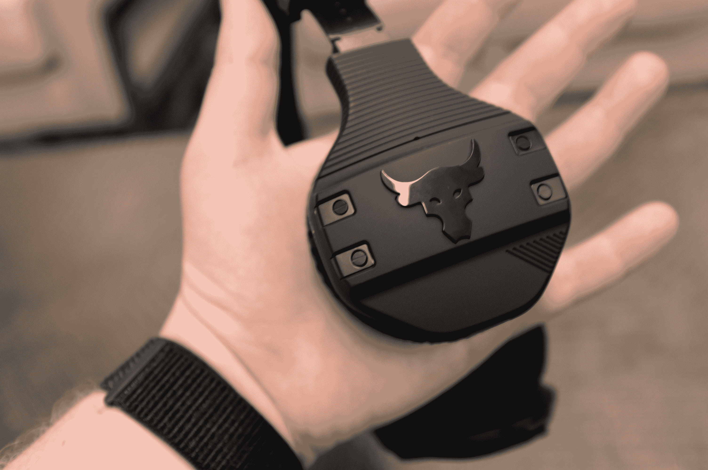

# 摇滚和安德玛联手打造了一些可笑的耳机 

> 原文：<https://web.archive.org/web/https://techcrunch.com/2018/06/28/under-armour-is-releasing-these-ridiculous-headphones-endorsed-by-the-rock/>

# 摇滚和安德玛联手打造了一些可笑的耳机

五年前，除非你有自己的品牌耳机系列，否则你算不上真正的名人。当然，时代变了，现在每个名副其实的名人都有自己的加密货币或康普茶线。

但是道恩·强森不是普通的名人。他就是那块奇怪的石头。如果他能把一个有 30 年历史的街机游戏变成一部轰动一时的怪物电影，他肯定能在 2018 年推出一副成功的名人耳机。

UA Sport Wireless Train 耳机——Project Rock Edition 正如其性质和名称所暗示的那样，是一款顶级耳机。他们在每个杯子上都有大公牛的轮廓——这个标志已经为摇滚乐队在安德玛的所有合作增光添彩——还有各种超大的按钮和开关，以及给他们带来一种工业美学的螺丝。

这款耳机是入耳式的，带有大海绵杯——这是一个有趣的设计选择，因为它们显然是为锻炼而设计的。我提交这张图片，是一块陷入沉思的流汗的石头，举着哑铃，作为证据 A:

我想这取决于你打算做什么样的锻炼。作为一个把大部分时间花在健身房跑步机上的人，耳塞通常是我的首选。如果你是那块石头，你很明显会超耳。

对于那些正在寻找有电影明星代言的无线耳机的人来说，这款耳机售价 249 美元。