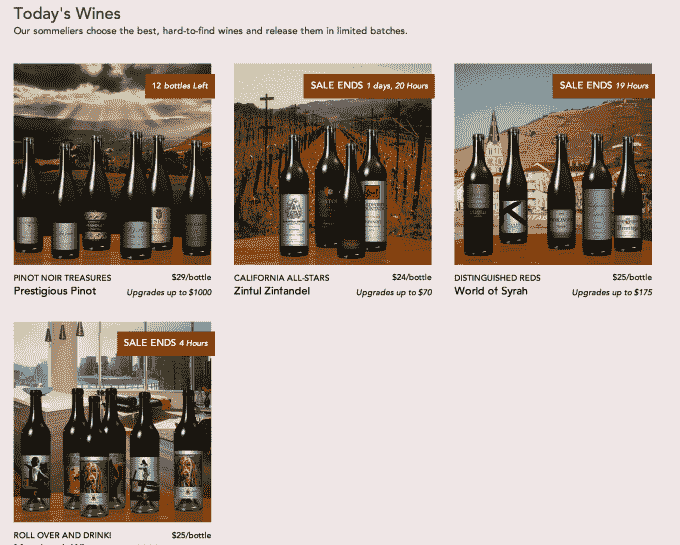
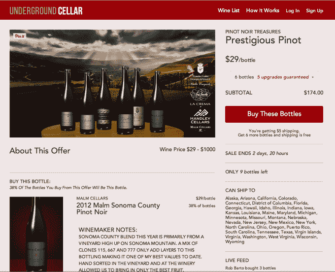
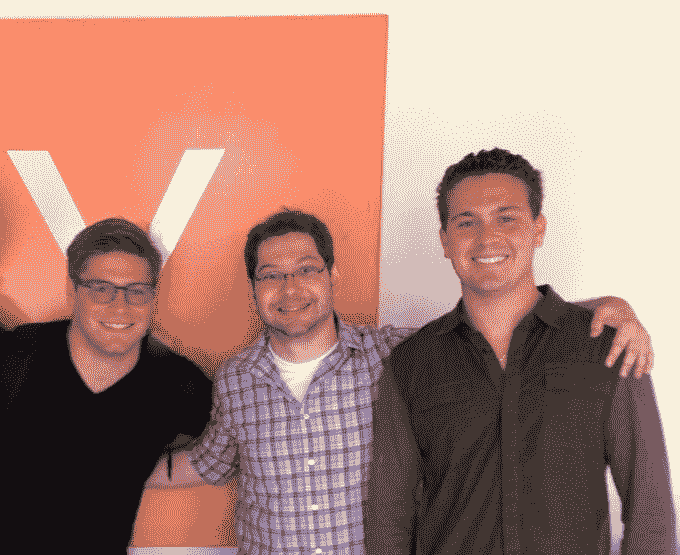

# 地下酒窖是一个购买葡萄酒的网站，免费奖励你“更好”的葡萄酒 

> 原文：<https://web.archive.org/web/https://techcrunch.com/2015/01/15/underground-cellar-is-a-wine-buying-site-that-rewards-you-with-better-bottles-for-free/>

虽然互联网并不缺乏在线购买葡萄酒的地方，但一家由 Y Combinator 支持的名为 [Underground Cellar](https://web.archive.org/web/20221209025434/https://www.undergroundcellar.com/) 的初创公司提出了一个有趣的葡萄酒销售新概念，其客户可以购买[一揽子交易](https://web.archive.org/web/20221209025434/https://www.undergroundcellar.com/home/current_offers)，其中包括随机免费升级到多家酒庄的优质、稀有和私人藏酒。这些葡萄酒可以立即运送给消费者，或者储存在地下酒窖自己的气候和温度控制的酒窖中，以便按需运送。

这家初创公司独特商业模式的想法来自杰弗里·肖(Jeffrey Shaw)，他是亚利桑那大学的校友，大学毕业后，他卖掉了自己的 ID 徽章打印业务，并开始从事后来成为地下地窖的工作，用出售所得的资金为其融资。

该网站成立于 2013 年，于当年秋天首次推出测试版，并以邀请模式运行至 2014 年 3 月。在此期间，30，000 名会员加入了地下酒窖，以发现葡萄酒和购买交易。

现在，在 Y Combinator 的演示日之前，该网站“正式”上线了。

这项服务的运作方式是，每天，网站上都有三到六种精选葡萄酒可供选择——可能是来自一个酒庄的一组葡萄酒，或者是所有葡萄酒都是同一种葡萄酒(例如黑皮诺、仙粉黛等)的集合。).消费者可以少买一瓶，也可以想买多少就买多少。然而，他们购买的越多，获得的“升级”就越多。

这些升级也在交易中出现，可能包括任何数量的优质高端葡萄酒，这些葡萄酒通常比消费者支付的价格高得多。虽然该网站根据订购的瓶子数量准确地告诉客户他们将获得多少升级，但令人惊讶的是，他们不知道列出的哪些可能的升级实际上会随订单一起发送，直到他们购买之后。

对消费者来说，吸引力在于你可以获得昂贵的优质葡萄酒，而不必支付更高的价格，但对葡萄酒厂本身来说，被宣传为“升级”可以让他们保护自己的品牌形象和当前的定价结构。

迄今为止，自首次亮相以来，地下酒窖已经与 300 多家葡萄酒厂合作，其中许多位于纳帕谷地区。该公司在网站上展示了 1000 多种不同的葡萄酒，迄今为止已经售出了价值“七位数”的葡萄酒。该网站现在还有超过 100，000 名社区成员。

Underground Cellar 商业模式的有趣之处在于，它将运输和履行变成了利润驱动力，而不是亏损主导者。酒厂给地下酒窖 20%的销售收入，外加每瓶 3 美元和每份订单 3 美元。Shaw 解释说，这给了公司在履约方面的利润空间。

“酿酒厂每年生产的葡萄酒比他们能卖出的……甚至储存的都多，”他说。

他们可能会选择以大幅折扣销售，但这可能会玷污品牌的形象，同时也训练消费者等到葡萄酒上市后再购买。尽管葡萄酒厂通过地下酒窖销售过剩库存通常能获得相同的利润，但它们喜欢这样做有助于保持自己的声誉不受损害。此外，这些交易的营销方式——有时甚至包括来自他们酒厂的额外照片和视频——给了他们曝光率，肖指出。

*(如图，从左至右:布兰登·祖查、杰弗里·肖、布莱恩·加拉格尔)*

## 储存葡萄酒的“云窖”

地下酒窖的客户还可以选择在该公司的气候控制“云窖”中免费储存多达 500 瓶葡萄酒，然后根据需要运送到他们的家中。(他们不付运费，直到把酒带回家。)该网站也鼓励他们批量发货，6 瓶 5 美元，12 瓶免费。

该公司现在在旧金山有一个十人团队，包括联合创始人布兰登·祖查、布莱恩·加拉格尔和本杰明·赫里拉。他们已经通过她的 AngelList 辛迪加从 Y Combinator 和 Shark Tank 的 Barbara Corcoran 那里筹集了 130 万美元的种子资金。

他们计划在 Y Combinator 的演示日之后再筹集 500 万美元，届时他们还将展示他们的更大愿景，包括将“升级”概念引入不同的垂直领域，包括美食、礼品卡、雪茄、体育赛事门票、时装和珠宝。

“我们的最终目标是成为 Gilt 的竞争对手，或者成为一家‘高档团购网站’，”肖说。