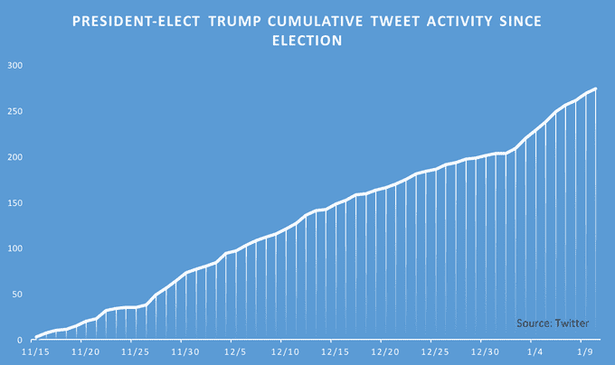
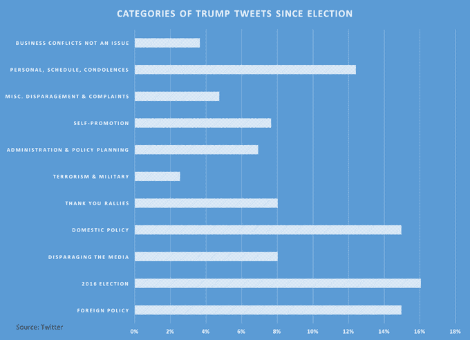
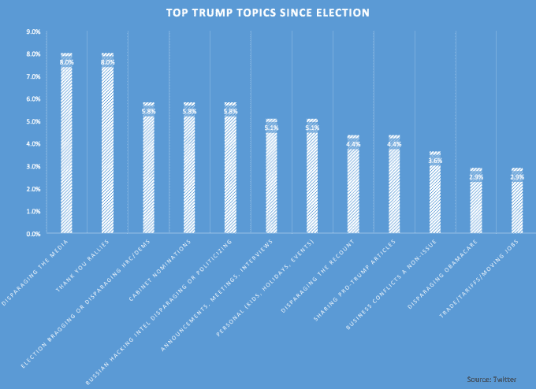

# 通过 Twitter 了解我们新总裁的工作重点 

> 原文：<https://web.archive.org/web/https://techcrunch.com/2017/01/16/understanding-our-new-presidents-priorities-through-twitter/>

肯·米勒是奥米迪亚网络公司的技术合伙人。此前，他是 PayPal 和 Intuit 的高管，也是 Square 的早期董事会顾问。

More posts by this contributor

对于当选总统唐纳德·特朗普(Donald Trump)在 11 月初获胜的原因，专家和周一早上的四分卫在过去两个月的大部分时间里都沉浸在猜测和断言的迷雾中。尽管有许多微妙的原因促使选民为特朗普拉杠杆，但我们也知道，对许多选民来说，有一些东西将他们从特朗普的首要旗帜“*让美国再次伟大*”上拉了下来。

无论是他们从信息中获得的一种普遍的高级怀旧情绪，还是信息背后吸引他们的具体子成分(如移民)，他们都愿意在这一过程中忽略很多东西。对大多数人来说，勾选他名字旁边的方框意味着相信他会着手让美国再次伟大起来。

所以带着这份信任(或许还有一丝希望？)考虑到近 6300 万选民，这位当选总统有理由充分利用就职典礼前的几个月时间，准备并宣传他在未来几天和几个月的计划，以恢复美国缺失的伟大。

一方面，可以说特朗普没有召开新闻发布会，或者在很大程度上甚至没有发布官方声明(除了上周最初的、有点奇怪和脱节的新闻发布会)，这给公众造成了一个信息和洞察力的真空，让他们不知道即将到来的计划和意图是什么——当然是相对于大多数即将上任的总统而言。但考虑到当选总统对社交媒体(特别是 Twitter)的喜爱，你可以很容易地说，与过去的美国权力移交相比，我们实际上有更多的信息和洞察力来了解他的重点在哪里，以及是什么让他晚上睡不着觉。

考虑到 11 月 8 日大选后的一周缓冲期(这是特朗普相对平静的社交媒体时期，主要是与选举有关的祝贺)，这位当选总统自 11 月 15 日以来在[推特](https://web.archive.org/web/20221215145135/https://twitter.com/realDonaldTrump)上发布了 274 次原创内容(不包括转发)。这相当于平均每天 4.8 次，相当于过去两个月中与公众沟通的数量相当可观。

许多人呼吁川普自选举以来(当然在选举之前)停止使用社交媒体[，甚至包括川普自己的员工](https://web.archive.org/web/20221215145135/https://www.washingtonpost.com/news/post-politics/wp/2016/12/14/trumps-supporters-admonish-him-for-twitter-use-but-give-him-wide-berth-to-govern/?utm_term=.763e13554ce9)[；但近 60 天后，不仅很明显退出 Twitter 不太可能，这些通信似乎成为了美国对特朗普赢得大选以来兴趣所在的主要洞察——而这个消息并不那么令人鼓舞。](https://web.archive.org/web/20221215145135/http://fortune.com/2016/11/06/trump-staff-twitter-account/)

分析当选总统的所有推特活动的内容和类别显示，在这 274 条信息中，只有 36.9%的推文讨论了可以粗略地认为属于以下类别之一的内容:行政规划、外交政策或国内政策。

特朗普剩余的 63.1%的沟通信息属于各种群体，如个人推文、自我宣传、媒体攻击、“感谢”集会、对利益冲突的投诉等等。具有讽刺意味的是，自赢得选举以来，最大的一类推文实际上是关于选举本身的推文，占所有通信的 16.1%。

鉴于特朗普的社交媒体和竞选记录，也许这种分布并不完全令人惊讶，但进一步挖掘这些类别中的个别话题，发现会变得更有说服力……至少对希望从特朗普那里听到他正在认真对待新工作、规划、学习和搭建桥梁的任何人来说。

这 11 个类别中的每一个都包含了当选总统发布的 53 个单独的话题。到目前为止，特朗普最喜欢谈论的个人话题是以某种方式贬低媒体(特别是《纽约时报》和 CNN)的通信和与他在 12 月大部分时间举行的“谢谢你”集会有关的帖子之间的统计联系。这两个话题都得到了他 8%的关注。

排在前五位的个人话题是:(3)选举吹嘘/贬低希拉里克林顿，(4)内阁提名和(5)俄罗斯黑客情报贬低或政治化。这三种邮件各占邮件总数的 5.8%。

值得注意的是，特朗普在竞选期间反复提到的关键和有问题的话题(创造就业、军事、移民和恐怖主义)在过去两个月里总共只收到了七条推文(2.6%)，这与他贬低周六夜现场、梅丽尔·斯特里普、奥巴马总统和《名利场》(2.6%)的关注量相同。

此外，可以说受到了即将上任的总统的一些不相称的关注和关注:支持普京和朱利安·阿桑奇或诋毁阿诺德·施瓦辛格和汉密尔顿的推文加起来占特朗普所有帖子的 3.6%——超过了公众对中国、朝鲜、叙利亚和联合国的沟通量的总和(只有 2.9%)。

除了特朗普最喜欢的话题(本质上往往是自私和自我推销的)，还有一些与行政或政策相关的话题经常受到关注，这或许可以暗示他在本月晚些时候接管后可能最关心的领域。排在第一位的是与组建内阁有关的推文(5.8%)，但贸易/关税/转移就业和奥巴马医改都受到了有意义的关注，各占 2.9%，这表明这两个领域可能是他 1 月 21 日的第一项工作。