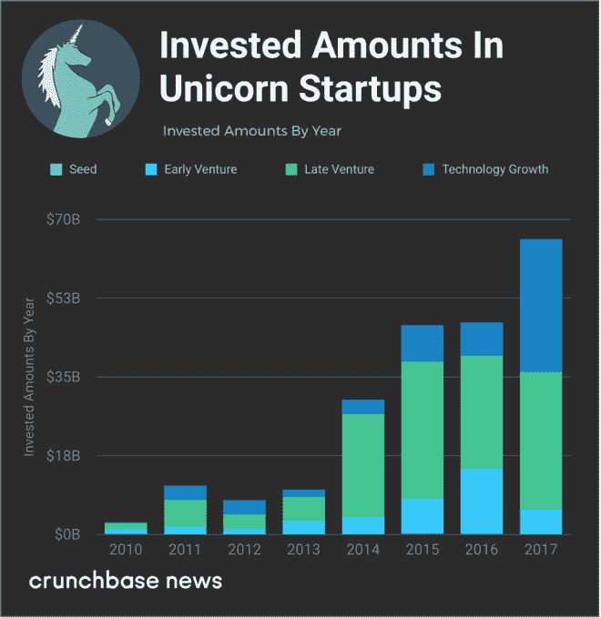
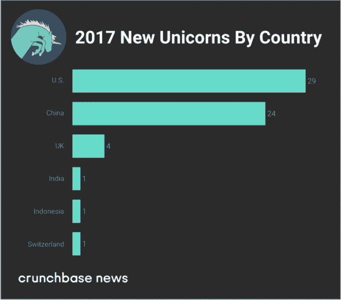
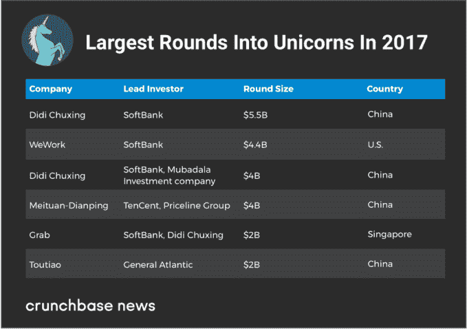
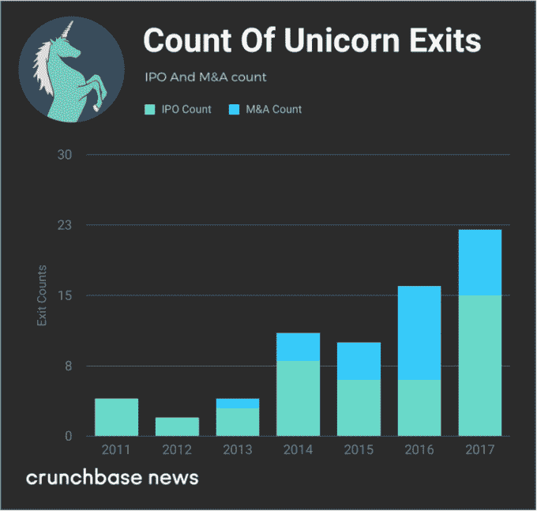
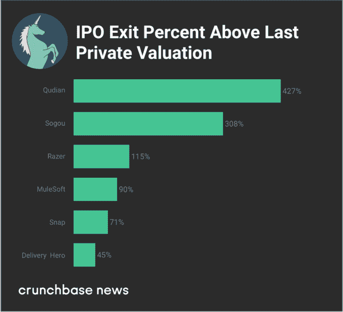

# 独角兽们狼吞虎咽，因为投资者提供了更多的资金

> 原文：<https://web.archive.org/web/https://techcrunch.com/2018/02/03/unicorns-gorge-as-investors-dish-up-bigger-rounds-more-capital/>

More posts by this contributor

乔安娜·格拉斯纳撰稿人

More posts by this contributor

投资者会在某个时间点关闭巨型独角兽融资的水龙头吗？如果是这样，我们还没有达到那个门槛。

去年，投资者向 [Crunchbase 独角兽排行榜](https://web.archive.org/web/20230326231928/https://techcrunch.com/unicorn-leaderboard/)的成员投入了创纪录的资金，这是一份估值超过 10 亿美元的私人风险投资公司名单。

根据 Crunchbase 数据的分析，全球范围内，2017 年进入独角兽公司的资金高达 660 亿美元，同比增长 39%。打车领域是投资者资金的最大接受者，该领域的几个竞争对手筹集了数十亿美元。投资者也在合作、消费互联网和增强现实领域投入了大量资金。

新人也在 2017 年首次加入了独角兽俱乐部，尽管速度比前两年略慢。2017 年全年，有 60 家新的创业公司加入了独角兽名单。相比之下，2016 年有 66 只新诞生的独角兽，2015 年有创纪录的 99 只新人。

下面，我们将分析新的和现有的独角兽的主要位置、投资资本的主要领域、退出以及影响该领域的其他一些趋势。

## 地理细分

绝大多数独角兽的总部要么在美国，要么在中国，新进入独角兽排行榜的人也是如此。

2017 年，美国和中国继续稳步创造新的独角兽。共有 29 家美国公司进行了首轮融资，估值达到或超过 10 亿美元，高于去年的 22 家。在中国，24 家新的独角兽加入了排行榜，低于 2016 年的 32 家。与此同时，欧洲和东南亚也贡献了一些独角兽。

在下面的图表中，我们看到了按国家分类的新加入者:

[新来者](https://web.archive.org/web/20230326231928/https://www.crunchbase.com/lists/new-unicorns-in-2017/f5dafe04-0421-4121-8408-8c4cf213c372/identifiers?new=false)是一个相当多样化的群体，横跨从农业科技到企业软件的各个行业，包括无成本股票购买平台 [Robinhood](https://web.archive.org/web/20230326231928/http://news.crunchbase.com/news/robinhood-brings-free-coinbases-1b-party/) ，在线教育提供商 VIPKID 和加密货币买卖平台比特币基地。

## 部门

然而，独角兽投资者对少数行业的公司表现出了特别强烈的兴趣。

尤其是拼车，这一年的融资非常强劲，该领域的公司获得了超过 10%的独角兽投资。这主要归因于 Lyft、Grab、Ola 和滴滴出行的数十亿和数十亿美元融资。

自行车共享也很大。两个新进入独角兽名单的人来自那个领域: [Ofo](https://web.archive.org/web/20230326231928/https://www.crunchbase.com/organization/ofo) 和 [Mobike](https://web.archive.org/web/20230326231928/https://www.crunchbase.com/organization/mobike) 。然而，今年晚些时候，人们开始担心消费者需求能否支撑不断膨胀的自行车供应。

即使按照独角兽的标准，其他获得大量融资的公司包括美国合作巨头 [WeWork](https://web.archive.org/web/20230326231928/http://news.crunchbase.com/news/wework-puts-cash-work-build-expansive-expensive-vision/) 和中国消费互联网公司[今日头条](https://web.archive.org/web/20230326231928/https://www.crunchbase.com/organization/toutiao)和[口碑](https://web.archive.org/web/20230326231928/https://www.crunchbase.com/organization/koubei)。

## 退出董事会

所以很多独角兽都在大轮融资。但有迹象表明，该集团的成员最终会为投资者带来回报吗？

总体而言，2017 年为独角兽退出观察人士提供了一些适度积极的消息。去年，15 家私人估值达到或超过 10 亿美元的风险投资公司上市，比 2016 年的水平高出一倍以上，也是 Crunchbase 开始跟踪该资产类别以来的最高总数。

与此同时，收购活动减弱。2017 年，有记录的涉及独角兽的 M&A 退出事件只有 7 起，低于 2016 年的 10 起。AppDynamics 是表现最好的退出公司，比上次的私人估值高出 95%。其余退出的公司，似乎都低于或等于上一次的私人估值。

在下面的图表中，我们看了过去七年独角兽的 IPO 和 M&A 数量:

独角兽 IPO 不仅在 2017 年更常见。表演通常也很好。去年许多新上市公司的市值都远高于它们上次的私人估值。根据这一指标，表现最好的包括几家中国的独角兽公司，由投资经理[趣店](https://web.archive.org/web/20230326231928/https://www.crunchbase.com/organization/qufenqi)和搜索引擎[搜狗](https://web.archive.org/web/20230326231928/https://www.crunchbase.com/organization/sogou)领衔。其他的佼佼者包括游戏硬件提供商 [Razer](https://web.archive.org/web/20230326231928/https://www.crunchbase.com/organization/razer) 和应用开发者软件提供商 [MuleSoft](https://web.archive.org/web/20230326231928/https://www.crunchbase.com/organization/mulesoft) 。

在下面的图表中，我们根据 IPO 后相对于上一次私募估值的百分比涨幅来看一些表现最佳的公司:

最近，上市似乎是投资者回报的更好选择。如果该公司股价低于上一次的私人估值，如果它扩大市场，公众股东推高股价，这个倍数可能会提高。对于 M&A 的交易，价格是固定的，晚期投资者要么已经建立了保护机制，要么在这些退出价格下亏损。

## 平均值表明未来会有更多的出口

对于已经上市的 45 家独角兽公司来说，首次估值达到 10 亿美元后，上市的平均时间是 26 个月。对于已经被收购的 25 家公司，被收购的平均时间是首次估值 10 亿美元后的 24 个月。

那么，这对于目前仍是私有企业的群体意味着什么呢？由于 263 家公司中有超过 150 家已经在独角兽排行榜上超过两年，鉴于积压的订单，我们预计退出数量将会增加。

*特别感谢管理 [Crunchbase 独角兽排行榜](https://web.archive.org/web/20230326231928/https://techcrunch.com/unicorn-leaderboard/)的[史蒂文·罗西](https://web.archive.org/web/20230326231928/https://www.crunchbase.com/person/steven-rossi)。*