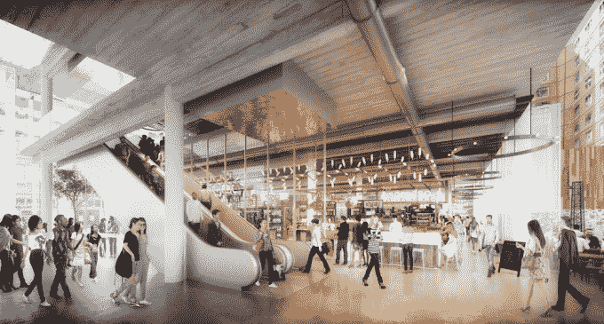

# 纽约市长比尔·白思豪展示规划中的技术中心 TechCrunch 的设计

> 原文：<https://web.archive.org/web/https://techcrunch.com/2017/02/17/union-square-tech-hub/>

# 纽约市长比尔·白思豪展示规划中的科技中心设计

纽约市长比尔·白思豪和他的团队公布了占地 25 万平方英尺的联合广场科技中心的设计方案。

该中心最早于去年 12 月[宣布](https://web.archive.org/web/20221228104716/https://techcrunch.com/2016/12/22/union-square/)，将包括 58000 平方英尺的创业“流动空间”和 36500 平方英尺的技术培训中心。(培训计划的合作伙伴包括纽约市计算机科学教育基金会、大会、Per Scholas、FedCap、Code to Work 和 Queens 联盟。)

主要租户将是[市民大厅](https://web.archive.org/web/20221228104716/http://civichall.org/)——一个有 1000 名成员的工作和活动空间，专注于创始人兼首席执行官 Andrew Rasiej 所说的“技术可以用来支持公共利益的想法”。

今天下午，白思豪在 adtech 公司纽约总部的一次活动中公布了这些设计，他还谈到了他对这个空间的希望。

在称赞纽约市的科技社区是“全国最多元化的科技社区”和“全国最具社会意识的科技社区”后，白思豪表示，该中心旨在“确保越来越多的纽约人从这个非凡的科技生态系统中受益。”

“这是为了保护民主，”他补充道，引起了热烈的掌声。“我想你能够推断出我的意思。人们热切希望确保信息和辩论的公开以及包容性的社会。我们在这个美丽的中心所做的将是其中的一部分。”

顾名思义，该中心将位于纽约的联合广场，目前由电子商店 PC Richard & Sons 占据。计划 2018 年开工，2020 年开业。