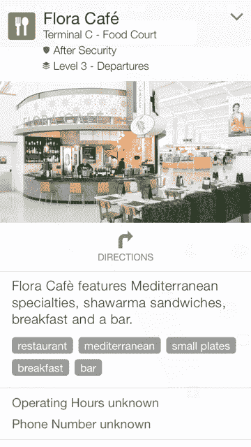
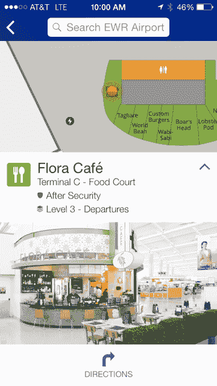
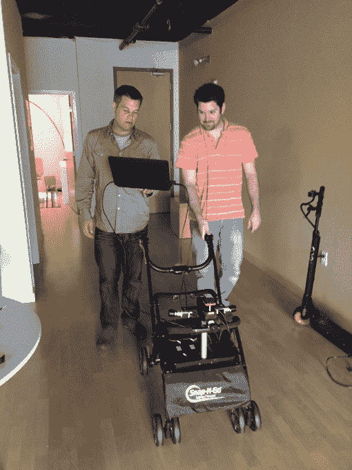
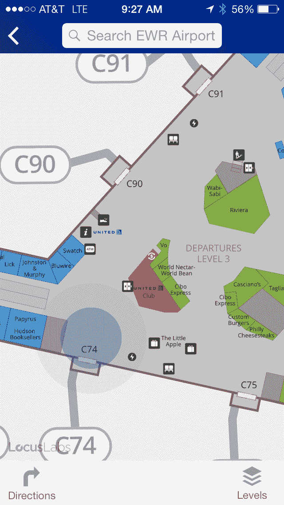

# 联合航空公司在其 iOS 应用程序 中引入了高度详细的机场地图

> 原文：<https://web.archive.org/web/http://techcrunch.com/2015/08/13/united-airlines-brings-highly-detailed-in-airport-maps-to-its-ios-app/>

无论手机地图技术变得多么先进，走进机场都会让你回到几十年前的实体地图时代。除了大型地图亭之外，没有其他非季节性旅行的方式，机场导航早就应该升级了。

作为今天晚些时候发布的新的更新应用程序的一部分，[联合航空公司](https://web.archive.org/web/20230318192448/http://www.united.com/)正在将智能室内地图技术集成到其 iOS 移动应用程序中。到目前为止，联合公司的应用程序已经被下载了 1900 多万次。具有相同功能的 Android 更新预计将于今年秋天推出。

“这是一项非常具体的技术，能够满足客户的真正需求，”联合航空电子商务规划和交付总监香农·凯利(Shannon Kelly)解释道。“我们有技术，我们有客户对它的需求。”

联合航空公司新技术和数字概念经理卡洛斯·法克斯(Carlos Faxas)解释说，这个想法源于内部对改善客户机场体验的技术的研究。“联合航空希望推动更具情境性的体验，”他说。

搜索让联合航空找到了总部位于三藩市的 [Locus Labs](https://web.archive.org/web/20230318192448/http://www.locuslabs.com/) ，这是一家为室内绘图搭建平台的公司。

Locus Labs 的首席执行官 Campbell Kennedy 解释说，该公司有机会从图片中提取信息，创建更好的地图。他以前是 DARPA 大挑战的参赛者，也是谷歌[自动驾驶汽车团队的成员。他将地图绘制过程与谷歌街景系统进行了比较。](https://web.archive.org/web/20230318192448/http://www.google.com/)

“我认为我真的从这些照片中看到了机会，全世界成千上万的照片。有价值的不仅仅是图片，还有那些图片中的元数据。”

Faxas 解释说，分析机场航站楼的高分辨率图片使 United 和 Locus Labs 能够创建非常详细的地图。“我们还可以使用地图来推导出物体和兴趣点之间的精确距离，这对用户来说真的很有帮助，”他说。“例如，我们可以告诉他们，你在纽瓦克(到你的登机口)的步行时间是 7 分钟。”

目前，地图功能将在美联航的七个国内枢纽提供。

“我们会根据你的旅行钱包来确定你的登机口，但如果你在大楼的其他地方，你可以自我识别最近的兴趣点，然后你可以搜索你的目的地，它会给你你的步行时间，”法克斯说，他解释了用户如何使用该应用程序在机场导航。“我们(甚至)试图识别自动扶梯及其位置，以帮助你在机场导航。”

图像是用肯尼迪对比的婴儿车大小版本的谷歌街景车拍摄的，配备了激光、相机和惯性测量装置。

“我们实际上在机场的公共区域推广了这个系统，”肯尼迪解释道。“我们全程拍照，我们还根据在那里收集的数据建立平面图，并将其转换为面向消费者的地图和事物数据库，不仅仅是地点，而是所有地方的事物。”

该系统被肯尼迪称为“现实捕捉系统”，有助于解决大规模收集精确位置数据的问题。

“这确实是物理世界搜索问题的症结所在。你需要大规模收集这些信息，并在适当的时候向人们展示。”

Locus Labs 的坎贝尔·肯尼迪(左)和丹·兰迪诺(右)站在他们的地图捕捉平台旁边。

**基于信标的地图引发隐私问题**

虽然联合航空公司的所有枢纽都将受益于这一基本的地图技术，但联合航空公司和 Locus labs 正在纽瓦克机场的联合航空公司航站楼开展一项试点计划，该计划使用信标技术进行更准确的定位。

“我喜欢把它想象成不是你父亲的蓝牙，”Faxas 开玩笑说，通过将信标的使用与“配对”智能手表或健身带进行比较，解决了对信标消耗电池寿命的担忧。

“我在纽瓦克机场的一个航站楼安装了信标，我们用它来为人们提供‘蓝点’和位置参考，”肯尼迪说，他还指出信标将有助于为不同的用户创造个性化的体验。

联合航空公司的纽瓦克机场正在测试信标技术。

“我可能希望给一个人不同的信息，或者不同的经历或道路，如果他们从飞机上下来去机场，或者如果他们来自街上，”他补充说。

beacon 技术的引入引发了隐私问题，并引发了对 United 和 Locus Labs 使用位置数据来跟踪用户和进行情境营销的担忧。联合航空公司的女发言人詹妮弗·多姆迅速回应了这些担忧。

“目前，我们只使用信标将它们与地图连接起来，”她说。“作为一家公司，我们的使命是让人们从 A 点到 B 点，[所以]我们不一定需要跟踪客户。

虽然联合航空公司没有计划以这种方式跟踪位置数据，但肯尼迪解释说这种能力仍然存在。

“技术基础设施是为了提供更加个性化的体验，”他说。“我们(可以)将这些位置信息与他们的行程结合起来，真正提供个性化的体验。”

“据我所知，曼联还没有必要这么做，”他保证。

Faxas 解释说，United 和 Locus labs 希望看到客户在机场使用地图的方式与在其他场景中不同。

“在机场低速行走，你有能力在没有危险的情况下改变方向，这是非常低的风险，”他解释说。“我们认为，用户基本上会调出地图，找到他们感兴趣的东西，他们会看到大致的方向，然后几乎关掉手机，走到那个大致的方向，当他们到达一个决策点和十字路口时，他们会再次打开手机。”