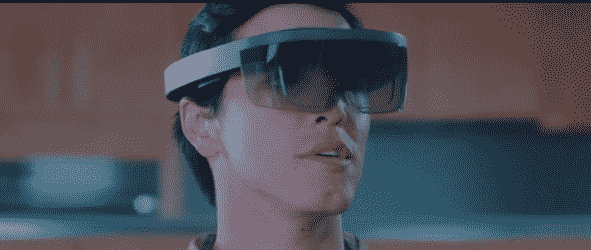
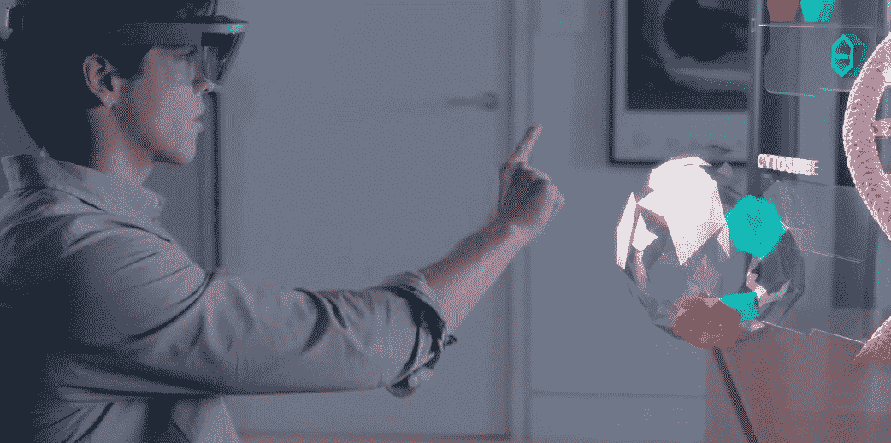

# Unity 将能够为微软的 holo lens TechCrunch 开发游戏

> 原文：<https://web.archive.org/web/https://techcrunch.com/2015/04/29/unity-will-be-able-to-build-games-for-microsofts-hololens/>

# Unity 将能够为微软的 HoloLens 开发游戏

对于那些涉足 Oculus Rift 开发的人来说，Unity 游戏引擎可以说是事实上的标准。

但这并不意味着 Unity/Rift 的关系是特别排斥的——那几乎不是 Unity 的风格。

因此，Unity 今天宣布支持一个完全不同的耳机平台:微软的疯狂全息风格的增强现实耳机 HoloLens。

Unity 是一个游戏引擎，旨在消除游戏开发中的一些痛点。你只需在 Unity 中设计一次游戏，然后只需很少的代码修改，它就可以移植到几乎任何流行的平台(iOS、Android、Windows Phone 和所有下一代游戏机)。

与此同时，HoloLens 是微软的一款看起来很疯狂的增强现实耳机，可以将高清全息图像渲染到你的环境中。它是在一月份首次宣布的，有一个可用性窗口，基本上工作到“最终”

Unity 表示，它将支持 HoloLen 的所有旗舰功能，包括空间映射(允许你检测你周围的现实世界物体并相应地渲染事物)、凝视(检测你在看/聚焦的地方)和手势/语音识别。

在你匆忙更新 Unity 之前:HoloLens 支持还没有公开。它仍然是在私人阿尔法，并没有时间表提到它可能是什么时候。鉴于 HoloLens 自己的发布日期仍然悬而未决，这是非常合理的——没有 HoloLens 进行测试，Unity 支持就没有那么有用。