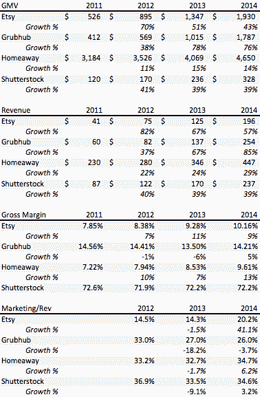
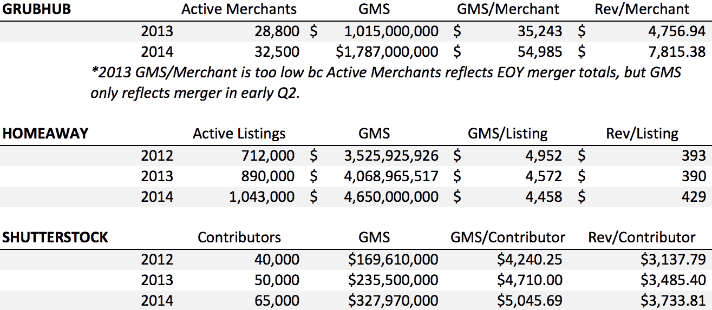
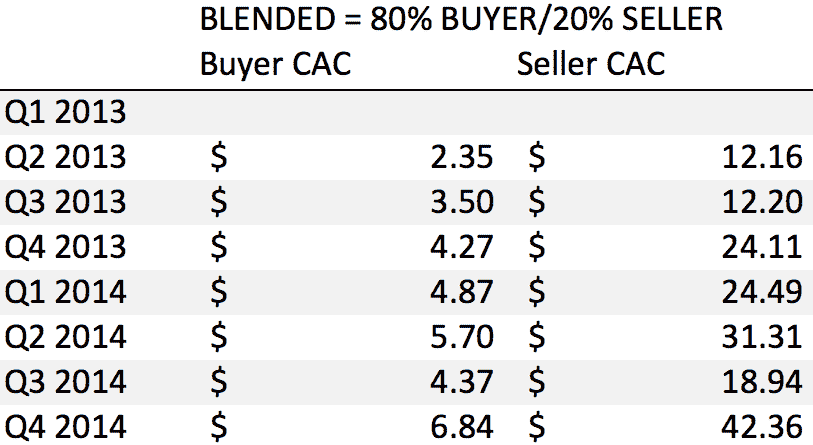
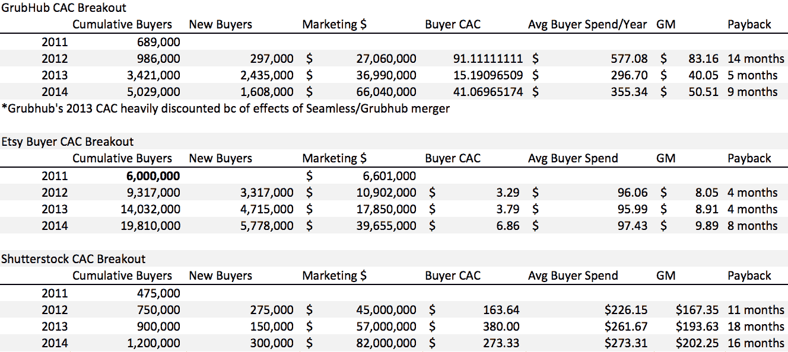
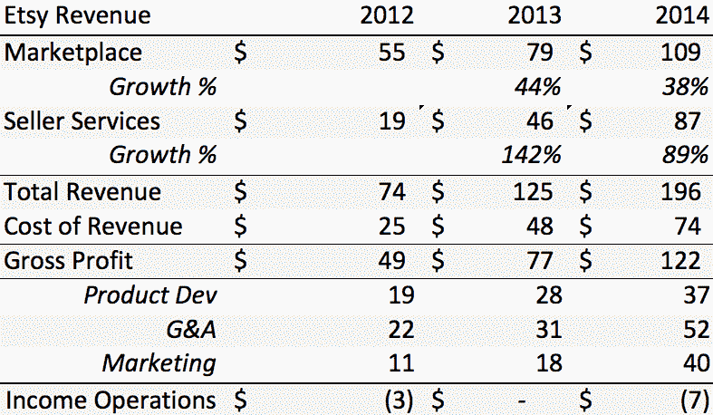

# 打开 Etsy 的 S1 

> 原文：<https://web.archive.org/web/https://techcrunch.com/2015/03/29/unpacking-etsys-s1/>

More posts by this contributor

**编者按:** *以斯拉·高尔斯顿是[芝加哥风险投资](https://web.archive.org/web/20221209033156/http://www.chicagoventures.com/)的风险投资家，也是 CardRunners Gaming 的前营销总监。他写博客* *[BreakingVC](https://web.archive.org/web/20221209033156/http://www.breakingvc.com/) 。*

作为许多数字市场的投资者( [Kapow Events](https://web.archive.org/web/20221209033156/http://www.kapowevents.com/) 、 [Spothero](https://web.archive.org/web/20221209033156/http://www.spothero.com/) 、 [Bloomnation](https://web.archive.org/web/20221209033156/http://www.bloomnation.com/) 、 [Shiftgig](https://web.archive.org/web/20221209033156/http://www.shiftgig.com/) 等等)，以及一个艺术和手工艺社区，[blissy](https://web.archive.org/web/20221209033156/http://www.blitsy.com/))我一直在急切地等待 Etsy 的 S1 申请，以便深入了解这个行业。

文件没有让人失望。Etsy 是一个强大的企业，具有非凡的网络效应。它的顾客非常忠诚，忠实的卖家收入可观。但也有合理的担忧:这是关于低利润率平台挑战的典型案例研究。此外，它还面临着严峻的挑战——增长曲线放缓，产品渠道不清晰。最重要的是，此次 IPO 正值一个转折点，Etsy 正寻求从其利基、手工业务拓展至服务更广泛的市场。

让我们开始吧。

## 估量空间

为了真正理解 Etsy，我觉得对照其他一些市场企业来评估它是很重要的:Homeaway、Shutterstock 和 GrubHub。  虽然他们不同，但他们都是自由职业者/共享/独立经济的某个方面的参与者。它们都聚集了极度分散的市场。他们也都提出了类似的主张:他们的平台最终为他们的商家扩大了总的可寻址市场和收入，尽管充当了收取费用的中间人。

首先，这里有一些高水平的统计数据，看看他们如何与 Etsy 相抗衡。请注意，Homeaway 并不报告其平台上交易的总价值，因为其大部分收入来自订阅。我试图根据几个假设来推翻这些数字。

以下是我从这一分类中得出的结论:

**增长正在放缓。**这并不令人惊讶。当然，随着规模的扩大，以同样的年/年百分比增长变得越来越困难。但特别令人担忧的是，面对 2014 年从 1800 万美元增加到 4000 万美元的一倍多的营销支出，他们的增长放缓了(或者更准确地说，按收入百分比计算，增长了 40%)。

**卖家服务至上。**过去三年，Etsy 的毛利率以每年 10%的复合增长率增长。鉴于它一直有 3.5%的佣金和 0.20 美元的上市费，显而易见的问题是这怎么可能？答:辅助服务、附加服务和产品都是针对其超级卖家的。Etsy 将其收入分为两类:市场收入(3.5%+0.20 美元/列表)和卖家服务(其他一切)。最终，要买入 Etsy，你需要相信这种以产品为中心的收入将显著增长，并推动其估值。

**非凡的网络效应。我最喜欢分析的指标之一是营销支出占收入的百分比。在这一点上，Etsy 是绝对令人信服的。从历史上看，它在百分比基础上的支出比竞争对手低 40-70 %,同时实现了与其他市场类似的增长率，如果不是更高的话。“网络效应”可能是一个时髦的术语，但 Etsy 是典范。87%的流量是直接/有机的，而 78%的购买来自回头客。他们在营销上的花费比竞争对手少很多是有原因的:他们的超级卖家代表他们推动收购。**

2014 年是一场实验吗？ Etsy 需要可信地向市场传达其 2014 年的营销努力是试验性的——这是其有史以来第一次如此快速地加大营销努力，并专注于建立自我维持的国际市场。其 S1 表明，这种增长主要是在这些外国市场的买方 SEM 收购(研究表明，传统的电视或广播广告很少)。但结果令人不安，CAC 在 2014 年几乎翻了一番。

## 网络的力量

在投资市场时，我寻找的一个决定性因素是该平台正在为双方创造可持续和有益的经济效益的证据。例如，在 [Zipments](https://web.archive.org/web/20221209033156/http://www.zipments.com/) ，许多快递员在平台上作为独立员工的收入比他们之前的快递公司高出近一倍。

另一个例子:Bloomnation 收到了一封来自花店的电子邮件:

> 我想抽出一点时间来感谢你让我成为 Bloomnation 的一员。几个月前我和你谈过。一月到二月，我真的受到了很大的打击，一直在挣扎。我很担心成为一个单身妈妈，这是我在商界的第 15 个年头。为了照顾我的儿子，我独自工作。我不知道网上销售是如何运作的。你的公司帮助我走出了我所在的红色区域，让我的商店重新焕发了活力，订单源源不断。我真的非常感谢你来我的店里订货。6 月份，我可以把儿子送进学校，这样我就可以专注于更多的业务。你帮助我重新爱上了我的生活和对花的热爱。我感到非常高兴，这就像是 1999 年我第一次开始的感觉，当时我 19 岁，在海滩上的车库里。

这种供应方效应如此重要的原因是因为幂律分布:也就是说，电力卖方将是你平台上规模的主要驱动力。虽然一次性卖家的长尾确实提供了产品广度和流动性，但超级卖家将推动他们自己的本地产品商店的销量和有机推荐。

考虑一下 Etsy 的情况(注意，Etsy 将 2011 年活跃卖家/客户定义为包括所有 2011 年活跃卖家/客户，包括 2005-2010 年间收购的卖家/客户，这些卖家/客户为大量现有超级用户自行选择):

在 S1，Etsy 提供了 2011 年买家和卖家的一瞥。在这个细分中，我们看到尽管只有 32.3%在 2011 年销售过一件商品的卖家在 2014 年仍在积极销售，但那些留在平台上的人已经发展成为真正的超级卖家——平均每个活跃卖家在该群体中获得 1.3 万美元。随着超级卖家变得越来越聪明，越来越有能力使用更好的工具，我预计他们的平均收入会继续增加。这是 Etsy 实力的最根本标志之一——卖家谋生的能力。

在买方方面，我们看到一个非常有价值的重复购买的相同模式出现:

根据我在市场中看到的情况，我的最佳猜测是，一个典型的群体(2012-2014 年)将会看到每年 80-85%左右的流失率，但该业务不是建立在一次性购买者的基础上的。电力购买者回来了，购买量同比增长 110%。公共市场需要问的一个基本问题是，市场上有多少这样的客户，Etsy 能找到接触他们的方法吗？

但总的来说，在高水平上，Etsy 已经为其卖家实现了令人印象深刻的价值最大化，尤其是与竞争对手相比。

 
这里要看的统计数据是，尽管活跃卖家在过去两年增加了 63 %,但同期每位卖家的 GMS 相应增加了 32%。这与正常的供需曲线形成鲜明对比，也进一步证明了 Etsy 的买家和卖家是最忠诚的。

相比之下，Shutterstock 的活跃贡献者在同一时期也增长了 63%，但其每名卖家的收入仅增长了 19%。的确令人印象深刻，但只是 Etsy 增长的一半。

顺便说一句，Homeaway 似乎对其房产所有者具有减速价值。但他们的业务主要是基于订阅，免费发布的房源(意味着质量较低的房产)拖累了平均水平。

然而，Etsy 和 Shutterstock 实际上也可以自由创建个人资料和销售商品——不管质量好不好。如果我是 Homeaway 的投资者，我会考虑这一点。

## 营销–CAC 和回报

从纯客户获取的角度来看，这些企业都没有像传统电子商务企业那样突破 CAC 或 LTV。也就是说，我做了一些假设来得到一个粗略的模型:

****

上面，我已经对买方或卖方的 CAC 进行了分解，假设所有的营销支出都分配给了任何一方。在这个练习中，我所做的最大假设是，我定义“新客户”的简单方法是用本期的累计买家(或卖家)减去前期的。这显然是一个糟糕的假设，因为(a)活跃账户之间的损耗和(b)休眠账户的重新激活。但是，假设(a)和(b)大致相互抵消，我们可以了解 Etsy 的营销引擎。

也就是说，实际上，Etsy 有两个客户——买家和卖家。其 S1 指出，“与 2013 年相比，2014 年的营销费用增加了 2180 万美元，即 122.2%，达到 3970 万美元，主要是由于谷歌产品列表广告的搜索引擎营销的增加”(这意味着主要是以买家为中心的收购)。如果我们假设 80%的费用在需求方(买方)，20%的费用在供应方(卖方)，情况会是这样。

总的来说，CAC 提高了所有买家和卖家的 Q/Q。虽然令人担忧，但在 Etsy 的规模下，这也是意料之中的，因为存在增量回报递减的一般规律。但是这很重要，Etsy 与 GrubHub 和 Shutterstock 相比如何:

*   引人注目的指标是 Etsy 的每位买家平均支出及其对应的每位买家毛利润有多低。Etsy 确实是唯一一家有规模的企业——他们确实有规模——但对于攻击订单规模小、利润微薄、购买频率中等的领域的其他企业来说，这是一个明显的危险信号。像这样的企业很少会最终成功——Etsy 做到了——但这是个例外:这应该是对企业家的一个警告。
*   每个客户的 GM 很重要的原因是因为客户获取非常困难(并且越来越困难)，大订单规模、大利润或高频率提供了重要的误差幅度。Etsy 在回收期方面的表现优于竞争对手，但其昂贵的 2014 年侵蚀了其回收期优势。
*   大多数营销人员会告诉你，以 Etsy 的规模来看，任何低于 12 个月的回报目标都是好的。即使收入/买家很少，它仍然远低于 12 个月。但是差距正在迅速缩小。即使它有很强的网络效应，我也不认为它的 CAC 可以显著降低。这就剩下两个选择:1)提高毛利润以增加收入/买家，或者 2)停止在增长方面的大量投资，以实现其高利润的超级用户的好处。

## 不全是那个基数

所有这些市场的共同点是不断摆脱对纯交易收入的依赖。以下是这四家公司如何看待他们的收入明细:

Etsy 有六个主要收入来源:3.5%的交易佣金；0.20 美元的刊登费和卖家服务；推广上市；直接结账；运输标签；和[销售点支付](https://web.archive.org/web/20221209033156/https://blog.etsy.com/news/2014/etsy-launches-in-person-payments-for-us-sellers/)(像广场阅读器)。

Homeaway 有三个主要收入来源:来自房产所有者的捆绑房源订阅收入，占总收入的 77%；来自按预订付费列表的 10%的交易佣金；以及各种辅助收入来源，如国家和地方广告、物业管理软件解决方案、保险产品和税务准备服务。

GrubHub 有两个主要收入来源。众所周知，它对自己的佣金结构守口如瓶，但大多数估计认为，它的基本佣金与上市有关，约为 10%，可变佣金用于优先配售。

Shutterstock 有四个主要收入来源:订阅购买套餐；按需定价，卖方获得购买价格的 20-30 %;其视频和音乐资产的许可收入；以及来自在线学习平台 SkillFeed 或云资产管理软件 WebDAM 的辅助收入。

对于这些市场中的每一个(奇怪的例外是 Homeaway ),基本交易费的重要性逐渐降低——辅助产品和服务推动了平台利润的增长。例如，这可能解释了为什么 Grubhub 如此专注于进入交付领域:大幅提升毛利率。

就 Etsy 而言，非交易收入的增长是其最强劲的增长动力。以至于他们明确强调了 S1 的增长:

在过去两年中，Etsy 的卖方服务收入几乎翻了一番，从总收入的 25%增加到 45 %,现在包括 Etsy 总销售额的整整 450 个基点。至关重要的是，这些新类别的快速增长抵消了 Etsy 核心市场毛利率的明显下降——过去两年下降了 8%——最有可能是由于对新客户的折扣[,这产生了反收入(从而收缩利润)效应](https://web.archive.org/web/20221209033156/http://abovethecrowd.com/2015/02/25/investors-beware/)。

这些卖方服务加倍重要，因为 Etsy 还包括市场交易的信用卡处理费，将其市场 GM 从 5.65%削减到有效的 3.5-4%。考虑到这一点，投资者应该问的问题是，这些补充服务的建设和运营成本有多高，它们能否继续以每年近 100%的速度增长？

尽管 2014 年收入增长了 57%，但总支出增长了 68%。令人欣慰的是，如果将营销费用从计算中剔除，年度费用仅增长了 51%。

投资者应该敦促 Etsy 更清楚地披露这些费用。去年是 Etsy 在营销方面学习的一年，我预计 2015 年的业绩和支出将会稳定下来。如果这一假设是正确的，并且如果支持卖方服务所需的费用继续成熟，Etsy 将拥有健康的资产负债表——尽管这是以高速增长为代价的。

## 手工制作不是很流行吗？

GrubHub 和 Shutterstock 都不遗余力地定义他们空间的广度——分别为 700 亿美元和 160 亿美元——Shutterstock 甚至委托撰写了一份研究报告。家庭度假租赁市场是巨大的，很容易突破一千亿大关。但 Etsy 没有提到它的市场规模——无法与艺术品和工艺品供应品(每年 300 亿美元的细分市场)相比。这种好奇反映了 Etsy 可能的致命弱点——市场并没有那么大。真的感觉是故意省略的:

> Etsy 卖家提供几十种在线零售类别的商品，包括珠宝、文具、服装、家居用品、工艺用品和古董。消费者市场研究公司欧睿(Euromonitor)估计，2013 年全球在线零售市场规模为 6950 亿美元，高于 2008 年的 2800 亿美元，年复合增长率(CAGR)为 19.9%。预计这种增长将持续下去，全球在线零售市场将成为整个零售市场的重要组成部分，到 2018 年将达到 1.5 万亿美元，这意味着 2013 年的 CAGR 将达到 16.6%。

例如，GrubHub 的市场渗透率为 2 %, Shutterstock 的市场渗透率(估计)为 2.5 %,如果 Etsy 接近其潜在市场的 10 %,这肯定可以解释为什么它的增长正在放缓，而 GrubHub 的销售总额却在加速增长。

虽然原则上珠宝、家居用品和手工艺品的市场非常庞大，但 Etsy 对手工制品的严格指导方针肯定是有限制的。这种担忧导致其在 16 个月前[对卖家指南](https://web.archive.org/web/20221209033156/http://www.bloomberg.com/bw/articles/2013-10-16/etsys-new-rules-open-doors-to-bigger-sellers)进行了重大修订，并在 9 个月前推出了 [Etsy 批发](https://web.archive.org/web/20221209033156/https://blog.etsy.com/news/2014/etsy-wholesale-launches-out-of-beta/)。即便如此，外包供应商的成功还有待验证——并对他们的总潜在市场产生真正的担忧。

作为针对较小市场的无数利基或垂直特定市场的早期投资者，进行这种市场规模练习会让我非常谨慎。我甚至可以说，任何年交易额低于 50 亿美元的空间都是不成功的。

## 打赌

如果 Etsy 今天以 20 亿美元的估值在公开市场上市(华尔街日报称[17 亿美元](https://web.archive.org/web/20221209033156/http://www.wsj.com/articles/etsy-an-online-crafts-marketplace-files-ipo-1425509562)),下面是它与同行的比较:

从收入和息税折旧及摊销前利润(EBITDA)的角度来看，Etsy 认为，相对于更成熟、增长更慢的市场，它理应获得溢价，这是公平的。但与 GrubHub 不同的是，它的增长正在减速——很快——尽管它集中精力利用高容量的批发零售商和销售点。

Etsy 的赌注是:

1.  市场最终比我们目前估计的要大，尤其是在国际上。因为大湄公河次区域的增长每年减速 15-30 %,你需要相信宏观趋势会导致消费者越来越青睐手工制品，或者他们能够吸引非手工、非手工但“仍然是精品”的买家和卖家。
2.  Etsy 可以通过其社区和网络效应的力量，通过低成本营销继续获得和培养超级用户。
3.  他们可以继续开发和推出高质量的辅助产品，绝大多数活跃卖家愿意为这些产品付费(目前有 18-36%的活跃 Etsy 卖家订阅了他们的每项卖家服务)，从而提高他们的整体毛利率。
4.  它能够构建产品并维持社区质量，同时稳定(或缩减)管理费用。
5.  他们的社区和品牌价值使他们不容易受到更多小众/垂直平台的影响，如 [Minted](https://web.archive.org/web/20221209033156/http://www.minted.com/) 或 [Dawanda](https://web.archive.org/web/20221209033156/http://en.dawanda.com/) 窃取宝贵的市场份额。

## 一些临别赠言

正如比尔·格利(Bill Gurley)明智地告诉优步的那样，一家公司避免混乱的最佳方式之一是将价格削减到实际上不可能降价的程度。这是 Etsy。与同行相比，Etsy 是买卖双方最便宜的交易市场。但这是有代价的:Etsy 只能规模化运作，因此其盈利能力依赖于非交易收入。

投资者应该相信，Etsy 的忠诚社区将在可预见的未来继续推动销售。相反，GrubHub 或 Shutterstock 的商家更有可能放弃该平台，转向成本更低的供应商。考虑到空间的大小和 GrubHub 不断增长的利润，难怪投资者如此看好下一代食品配送应用程序——post mates、Doordash 和 Sprig——既有巨大的空白空间，也有机会在价格上窃取市场份额。

如今，大多数市场初创公司都是以地理位置为中心的按需平台(优步就是典型)。尽管还没有一个产品上市(或披露详细信息)，但有几个明显的同类最佳基准已经出现:

*   **10 倍种植者:**这通常是在一年内从 1000 万美元的收入增长到 1 亿美元(Instacart、Postmates、blue pian real……优步当然完全在一个独立的轨道上)
*   **:30 天内 10 万美元:**当平台能够推出新的城市，并在第一个月内在本地化的 GMV 看到至少 10 万美元。这种新的市场类型需要与单位经济高度协调，因为物流/配送费用会阻碍原本健康的利润率。

也许是我对芝加哥的偏见，但是 GrubHub 看起来像是一个商业怪兽。是的，在我看来，它更容易受到定价混乱的影响，但它的加速增长、强劲的市场利润率、仅 2%的市场渗透率和频繁的消费确实令人印象深刻。它理应获得溢价倍数，我将在未来 12 个月密切关注。

****

**附录**

我看到一些其他文章试图将 Etsy 与易贝、阿里、Wayfair 和 Zulily 进行比较。我觉得这些比较真的都是有缺陷的。Ebay 太成熟了，比 Etsy 早成立近十年，更不用说 PayPal，而不是它的市场，是它最强的产品。阿里巴巴水平太低，无法进行准确的比较；虽然 Wayfair 和 Zulily 将买家和卖家联系起来，但它们都是以闪购为主的电子商务企业。我承认，实际的 Wayfair 平台在功能上是一个市场，[，但它的增长动力，Joss & Main](https://web.archive.org/web/20221209033156/http://gregbettinelli.com/my-wayfair-ipo-breakdown-when-an-s-1-doesnt-tell-you-everything/) ，并不符合同样的动态。

Homeaway 的绩效付费列表产生 10%的交易费。他们为超级卖家提供了各种订阅捆绑包，但我们可以假设超级卖家足够精明，能够在订阅的基础上对 10%的费用产生明显的折扣。我使用了一个滑动比例，基于他们的订阅与按效果付费列表来估计他们的毛利润。他们的毛利润也受到辅助服务的积极影响(他们自己报告)。Shutterstock 没有正式记录他们的 GMV 或毛利润，但可以通过假设他们的收入代表总交易收入，并减去他们在收入成本描述中记录的对贡献者的支出来推算。尽管这一比例约为 70 %,但由于 SkillFeed 平台和 WebDAMs 软件的收入，他们的毛利润最终会略高。

我只能假设，为了减轻与 Airbnb 的低摩擦注册/交易的相关性问题。以及增加毛利润——我估计从大约 5%到接近 10%的订阅有效。也就是说，他们的用户服务是他们相对于 Airbnb 的最大优势之一，观看这场战斗将会很有趣。

*作者注:我不是注册投资顾问，也不是公共市场专家。这篇文章不应该成为你投资决策的基础。*