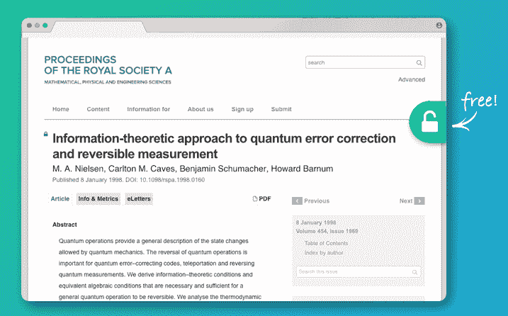

# Unpaywall 在网上搜寻科学论文的免费版本

> 原文：<https://web.archive.org/web/https://techcrunch.com/2017/04/05/unpaywall-scours-the-web-for-free-versions-of-scientific-papers/>

科学出版世界是一个复杂的世界，但钟摆目前正在从过去十年的付费大型期刊转向更开放的模式——但仍然很难在短时间内找到你需要的文章的完整副本。Unpaywall 是一个浏览器插件，它可以识别你正在寻找的论文，然后检查它是否可以在网上任何地方免费获得。

在 Firefox 或 Chrome 中安装该插件，当你到达一个总结或显示文章部分内容的页面时，会出现一个小锁图标，告诉你是否可以在其他地方免费获得该插件。例如，这张纸上的图标是灰色的(它仍然只在付费墙后面可用)，但这里的(也在 Nature)，它是绿色的。点击它会把我带到 Arxiv 上的 PDF 版本。

un path wall，应该马上注意到，它主要是一个名为 [oaDOI](https://web.archive.org/web/20230403213207/https://oadoi.org/) 的工具的接口，该工具收集和整理开放存取期刊和文章的数据库。为了确保他们的同时代人能够访问他们的工作，研究人员通常会将他们的论文提交给预印本资源库(如 Arxiv)或将其托管在他们自己的页面或大学数据库中。

两者都是由关注科学领域开放获取问题的非营利组织 Impactstory 开发的。

当然，在最终版本中，标题、格式、文件名等可能会有微小的变化。这些工具考虑到了这一点，在可能的情况下使用 DOI 数字，但也在标题和作者之间进行软匹配。

如果一篇论文有五六个作者，谁的页面或实验室会托管它？查找起来既费时又常常毫无结果，我自己也不止一次地不得不直接向研究人员索取一份拷贝。迁就好管闲事的记者不是他们的工作！所以 Unpaywall 至少对我来说是一个无价的工具。

就像[recapt](https://web.archive.org/web/20230403213207/https://free.law/recap/)一样，搜索你需要的法律文件，或者在别处找不到的情况下上传，这是一种利用网络改善访问的好方法。这比[科技中心](https://web.archive.org/web/20230403213207/https://techcrunch.com/2016/04/29/sci-hub-is-providing-science-publishers-with-their-napster-moment/)的非法但极其实用的论文盗版更少道德问题。不是所有的报纸都能在某个地方买到，但是有很多都可以买到。

[在《自然》杂志](https://web.archive.org/web/20230403213207/http://www.nature.com/news/unpaywall-finds-free-versions-of-paywalled-papers-1.21765)上指出，使用 oaDOI 和其他开放存取数据库用于各种目的的其他工具正在开发中。正如我所说，钟摆正在向那个方向摆动，而《自然》是需要走在前面的出版巨头之一。