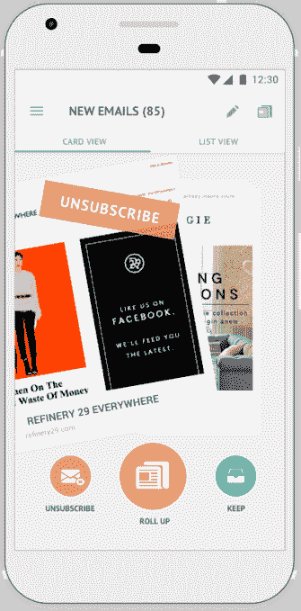

# 展开。Me 将其电子邮件管理应用程序引入 Android 

> 原文：<https://web.archive.org/web/https://techcrunch.com/2017/10/31/unroll-me-android/>

# 展开。Me 将其电子邮件管理应用程序引入安卓系统

Android 用户现在可以使用来自[的新 Android 应用](https://web.archive.org/web/20230327065253/https://unroll.me/app/)来对抗垃圾邮件和管理他们的电子邮件订阅。我。

需要说明的是，任何拥有智能手机的人都已经可以享受这项服务的好处了。你只需要连接你的电子邮件帐户，然后使用展开。Me 的功能是退订你不想要的电子邮件，并将其余邮件汇总成一份每日摘要。

然而，首席执行官 Jojo Hedaya 听起来对他的团队的应用程序界面特别自豪——首先在 iOS 上发布，现在在 Android 上发布。这个想法是把管理你的订阅变成一个有趣的 Tinder 风格的交互，向左滑动取消订阅，向上滑动将时事通讯添加到你的每日汇总中，向右滑动将它保留在你的收件箱中。

“我很有信心，这是从你的收件箱中清除杂物的最好方法，”赫达亚说。

大多数人真的有足够的订阅量来刷很多东西吗？好吧，展开。Me 表示，平均每个用户的注册订阅数超过 62 个。除了滑动之外，该应用程序还允许您管理所有订阅的列表，并阅读您的汇总。

虽然你可以在应用程序中完成很多事情，但 Hedaya 强调说，他并没有试图取代传统的电子邮件客户端。

“在我看来，过去解决电子邮件客户端游戏的尝试达到了 75%，”他说。“我想确保我们有一个单独的解决方案，可以帮助您处理混乱的电子邮件。”

比如展开。Me 的其他服务，Android 应用程序是免费的——该公司由 Rakuten/Slice 所有，并从用户数据中赚钱。(那个[展开了。今年早些时候，我陷入了困境](https://web.archive.org/web/20230327065253/https://www.nytimes.com/2017/04/24/technology/personal-data-firm-slice-unroll-me-backlash-uber.html?_r=0)，作为回应， [Hedaya 发誓要更加透明](https://web.archive.org/web/20230327065253/http://blog.unroll.me/we-can-do-better/)。)