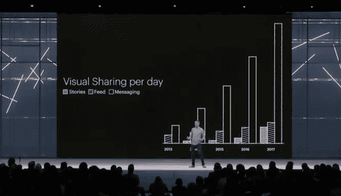
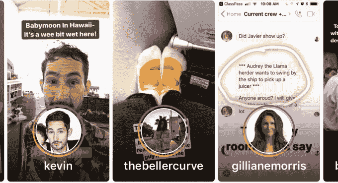
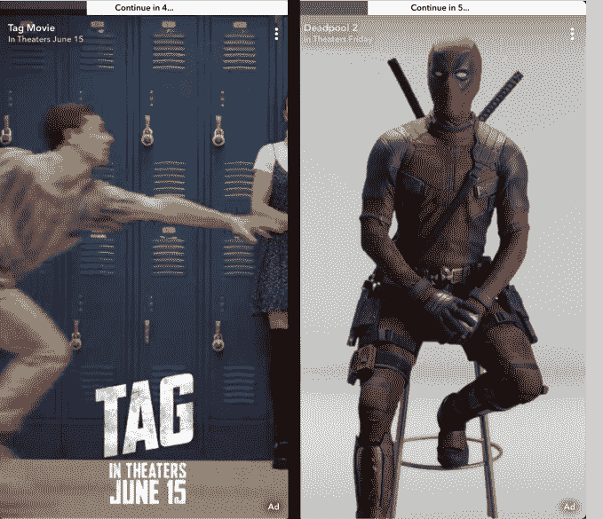
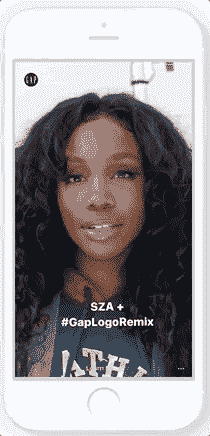

# 为什么不可错过的故事广告可以重振脸书

> 原文：<https://web.archive.org/web/https://techcrunch.com/2018/07/27/unskippable-stories-ads/>

准备迎接不可避免的入侵。如果 Stories 社交媒体幻灯片格式是移动电视的未来，它将以商业广告结束。用户不会喜欢它们。如果做错了，他们会缠着人们不要花太多时间去观察朋友们每天都在做什么。但脸书及其应用程序家族不可能让我们在过去的故事广告出现在我们的屏幕上后的一瞬间快进。

我们正处于向故事转变的尖端。脸书估计，在 2019 年的某个时候，在社交媒体应用中，[分享故事将超过](https://web.archive.org/web/20230401110002/https://techcrunch.com/2018/05/02/stories-are-about-to-surpass-feed-sharing-now-what/)通过 feeds 分享。一个很大的原因是他们不需要太多的思考来创造。拿起你的手机，拍摄一张照片或一个短视频，你就能立即获得身临其境、引人注目的全屏内容。你从来不需要思考。

2018 年 F8 的脸书 CPO Chris Cox 绘制了故事的崛起，这些故事将在 2019 年超越 feed 共享

不像文本，需要预先思考，这可能会让一些人望而生畏，故事是指向和拍摄。他们甚至不需要标题。当然，如果你机智或者有艺术天赋，你可以用各种评论和创意来点缀它们。它们可以成为你向外界表达内心独白的一种方式。但是，制作一个故事所需要的基本努力可能比分享一个状态更新要少。这帮助 Stories 在脸书的应用程序和 Snapchat 上的日用户数飙升至 13 亿以上。

至少对脸书来说，问题是用状态式广告赚钱要简单得多。这些广告表面上是老派的标语，但却推动了脸书收入的增长，每个季度获得 130 亿美元的收入和 50 亿美元的利润。文本，小照片和链接。经过 20 多年的实践，广告商已经习惯了这些广告。即使预算紧张的小企业也可以制作这些广告。用户至少需要一秒钟的时间来浏览它们——足够让它们偶尔有效地植入品牌或吸引点击。

故事和故事广告是完全不同的。他们至少需要大而诱人的照片，或者最好是持续 5 到 15 秒的时尚视频。对于广告商来说，这是一个巨大的创造性飞跃，尤其是那些自己很难拍摄出精美内容的小企业。用户通常需要向上滑动或点击故事广告的一小部分才能点击进入，而不是显示链接的展开预览。

故事本来就是可以跳过的。用户已经学会快速点击，一张接一张地浏览朋友的故事，尤其是在浏览那些帖子太多或来自更远熟人的帖子时。人们在无聊的时候会很快扣动扳机，尤其是在有广告的时候。

一种新型的广告盲出现了。当我们滚动过去的时候，我们的眼睛不是呆滞的，而是紧张地盯着，寻找一些不值得我们浪费时间和应该跳过的最轻微的暗示。一个品牌名称，“赞助”标签，做作的产品照片或任何看起来不合群的东西都会让我们立即点击过去。

这就是为什么脸书·首席运营官·雪莉·桑德伯格在残酷的收益电话会议上,承认“问题是，这会和新闻一样赚钱吗?”时吓坏了投资者。我们真的不知道。”这是一种全新的形式，广告商需要时间来适应和完善。过去一年，脸书一直警告称，随着新闻供稿广告库存告罄，收入增长将会放缓，但它从未强调过这种危险是什么:故事。这导致了创纪录的 1200 亿美元的股价下跌。

对脸书来说，从新闻供稿广告到故事广告的转变将是比桌面广告到移动广告更大的转变。Feed 广告看起来和效果都一样，只是它们周围的屏幕发生了变化。故事广告是一个全新的领域。

## 故事广告是比网络到移动更大的转变

有一种常见的广告形式让人想起:电视广告。在 TiVo 和 DVR 时代之前，你必须耐着性子看完广告，才能获得下一个热门内容。我相信故事最终也会如此，为脸书带来数十亿美元的收入。

Snapchat 被脸书的竞争逼得走投无路，迫切希望避免再次错过收入预期。因此，本周，[向另外 100 家广告商推出了](https://web.archive.org/web/20230401110002/http://adage.com/article/digital/snapchat-opens-private-ad-marketplace-discover-shows/314373/)不可抓取的垂直视频广告，实际上称之为“商业广告”,买家很快就可以自助购买。Snap first [在 5 月份推出了](https://web.archive.org/web/20230401110002/http://adage.com/article/digital/snapchat-starts-showing-ads-viewers-skip/313509/)，尽管 6 秒钟的宣传片仍然只插入到其较长形式的几分钟优质节目中，而不是用户生成的故事。Snap 发言人表示，他们无法对未来的计划发表评论。但我预计它的立场将不可避免地改变。《老友记》的故事非常有趣，足以迫使人们观看整个广告，所以这个平台可以让我们观看。

Snapchat 已经绝望了，这就是为什么它已经开始在不可抓取的广告上工作了。如果脸书的 Instagram 和 WhatsApp 等应用与 Snapchat 陷入激烈竞争，我认为我们会看到更多的边缘政策。双方都希望对方先展示不可错过的广告，这样对方就能试图偷走他们愤怒的用户。

但脸书在很大程度上击败了 Snapchat，后者的用户增长大幅下滑。Snapchat 拥有 1.91 亿日常用户，但脸书故事有 1.5 亿，Messenger Stories 有 7000 万，Instagram Stories 有 4 亿，WhatsApp Stories(称为 Status)以 4.5 亿领先。世界各地大多数人的朋友都不会在 Snapchat 上发布故事，所以脸书不会冒险用过于激进的广告将用户推向那里，或许美国青少年除外。

Instagram 的三张幻灯片故事轮播广告

这就是为什么我预计我们将很快看到脸书开始测试不可错过的故事广告。一开始可能会有很高的上限，大概每个用户每天一到三次。早在 2014 年，脸书就采取了类似的方式慢慢推出自动播放视频新闻广告。脸书的应用程序可能只会在一个朋友的故事之后，下一个朋友的故事之前显示，介于两者之间，而不是可怕的前卷。Instagram 已经提供了多达三张幻灯片的 [carousel Stories 广告](https://web.archive.org/web/20230401110002/https://techcrunch.com/2018/02/01/instagrams-carousel-ad-format-is-coming-to-instagram-stories/)，而不是一张，所以用户必须点击三次才能跳过它们。

Instagram 的一位发言人告诉我，他们“目前没有计划分享”不可错过的广告，脸书的一位发言人说，“我们没有任何计划在脸书或 Instagram 上测试不可错过的故事广告。”但是计划可以改变。Snap 发言人指出，与完整的 30 秒电视广告不同，Snapchat 的商业广告长达 6 秒，这符合移动视频广告的新兴行业趋势。百威啤酒最近制作了一些六秒钟的在线广告，也在电视上播放，显示了这种格式的可重用性，可以加快采用速度。对于不寻求当场购买的品牌广告主来说，他们需要时间来留下印象。

通过让一些故事广告不可抓取，脸书的应用程序可以收取更多费用，同时让它们对广告商更有影响力。这也将减少企业的创作压力，因为他们不会被迫让第一瞬间变得如此短暂，以至于人们不会快进。使用不可错过的广告也可以刺激人们在未来为[假设的无广告脸书高级订阅](https://web.archive.org/web/20230401110002/https://techcrunch.com/2018/04/15/would-it-make-us-love-or-hate-ads/)付费。

如果脸书让故事广告形式发挥作用，它将拥有一个光明的未来，与股价暴跌带来的末日氛围形成鲜明对比。脸书的应用程序中的重复故事用户数量超过了 5X，超过了最接近的竞争对手 Snapchat。这个社交巨人看到图书馆里每天都有大量的故事等着被货币化。