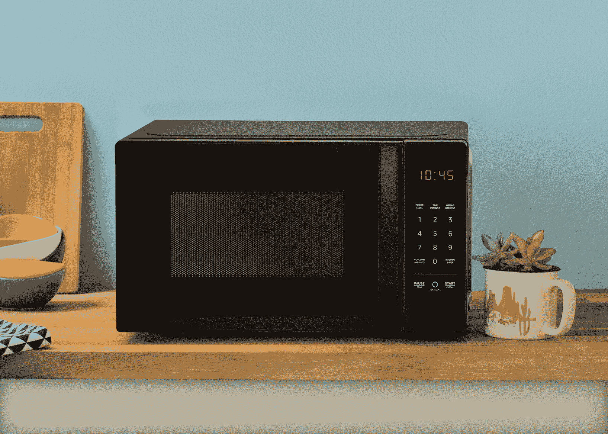
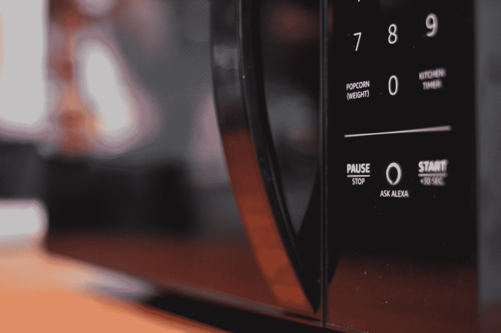

# 近距离接触亚马逊售价 60 美元的 Alexa 微波炉 

> 原文：<https://web.archive.org/web/https://techcrunch.com/2018/09/20/up-close-with-amazons-60-alexa-microwave/>

# 近距离接触亚马逊 60 美元的 Alexa 微波炉

在今天的活动中，亚马逊很快指出，并没有为 21 世纪的微波炉做太多的更新。虽然这可能是对无处不在的家用电器的相当公平的批评，但新的 [AmazonBasics 微波炉](https://web.archive.org/web/20221025222356/https://techcrunch.com/2018/09/20/amazon-launches-an-alexa-microwave-with-built-in-popcorn-dash-button/)与其说是关于太空时代的技术，不如说是帮助开创了 Alexa 在厨房的未来。

和去年的 Echo 按钮一样，该公司表示，该产品最初是作为内部参考设计推出的。换句话说，该公司并没有打算为消费者制造微波炉。相反，它似乎对自己的成果非常满意，以其低成本的 AmazonBasics 产品线将该产品推向市场。

这里最后一点很重要。毕竟，这是一个 60 美元的产品。这是一个便宜的微波炉，缺乏许多高端设备上的便利，所以如果你正在为你新改造的厨房寻找一个新奇的东西，我很抱歉马里奥，但你的微波炉在另一个城堡里。

这款新设备更注重便利性，该公司在产品中直接内置了一个爆米花按钮就证明了这一点。一名代表在舞台上说，“笑是没关系的，”他承认整件事完全是荒谬的。但是，嘿，如果你打算将商业直接整合到你的微波炉中，爆米花可能是一个不错的起点。

该产品确实需要亚马逊做一些花哨的后端工作。事实证明，很难设计出一款能与 Wi-Fi 信号和谐相处的微波炉。有道理，但如果你不在通用电气工作，这可能不是你真正考虑过的事情。所有这些都很重要，因为尽管有一个“询问 Alexa”按钮，但微波炉需要一个 Echo 或其他外部硬件产品来将助手带到设备上。

总而言之，微波炉，嗯，只是微波炉。它延续了该公司将低成本产品推向市场的趋势，作为一种亏损领导者/参考设计，以推动第三方开发自己的硬件。

*点击查看我们对此次活动[的全面报道。](https://web.archive.org/web/20221025222356/https://techcrunch.com/tag/amazon-hardware-event-2018/)*