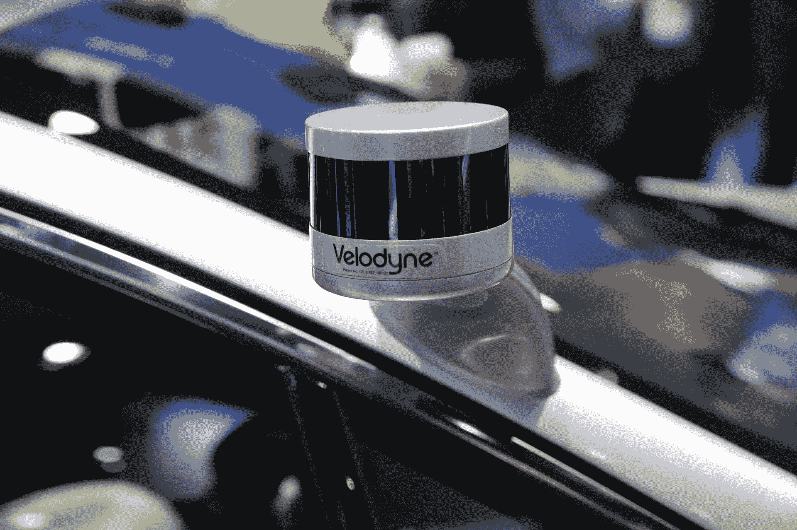

# 近距离接触福特全新自主开发 Fusion 混合动力车 

> 原文：<https://web.archive.org/web/https://techcrunch.com/2017/01/06/up-close-with-fords-new-autonomous-development-fusion-hybrid-car/>

福特宣布更新

[Fusion Hybrid development vehicle](https://web.archive.org/web/20221006041854/https://beta.techcrunch.com/2016/12/28/fords-newest-self-driving-test-cars-have-more-compute-power-and-better-vision/)

在 12 月下旬进行自动驾驶测试，该车在今年的 CES 上展出。新车辆既包括基础融合车辆中的新平台，也包括新的虚拟驾驶员系统，该系统涵盖了布置在汽车周围的传感器，传感器融合系统将汽车收集的所有数据合并到一张道路图片中以进行路线规划，以及车辆中的新计算堆栈以处理实际驾驶任务。

我有机会在 CES 展会上参观了这款车，并与福特首席执行官马克·菲尔兹谈论了这款新的测试车。Fields 指出，这款车改进了传感器，包括更好的摄像头，前、侧和后摄像头集成到车顶行李架上，设计看起来更像你在路上看到的普通汽车。

[gallery ids="1435537，1435538，1435539，1435540，1435541，1435542，1435543，1435544，1435545"]

新的测试车辆也有两个激光雷达传感器，而上一个版本有两个，这些实际上提高了车辆周围 200 米的更长传感范围。两个激光雷达传感器固定在车辆的 a 柱上，由于它们突出的支撑杆，看起来有点像虫子。这是少数几个真正明显的外部标志之一(除了徽章)，揭示了汽车的目的，但它是一个很大的进步，在显而易见的技术与旧车辆相比。

这些激光雷达装置也在技术上得到改进；它们是威力登的固态混合 Ultra Puck 激光雷达装置，可以看到上一代产品两倍的范围。这很重要，因为这意味着车辆的虚拟驾驶员有更多的决策时间；更大的感应范围意味着有更多的时间发现问题并采取措施避免问题。

菲尔兹表示，随着时间的推移，他预计这种设计在明显的传感器放置方面会变得更加无害，但他拒绝给我任何关于自动共乘车队最终车辆设计的线索。

这款 Fusion 混合动力测试车将于本月开始上路，车队将在密歇根州、加利福尼亚州和非洲的公共道路上进行测试，并在密歇根大学的 Mcity 自动驾驶汽车测试设施中进行测试，该设施模拟了一系列真实的驾驶条件。