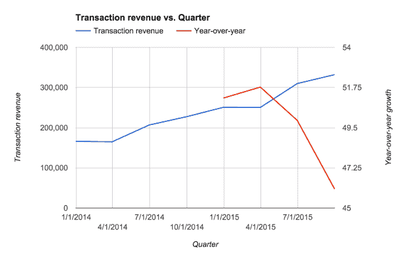

# 最新的 Square 财务数据显示，第三季度收入 3.322 亿美元，亏损 5390 万美元 

> 原文：<https://web.archive.org/web/https://techcrunch.com/2015/10/26/updated-square-financials-show-q3-revenue-of-332-2m-53-9m-in-losses/>

Square 今天向美国证券交易委员会提交了一份更新文件，显示今年第三季度收入增长放缓，净亏损扩大。

该公司报告净亏损约 5400 万美元，第三季度星巴克的交易成本约为 4100 万美元。该公司今年第三季度的交易收入约为 2.81 亿美元，本季度的净收入为 3.32 亿美元。上一季度，该公司净营收为 2.27 亿美元，净亏损为 3770 万美元。

然而，这显示的是交易收入增长放缓——随着该公司准备上市，这对投资者来说不一定是最强的信号。话说回来，随着公司的增长，它们的收入增长将继续放缓。但鉴于 First Data IPO 的疲软，IPO 市场有点不稳定，这可能足以对该公司的首次公开发行产生实质性影响。

最初，[从公司的第一份申报文件](https://web.archive.org/web/20221007021052/https://beta.techcrunch.com/2015/10/14/square-files-for-ipo-on-560-6m-in-half-year-revenue-slim-77-6m-loss/#.v3io1o:dnKj)来看，Square 的财务表现看起来*并没有*那么糟糕:2015 年上半年，它的收入为 5.606 亿美元，亏损 7760 万美元。在一年前的六个月中，它的收入为 3.719 亿美元，亏损略高，为 7，940 万美元。

该公司最近一个季度的运营支出增速超过了收入增速。经营成本的增加导致 Square 在报告期内出现了最高的 GAAP 净亏损，可追溯到 2013 年第四季度。事实上，该公司在第三个日历季度的净亏损几乎是第二季度赤字的两倍——Square 的业务具有很强的季节性，但这种差距可能会吓到投资者，他们对那些承诺以现金为代价实现高增长的公司变得更加警惕。

在调整后的 EBITDA 基础上——投资者可能会在该公司的 IPO 中注意这一点——Square 再次下跌，在上一季度实现 85.9 万美元的收益后，亏损 1580 万美元。这也比去年同期更糟糕，当时该公司公布的 EBITDA 为负 1300 万美元。

公司的营业费用也持续扩大。Square 表示，第三季度运营支出为 1.485 亿美元，去年同期为 9，710 万美元。

Square 是最受期待的 IPO 之一，原因有两个，其中之一是其首席执行官杰克·多西基本上在运营两家公司——Square 和 Twitter。最近几周，多尔西向 Twitter 员工返还了股份，据透露，他拥有 Square 超过 20%的股份，如果该公司作为一家上市公司表现良好，他仍然会有一大笔财富。

另一个小提示([由福布斯](https://web.archive.org/web/20221007021052/http://www.forbes.com/sites/miguelhelft/2015/10/26/khosla-steps-off-square-board-as-revenue-climbs-46-in-q3/)发现):维诺德·科斯拉已经选择从 Square 董事会辞职。

> 科斯拉先生此前曾表示，他希望在我们首次公开募股之前辞去我们董事会的职务，这与他声明不在上市公司董事会任职的意愿一致，并且他已经从我们的董事会提出辞呈，自与本次募股相关的注册声明生效之日起生效。他仍将是董事会的顾问。

我们现在正在筛选文件，并将在*发布更多信息后更新这篇文章。*