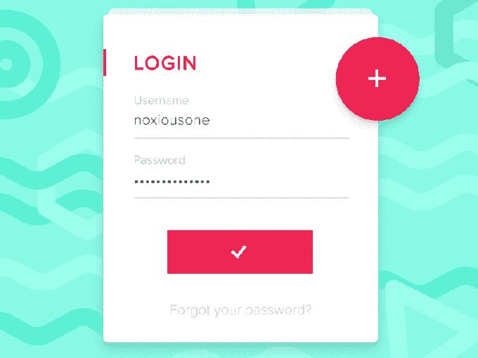
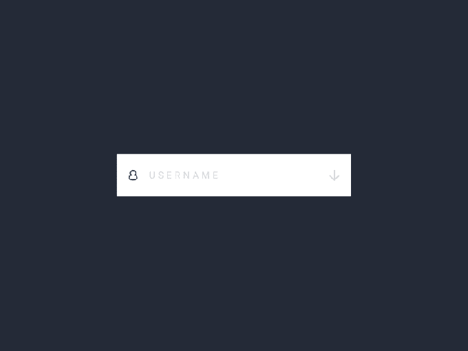

# UpLabs 认为设计师和开发人员应该多出去逛逛

> 原文：<https://web.archive.org/web/https://techcrunch.com/2016/03/07/uplabs-thinks-designers-and-developers-should-hang-out-more/>

UpLabs 是一个社区驱动的市场，让设计者和开发者共享现成的 UI 资源——如登录框和支付表单——来构建应用和网站。

创始人 Matt Aussaguel 和 Guillemette Dejean 来自法国，在进入 Y Combinator 的 2016 年冬季班后移居美国。

他们一直认为现有的社区隔离了设计师和开发人员，使他们无法有效工作，当他们合作并理解彼此的限制时，漂亮的产品就诞生了。

Aussaguel 指出，如果你呆在一个像 Dribbble 这样的设计师社区中，你会看到许多不可能——或者至少难以置信地难以——从开发者的角度实现的模型。另一方面，开发者可以更专注于他们正在构建的东西，而不是应用程序或网站的视觉吸引力。

UpLabs 希望成为开发者学习更多设计知识和购买交互式原型的资源。在 UpLabs 社区中，设计师和开发人员可以从彼此那里获得关于实时概念的反馈，也可以买卖他们的原型。

那么，它是如何工作的呢？

UpLabs 为[网站](https://web.archive.org/web/20230323014826/http://www.site.uplabs.com/)、 [iOS 和 OS X](https://web.archive.org/web/20230323014826/http://www.ios.uplabs.com/) 以及[材料设计](https://web.archive.org/web/20230323014826/http://www.materialup.com/)管理资源，提供用户界面、实验、开源应用、库和即用型产品。

这有点像开发人员的产品搜索——只不过 UpLabs 不是展示初创公司，而是将焦点放在最好的材料设计例子上，并在网站上出售。

这里有几个登录框设计的例子。

[编码原型中的示例#1。](https://web.archive.org/web/20230323014826/http://www.materialup.com/posts/material-compact-login-animation)

例 2 [编码原型。](https://web.archive.org/web/20230323014826/http://www.site.uplabs.com/posts/3d-sign-up)

UpLabs 最初并不是一个市场。这个想法诞生于 2014 年 12 月，当时 Aussaguel 创建了一个网站，每天列出一个特殊的材料设计示例。在设计社区的热情反馈和 Google 的支持之后，UpLabs 开始帮助设计师和开发者展示他们的作品。

将产品推向市场是合乎逻辑的下一步。现在，该网站每天展示 20-25 个设计，每月有超过 100 万个搜索请求，主要是为了解决特定的 UI 挑战，如登录框、支付表单或导航标签。UpLabs 拥有大约 6 万名用户。Aussaguel 估计，UpLabs 由 60%的设计师和 40%的开发人员组成。

他们面临的主要挑战之一是保持高质量。

由于无缝提交流程和谷歌的宣传，该网站获得了大量的提交。一个经过验证的用户提交系统让二人组的策展变得更加容易。当帖子从社区获得足够多的支持票时，用户将被授予一个经过验证的个人资料，允许他们直接上传到 showcase，而不必经过审查。

UpLabs 团队也希望将设计师和开发人员线下联系起来，并在欧洲组织了一系列会议。聚会邀请了谷歌设计社区的知名人士，并邀请了谷歌福音传道者[尼克·布彻](https://web.archive.org/web/20230323014826/https://plus.google.com/+NickButcher)等演讲者。

“如果你想成为一名优秀的设计师，你应该和更多的开发人员交往，反之亦然，”Aussaguel 告诉我。"如果你能记住这一点，你就会处于有利地位。"