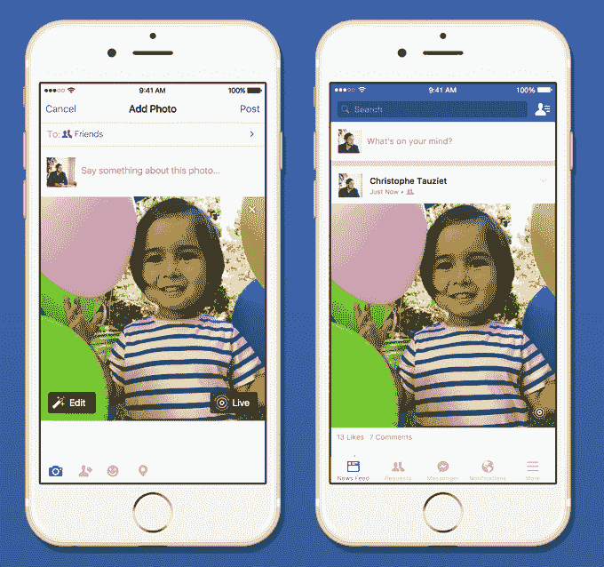
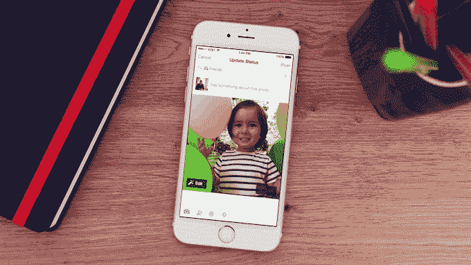

# 脸书开始支持苹果的实时照片 

> 原文：<https://web.archive.org/web/https://techcrunch.com/2015/12/21/upload-live-photo-facebook/>

距离苹果公司推出 iPhone 6s 的“实时照片”还不到 3 个月，大型第三方正在缓慢但稳步地寻找整合它们的方法。Tumblr 就在几天前……现在现场照片得到了最大的照片分享巨头脸书的支持。

从今天早上的更新开始，脸书推出了在他们的 iOS 应用中上传和查看实时照片的功能。

有一个问题:因为现场照片仍然是相当新的，脸书不会一下子向所有人提供支持。虽然有些人会看到他们早在今天早上就开始出现在他们的饲料中，但许多人直到新年才会看到他们。

上传实时照片与上传标准静态照片非常相似——事实上，除了多一个步骤之外，两者都是*相同的*。当从你的相机胶卷上传照片时，一个“实时”框出现在右下角；点击它，它会上传为实时照片。别敲了，只有蒸馏器上升。

对于每张实时照片，你都必须手动点击这个框，这是有充分理由的:一旦在你的 iPhone 上启用了这个功能，你就可以很少甚至根本不用考虑就能创建实时照片。人们很容易忘记这个功能已经打开了。事实上，现场照片包括你按下快门之前/之后的 1.5 秒视频*和*音频，很容易想象你无意中捕捉到一些你……可能不想公开的东西。通过选择每张照片，你就不太可能不小心上传了你忘记放在那里的东西。

一旦进入 feed，实时照片将默认显示为静态图像，就像照片一直显示的那样。然而，在每一个的右下角，将会有一组同心圆——苹果公司用来指示相机用户界面中“实时照片”切换的同一图标(见最右上角的图片示例)。按住任何带有这些圆圈的照片，实时照片就会开始播放。抬起你的大拇指，它会变回静止状态。

目前只有 iPhone 6s 和 6s Plus 可以捕捉实时照片，但在脸书的情况下，任何运行 iOS 9 的设备(因此任何与 iPhone 4S 一样旧的设备)都可以查看这些照片。

说一句“LOL，用声音移动照片，很容易把现场照片一笔勾销。那不叫视频吗？”。这没有错！但这也不是全部。

当你说“视频”时，大多数人会联想到一些需要额外思考、取景和努力的东西。如果一个视频长 3 秒，感觉像是意外。现场照片更像是一个*奖励*——一些被动创造的东西，没有额外的努力。你仍然可以得到你精心排列的静止照片…但是现在有了一点额外的潜力。大多数时候，现场照片最终会变得愚蠢或模糊……但有时——只是有时——它们捕捉到了一些精彩的东西。