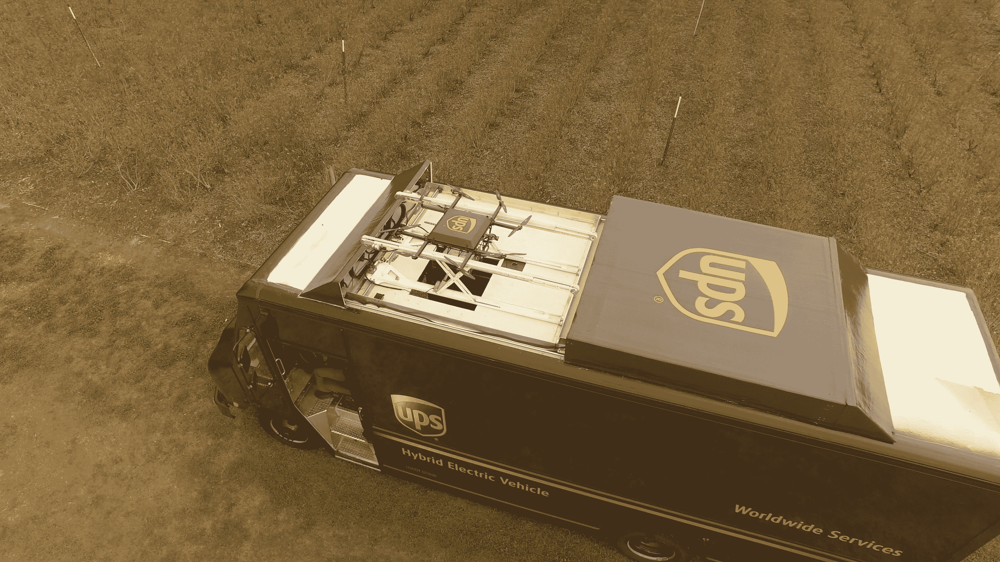
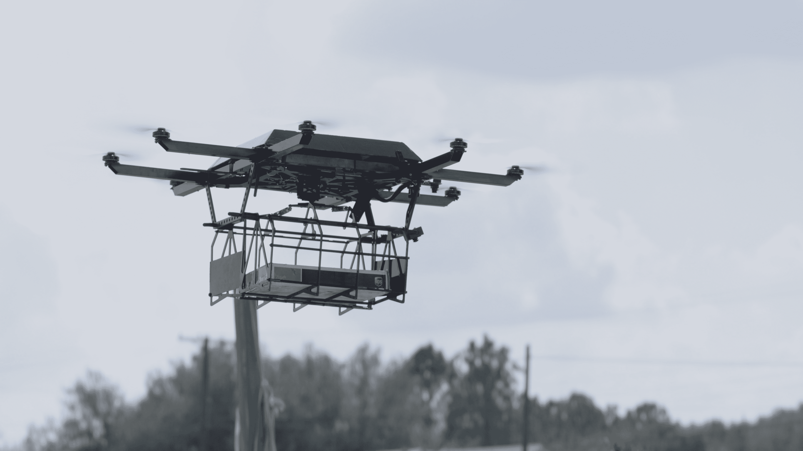
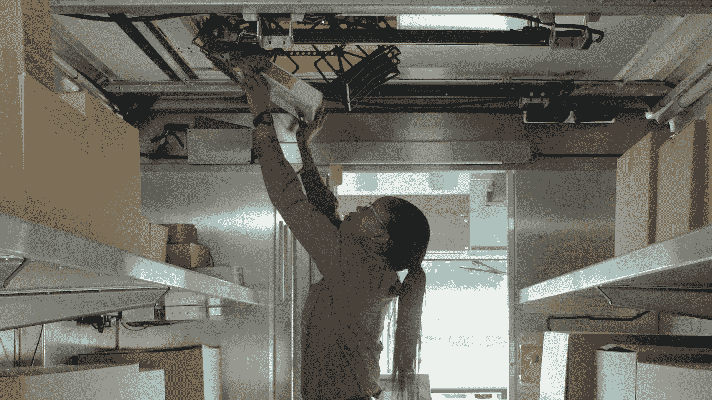
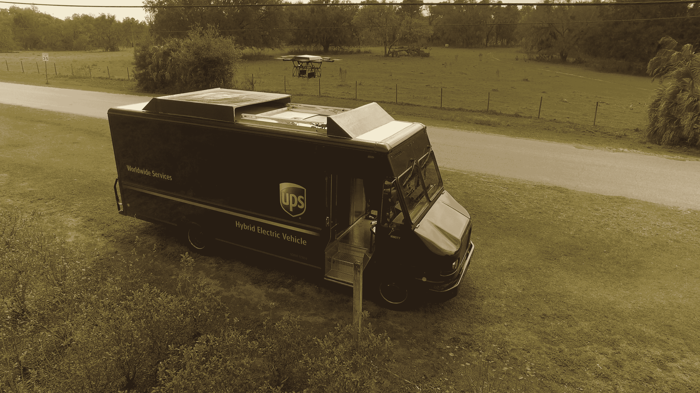

# UPS 测试显示送货无人机仍需改进

> 原文：<https://web.archive.org/web/https://techcrunch.com/2017/02/21/ups-tests-show-delivery-drones-still-need-work/>

周一，在佛罗里达州坦帕市外的一个蓝莓农场，UPS 首次测试了使用无人机进行住宅送货。

物流巨头专门从一辆送货车的顶部发射了一架八翼直升机，或多旋翼无人机。无人机直接将包裹送到一个家庭，然后返回到货车上，货车现在已经沿着道路移动到一个新的位置。货车用机械臂将无人机拉下来，停靠在车顶上。

周一测试中使用的无人机是由俄亥俄州的 Workhorse Group Inc .制造的，该公司已经是 UPS 的技术供应商。Workhorse 制造商用混合动力电动卡车、电池，并开发航空航天技术。UPS 已经购买了 350 辆混合动力电动卡车，其中 125 辆已经上路。该公司在 UPS 测试中使用的新 HorseFly 无人机交付系统是为其车辆量身定制的。

用于测试的卡车是定制的，能够从车顶发射 HorseFly 无人机，然后在它返回时用机械臂抓住它。悬挂在无人机下方的笼子延伸穿过卡车上的舱口，无人机可以在那里下降并装载另一个包裹。停靠时，无人机通过其手臂和卡车电池之间的物理连接进行充电。

发射无人机的送货车的概念并不新鲜。梅赛德斯-奔驰和无人机科技初创公司 Matternet 透露了开发“Vision Vans”的计划，该计划于 2016 年 9 月从梅赛德斯-奔驰的卡车[上发射 Matternet 的送货无人机。](https://web.archive.org/web/20230321051814/https://techcrunch.com/2016/09/07/mercedes-benz-and-matternet-unveil-vans-that-launch-delivery-drones/)他们在 CES 上推出了现实版的[送货车，](https://web.archive.org/web/20230321051814/https://techcrunch.com/2017/01/10/check-out-the-real-world-version-of-the-mercedes-benz-drone-delivery-van/)也是。

根据 UPS 工程副总裁 John Dodero 的说法，该公司的目标是让无人机在任何类型的车辆上工作，无论是燃气动力还是电动车辆，以进行最后一英里的递送。他解释说:“我们在汽车顶部的那个巢可以放在任何汽车上，但我们必须确保它有能力并设置好进行充电。”

至于 HorseFly 本身，该公司表示，这款 9.5 磅重的无人机采用碳纤维结构，由专有的锂 18650 电池组提供动力，最高时速为 45 英里，飞行时间为 30 分钟。相比之下，大多数消费级无人机只会飞行 22 分钟左右。马蝇可以携带重达 10 磅的包裹，使 UPS 能够处理各种住宅快递。

Workhorse 首席执行官史蒂夫·伯恩斯解释说:“我们研究了它可能需要携带的东西——它不需要携带 50 磅重的电视或类似的东西。”。“我们研究了他们平均携带的产品包，并围绕最佳使用情形进行构建。”

根据联邦航空局的现行规定，在测试中，马蝇必须待在飞行员的视线范围内。它还在为测试目的而编程的预先配置的路线上飞行。但在现实世界的操作中，UPS 的专有路由软件，称为 On-Road Integrated Optimization and Navigation，或 ORION system，可用于确定无人机的飞行路线。

如果这项技术按预期发展，有一天 UPS 司机可以按下安装在卡车仪表板上的触摸屏上的按钮，派出无人机完成一些递送。

举例来说，这将允许司机避开宽度不足以容纳他们卡车的道路，并在离家很远且很少的农村地区将他们的路线缩短几英里。司机不必驾驶无人机，但可以按下按钮，在需要时发射和召回无人机。

HorseFly 的导航系统利用涵盖空域、地形、天气和风力条件的在线数据库，以及来自 GPS 罗盘、激光雷达和红外摄像机等机载传感器的数据进行着陆。

“从技术上来说，最困难的事情是让 HorseFly 无人机与电动卡车重新配对，”Burns 解释道。“有一个小入口…我们基本上必须在顶部有一个机器人系统，抓住它，捡起它，并把它放进洞里。”

他补充道，整个系统本身就是为了冗余而构建的。如果一个推进器失灵，无人机仍然可以飞行。如果两个出去，它至少可以着陆。如果 4G LTE 连接变得不可用——在农村地区这种可能性很大——无人机仍然可以通过射频与卡车通信。

这并不是 UPS 第一次尝试无人机技术。该公司早期的努力集中在人道主义无人机送货上，比如在卢旺达使用滑索无人机运送血液。去年秋天，[它还与波士顿的无人机制造商 CyPhy，](https://web.archive.org/web/20230321051814/https://pressroom.ups.com/pressroom/ContentDetailsViewer.page?ConceptType=PressReleases&id=1474568757660-815)合作测试了向偏远地区的商业送货，UPS 通过其战略企业基金投资了 cy phy。但这是联合包裹首次透露其对无人机如何融入其日常运营的设想。

UPS 并未持有上市公司 Workhorse Group Inc .的股权..它选择这家公司主要是因为它目前已建立的供应商关系以及 Workhorse 在其无人机技术上已经取得的进展。

与其在内部开发自己的无人驾驶飞机，倒不如让联合包裹坚持一种在地面上行之有效的模式，像从其他公司购买卡车一样购买无人驾驶飞机。

正如优步在匹兹堡的例子所显示的，如今机器人人才很难得到，甚至更难留住。这家按需运输和交付公司最初从卡内基梅隆大学挖走了一支庞大的团队，现在正尝到自己的苦果，福特从其团队中大量招募人员来开发自动驾驶汽车。

与此同时，美国联邦航空管理局(Federal Aviation Administration)仍在完善管理无人机广泛商业使用的规则。根据美国邮政局的一项调查，无人机故障仍然是美国公民的一个严重问题，他们通常希望无人机送货，但又担心伤害性的事故[。](https://web.archive.org/web/20230321051814/https://www.uspsoig.gov/blog/do-americans-want-drone-delivery)

坦率地说，他们应该担心。在周一 UPS 的第二次非官方马蝇演示中，某种干扰——可能来自广播记者的摄像机——导致无人机的指南针出现问题。这架无人机中止了发射，试图降落在 UPS 卡车的顶部，落到了一侧，并差点被仍然关闭的车辆盖子压碎。

“我们以前从未见过它，”伯恩斯谈到这个小故障时说。

除了解决技术问题，像 UPS 和亚马逊这样的公司，正在建造自己的送货无人机，必须考虑如何将这项技术整合到他们的劳动力中，特别是如果这是以人们的工作或有偿小时工为代价的话。值得一提的是，联合包裹表示，司机工作不会消失。“UPS 司机是公司的代言人。客户依赖他们，”Dodero 说。

“我们必须有竞争力。我们在这里所做的一切都是为了减少司机可能不得不驾驶的里程数，”他解释道。“我们的目标不是取代 UPS 司机…我们只是想增强他们的能力，让他们更有效率。”