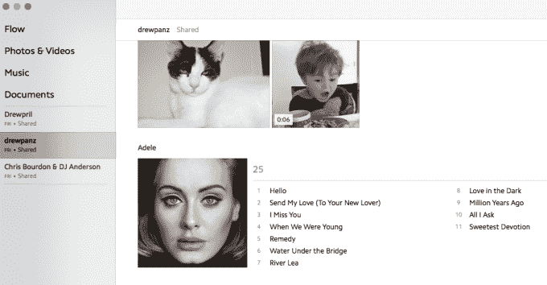

# Upthere 的测试版用户上传了超过 350 万份文件 

> 原文：<https://web.archive.org/web/https://techcrunch.com/2015/11/21/uptheres-beta-users-have-uploaded-more-than-3-5m-files/>

# Upthere 的测试版用户上传了超过 350 万份文件

该公司告诉我，Upthere [上周推出了他们的第一款应用](https://web.archive.org/web/20221209174529/https://beta.techcrunch.com/2015/11/12/uptheres-apps/)测试版，到目前为止，测试期开了个好头。没有消息说有多少用户在测试期间溜走了，但我被告知邀请正在慢慢发放。

超过 350 万个文件已经上传到 Upthere，它的目标是成为你在云中的个人电脑。一旦你的文件在那里，你可以自由地在任何设备上查看它们，无论是移动设备还是台式机。这个想法是，因为你是直接把文件写到云，你也是直接读取它们…而且速度超快。

阿黛尔的专辑昨天发行时，我从亚马逊上花 9.99 美元买了这些歌曲，并立即将 MP3 上传到 Upthere。使用他们的家庭应用程序，我可以从任何地方播放专辑，而不必将文件存储在本地:

仅仅存储歌曲并不是我的目标，我与我的未婚妻一起将歌曲共享成一个循环，或者共享任何规模的群组，她可以在开车上班的路上听新专辑。我问他们如何处理像与朋友和家人分享歌曲这样的事情，一位发言人告诉我:

> 我们尊重版权所有者的权利，我们希望我们的用户也这样做。也就是说，我们有按照美国法律处理 DMCA 请求的机制。

基本上，我不会在网上任何地方发布歌曲供任何人下载。事实上，你不能在一个循环中“下载”你共享的文件…它们只是可供消费。我会从 Spotify 或 Apple Music 上下载整张专辑……但是阿黛尔不想要那个。

快速提示:如果你正在使用 Upthere，让你的朋友排在等候名单最前面的方法是邀请他们加入一个循环，我知道了。