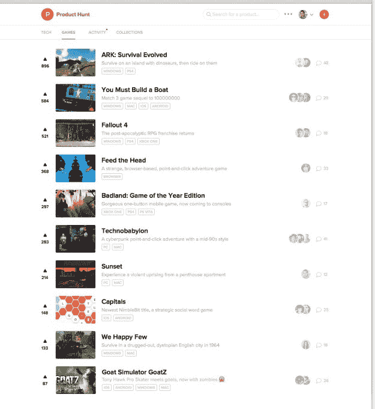
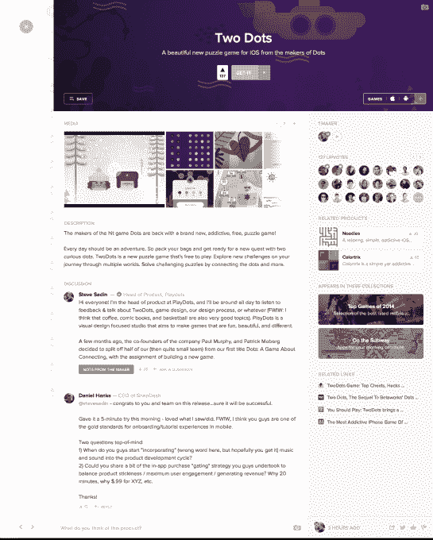

# 产品搜索升级为游戏类别 

> 原文：<https://web.archive.org/web/https://techcrunch.com/2015/06/11/upupdowndownleftrightleftba/>

为顶级科技产品投票的平台 Product Hunt 首次从科技领域向游戏领域扩张，并邀请游戏出版物 Polygon 的联合创始人[拉斯·弗鲁什蒂克](https://web.archive.org/web/20221209185848/https://twitter.com/russfrushtick)领导这一新类别。

产品搜索游戏部分看起来将类似于产品搜索上当天顶级科技产品的主要列表，但充满了新的游戏产品。

这是 Product Hunt 的长期发展，也是重要的下一步，因为它将继续在科技行业以外发展，同时不会失去科技产品爱好者的核心受众。

但是这不是我们第一次听到这个想法。在过去的几个月里，Product Hunt 一直在梳理游戏类别，增加了一份[游戏文摘简讯](https://web.archive.org/web/20221209185848/http://www.producthunt.com/r/53e5393bfd104e/20611)，并暗示现在它将增加科技以外的类别。

它已经在音乐方面实现了飞跃。我们[在 Product Hunt 上报道了 Snoop Dogg 的最新专辑](https://web.archive.org/web/20221209185848/https://beta.techcrunch.com/2015/05/12/product-hunt-moves-beyond-tech-with-the-launch-of-snoop-doggs-new-bushalbum/)的发布——这与其常规的科技产品垂直市场明显不同。这位说唱巨星甚至在网站上和粉丝一起做了一个 Reddit 风格的 AMA。

但据创始人瑞安·胡佛(Ryan Hoover)称，尽管音乐、时尚、电影和其他类别已被视为未来产品搜索的可能补充，但游戏是该平台更自然的下一步。他认为，科技和游戏在人口统计学上有很多交叉，这两者显然是契合的。

“几个月来，我们已经在产品搜索上看到了游戏，”胡佛告诉 TechCrunch。

尽管平台上有 45 个不同的用户生成的音乐收藏和大约 279 个产品搜索上的音乐相关产品，但胡佛指出，音乐发现已经是一个非常拥挤的空间。

“我不认为音乐领域是我们现在最容易探索的领域，因为它已经被 Spotify 占据了主导地位，苹果刚刚推出了流媒体服务。“这当然是一个巨大的机会，但我认为音乐作为下一个类别不适合我们，”胡佛说。

他说，游戏是一个与产品搜索社区和一般技术更密切相关的类别。他说得有道理。产品搜索上有 31 个游戏集合，但平台上有多达 758 个游戏产品，游戏下有 4601 人，音乐下有 493 人。

这个类别对胡佛来说也是一个舒适的类别。他曾在 PlayHaven 和 InstantAction 工作过，然后开始自己开发产品 Hunt，所以他已经涉足游戏世界有一段时间了。

“游戏创作出现了爆炸式增长，尤其是在游戏的不同类别中。移动电话在这方面有所帮助。但是每个人都在出版，从一个 17 岁的孩子到大公司。胡佛说:“随着越来越多的东西被创造出来，我认为我们有义务进行管理，找到最好的东西。”。

这种独立游戏创作的想法是这个平台上这个新品类最让他着迷的地方。

在过去的几个月里，这个游戏插件已经慢慢向产品搜索社区的个人游戏爱好者推出，但现在任何想用它来发现新游戏的人都可以通过网址【producthunt.com/games找到新游戏。

“如你所知，从一开始，我们就让 PH 社区参与进来，分享早期模型并寻求反馈，”胡佛说。他的团队使用了通过网络和移动原型平台 [InVision](https://web.archive.org/web/20221209185848/http://www.invisionapp.com/) 创建的实体模型，来了解什么样的设计适合这个社区。

到目前为止，Product Hunt 在用少量核心社区测试想法方面做得很好，看看什么有效。但是它仍然面临着和其他网站一样的挑战。Digg 因试图涉足其他领域而失去了核心受众。直到 Pinterest 开始向对时尚和 DIY 感兴趣的妈妈博主这一更为精选的类别进行营销，它才取得了长足的进步。

胡佛知道面前有一个挑战，并表示他特别依赖于其他网站的设计灵感，这些网站已经建立了跨类别的桥梁。但他也在试验，随着他向网站添加新的类别，产品搜索将如何发展。

“产品搜寻开始变得不一样了，坦白地说，ProductHunt.com 将会是什么样子还是未知数。当你可能将电影、音乐、书籍、游戏、科技放在一个体验中时，你看的单一内容是什么，你如何体验产品搜索？这是新的，”胡佛说。

很少有网站成功地创造了各种类别的东西，并且在这个过程中没有失去核心受众。虽然 Reddit 和 Tumblr 都在不同程度上做到了这一点。看到产品搜索作为一个平台如何继续发展，同时冒险进入新的类别，并在未来策划一个更独特的类别列表，这将是一件有趣的事情。

