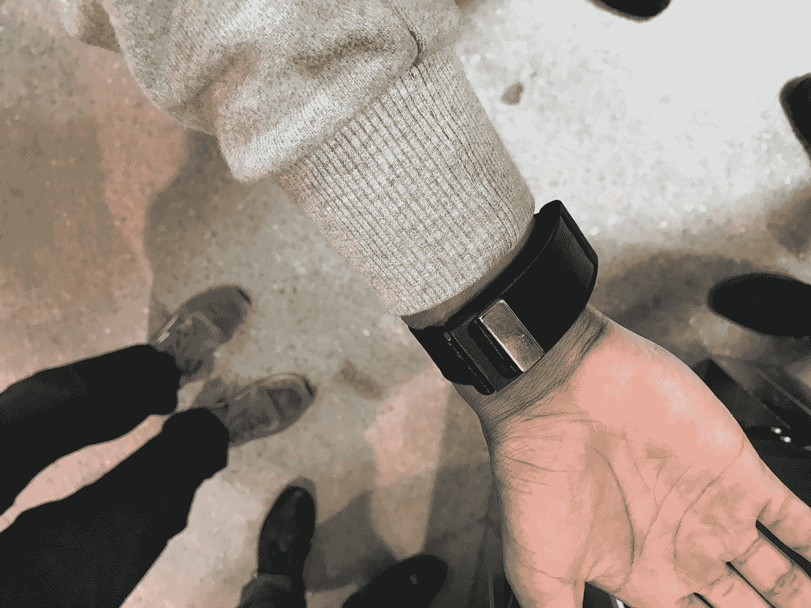
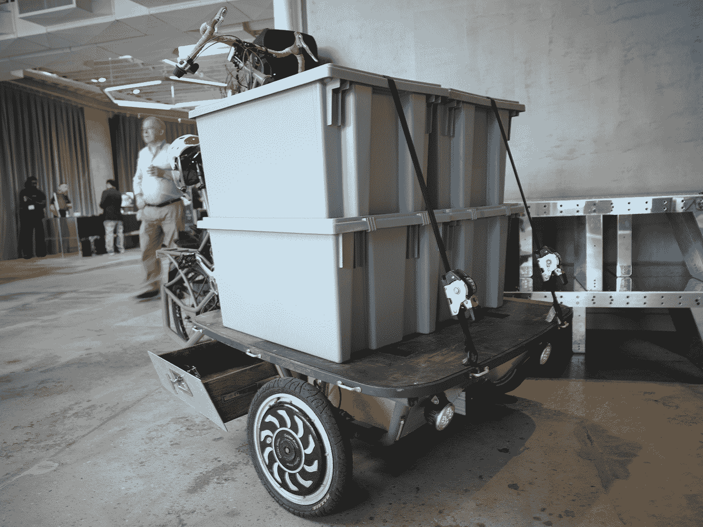
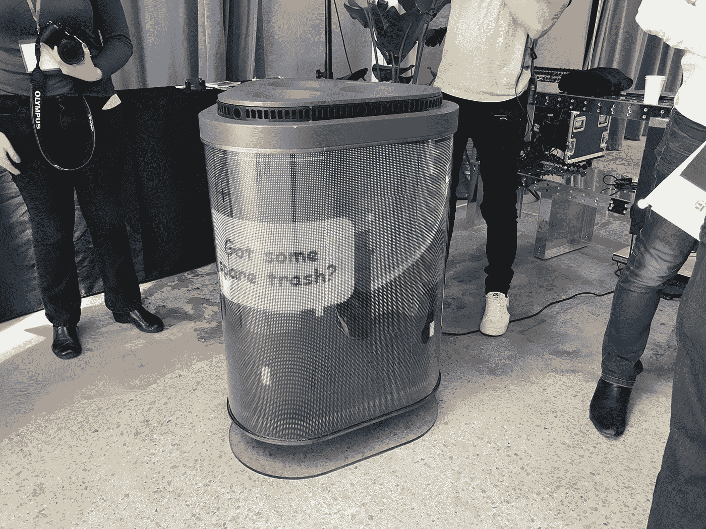

# Urban-X 的投资者展示了高科技面罩、盲人导航等功能 

> 原文：<https://web.archive.org/web/https://techcrunch.com/2017/05/06/urban-xs-investors-showcase-features-high-tech-face-masks-navigation-for-the-blind-and-more/>

Urban-X investors showcase 是一个闭门活动，向潜在投资者和媒体展示了八家不同的孵化初创公司。本周早些时候，我顺道去看看有什么大惊小怪的。

在 Urban-X 02 队列的八家公司中，我挑选了四家解决污染、视力障碍、城市配送和保持公共卫生问题的公司:O2O2 Facewear、WearWorks、Upcycles 和 Sencity。

## 盲人触觉导航

或许在 Urban-X 展示台上展示的产品和服务的潜在改变来自 WearWorks 。他们的原型腕带是为盲人和视力受损者提出的基于 GPS 导航的解决方案。

使用触觉反馈，WayBand 使用一个强大的马达来给你关于你在哪里和往哪个方向走的触觉。

WearWorks 一直在与一些视障人士合作测试 Wayband，其中包括一名将参加今年纽约马拉松比赛的超级马拉松运动员。

如果马拉松测试证明成功，WearWorks 将开始向早期用户提供更多设备，然后再进行公开发布。

## 使面罩现代化

现代面具公司 O2O2 正在利用他们所谓的“数十亿美元的产业”。他们首先关注像北京这样的城市，那里的污染和空气质量是世界上最糟糕的大城市之一。

奇怪的是，O2O2 不允许与会者试戴面具(声称它只是暂时为创作者的面部结构制定的)。然而，O2O2 承诺在发布时推出四种不同的面部模具，带有可定制的模块(你在上面看到的单元是一个工程原型)，包括传感器，过滤器和电池。

这款口罩最酷的功能是可以监测你的生命体征(我假设这是你的 VO2 呼吸统计)，以及通过配套的智能手机应用程序监测空气质量数据。

佩戴氧气面罩的人收集到的数据可以用来解决特定地区的污染问题，包括确定城镇中每天污染最严重的地区。

## 简化城市运输工具

Upcycles 在台上说的第一件事是，他们以人类为中心，反对机器人。这激起了人们的兴趣，但真正让人们好奇的是[亚克斯，一种新型城市运输工具](https://web.archive.org/web/20221025230609/http://www.upcycles.biz/)。

Yax 是一辆外观怪异的平板三轮车，设计用于在狭窄的城市街道上上下运送高达 500 磅的设备。骑着 Yax 的送货人可以完全看到他们座位的上方和周围，能够像保护其他自行车一样保护 Yax。

## 的时代..数字垃圾桶？

也许最合适的介绍来自于 [Sencity，有四宾。森城的一些设计作品已经被用于澳大利亚的大使馆和购物中心——本质上，他们是一家设计公司。现在，他们希望通过让垃圾桶具有互动性和视觉吸引力来解决城市街道的清洁问题。](https://web.archive.org/web/20221025230609/http://sencity.city/)

TetraBIN 通过传感器、扬声器、麦克风和全 LED 屏幕环绕来实现这一点，因此它可能是你见过的最高科技的垃圾桶。路人不仅可以扔垃圾并获得有趣的视觉效果，还可以问路去买杯咖啡，或者在视觉上被引导去扔可回收物和普通垃圾。

这在纽约这样的城市会有多大用处，时间会证明一切。我对这种产品的主要担心是它可能会被…丢弃。