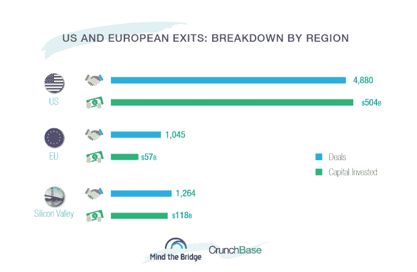
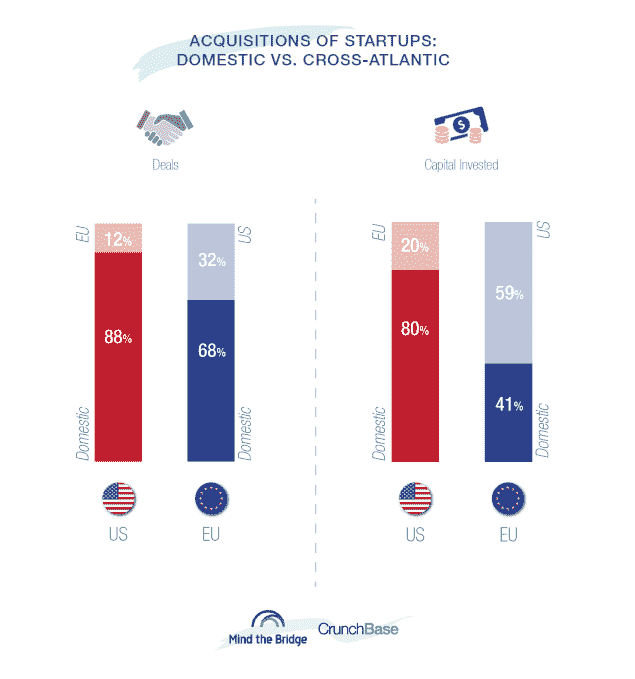

# 美国买家狼吞虎咽创业公司，而欧洲人蚕食 

> 原文：<https://web.archive.org/web/https://techcrunch.com/2016/09/11/us-buyers-gorge-on-startups-while-europeans-nibble/>

# 美国买家狼吞虎咽创业公司，而欧洲人却在蚕食

乔安娜·格拉斯纳撰稿人

More posts by this contributor

阿尔贝托·奥内蒂撰稿人

美国公司比欧洲公司对创业公司有更大的胃口。

根据 CrunchBase 和创业基金会 [Mind the Bridge](https://web.archive.org/web/20221205113308/https://www.crunchbase.com/organization/mind-the-bridge-foundation#/entity) 的一份新报告，在过去五年中，美国公司收购的初创公司约为欧洲收购者的四倍。

该研究调查了自 2012 年以来欧洲和美国公司的约 6000 起收购，发现美国收购者完成了 82%的交易。总部设在美国的公司也占据了所有 15 个最活跃的收购者。

以下是更多的发现:

*   在 15 家最活跃的收购者中，有 11 家是硅谷公司。最活跃的欧洲收购者，德国的 SAP，在名单上排在第 33 位。
*   总的来说，自 2012 年以来，欧洲最活跃的 15 家公司收购的初创公司数量与谷歌收购的数量大致相同。
*   英国是最贪婪的欧洲国家。总体而言，英国公司收购的初创公司数量超过了德国、法国、比荷卢、西班牙和意大利的总和。
*   英国也是欧洲最大的被收购的创业公司生产国。自 2012 年以来，已有 532 家英国初创公司出售了股票。这是同期德国初创企业收购数量的 3 倍多，法国的 4 倍多。
*   欧洲公司收购更多国内初创公司，但在美国交易上花费更多。被研究的欧洲并购案例中，约有三分之二是针对欧盟初创企业的。然而，对美国初创公司的收购消耗了近 60%的披露支出。

*启动跨大西洋 M & As 完整报告。美国 vs 欧盟*将于 9 月 12 日在加州山景城举行的[欧洲创新日](https://web.archive.org/web/20221205113308/http://eid.mindthebridge.com/)会议上公布。