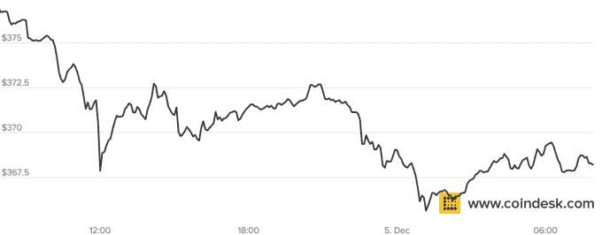

# 美国法警完成丝绸之路比特币的第二次拍卖

> 原文：<https://web.archive.org/web/http://techcrunch.com/2014/12/05/us-marshals-complete-second-auction-of-silk-road-bitcoin/>

# 美国法警完成丝绸之路比特币的第二次拍卖

美国法警服务已经完成了从最初的丝绸之路缴获的[比特币](//web.archive.org/web/20230314102543/http://techcrunch.com/tag/bitcoin%E2%80%9D)的第二次拍卖。此次拍卖由 5 万 BTC 组成，是 6 月份开始的 BTC 拍卖中的最新一次。

USMS 报道称，11 个注册投标人对比特币进行了 27 次投标，低于 6 月份的 45 个投标人。 [Coindesk](https://web.archive.org/web/20230314102543/http://www.coindesk.com/us-marshals-bidder-turnout-second-bitcoin-auction-declines-sharply/) 将这一下降归因于更小的竞价窗口——6 小时对 12 小时——以及由于更大块比特币的大量供应导致买家兴趣降低。

比特币的价格没有受到此次出售的影响，目前约为 380 美元。6 月，由于用户饶有兴趣地观看了第一次销售，价格短暂上涨了 7%。

USMS 仍然拥有 94000 枚 [BTC](//web.archive.org/web/20230314102543/http://techcrunch.com/tag/bitcoin%E2%80%9D) ，应该会在未来几个月出售这种加密货币。据称，这批比特币属于罗斯·乌布里希特，他被认为是最初的丝绸之路网上交易市场的负责人。

