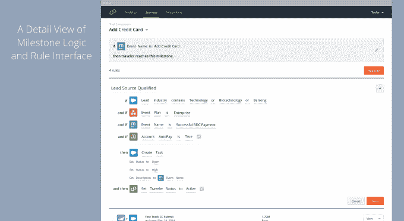

# Usermind 秘密出现，计划整合业务运营 

> 原文：<https://web.archive.org/web/https://techcrunch.com/2016/03/16/usermind-emerges-from-stealth-with-a-plan-to-integrate-business-operations/>

借用信息技术剧本中的一页，[user mind](https://web.archive.org/web/20221209103040/http://usermind.com/)——一家由[安德森霍洛维茨](https://web.archive.org/web/20221209103040/http://a16z.com/)和[门洛风险投资](https://web.archive.org/web/20221209103040/https://www.menlovc.com/)支持的新成立的创业公司——正在出售一种旨在为商业运作提供透明度和清晰度的服务。

由 MIchel Feaster 和 Przemek Pardyak 共同创建的 Usermind 是 Feaster 认识到虽然 IT 部门现在有了允许他们更有效地合作的工具(捆绑在 DevOps 软件的笨拙新词下)，但业务运营仍然实际上是孤立的。

Feaster 和她的导师和最初的支持者 Ben Horowitz 把这归咎于软件即服务工具的广泛流行。

“几乎没有一家公司没有多重记录系统，”Horowitz 说。Horowitz 说，销售团队使用 Salesforce，营销团队使用 Marketo，人力资源和管理层使用 Workday 进行员工管理，这些系统都无法相互通信，以提供公司目标的整体视图。

Horowitz 说，Usermind 有助于回答“贯穿其中的过程是什么，我需要每个交易或过程的哪些信息”的问题。

“围绕 shadow IT 有很多讨论，”费斯特告诉我。“企业开始购买和消费 SAAS，这可能是自网络发明以来最大的技术模式转变，但市场营销、IT 和财务部门正在建立这些小型技术团队，这一事实意味着什么？”

对于 Feaster 来说，这意味着开发一组工具的潜力，这些工具可以从不同业务操作的不同、离散的工具包中提取数据，并在整个组织中传递信息，以使业务单位更有效地协同工作。

用户思维理论的核心是一个概念，即企业正在重新定位他们的工作方式，以关注客户如何看待他们。该公司的软件创建了一个单一的枢纽，不同的业务单位可以集中他们的资源，并创建一个总体计划，以实现跨越不同组织边界的业务目标。

“企业正在经历这样的转变:营销侧重于销售线索，销售侧重于运营，以及……我们如何成为一家提供相同客户体验的客户公司，”Feaster 说。

总部位于西雅图的 Usermind 在最近一轮融资中筹集了 1450 万美元，由 Menlo Ventures 领投，之前的投资者 Andreessen Horowitz 也参与了投资。

该公司有 25 个客户和 30 名员工，并打算用它的 1450 万美元建立销售和营销，并继续其产品开发，根据 Feaster。

