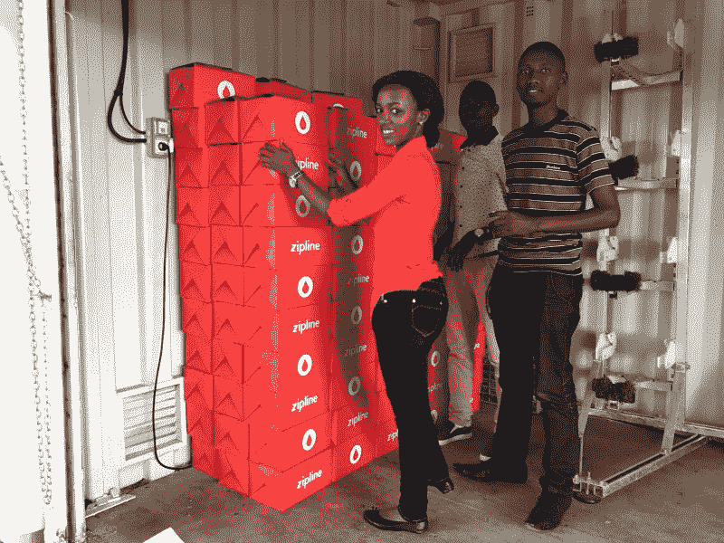
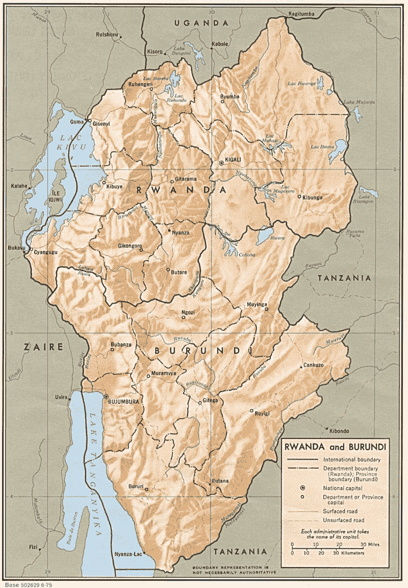
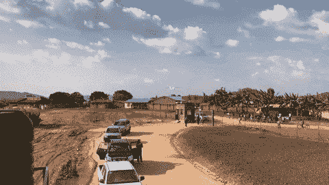
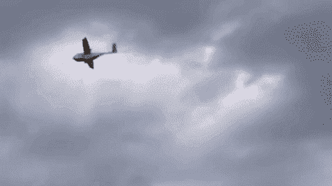
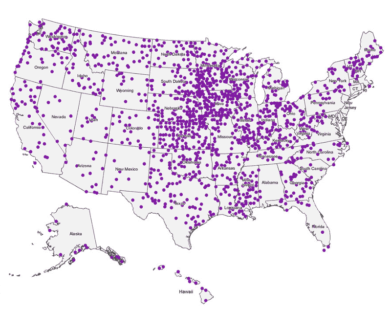

# 使用无人机打造未来的救护车队 

> 原文：<https://web.archive.org/web/https://techcrunch.com/2017/12/25/using-drones-to-build-the-ambulance-fleet-of-the-future/>

爱丽丝·劳埃德·乔治撰稿人

爱丽丝·劳埃德·乔治是纽约的早期投资者，也是

[Flux](https://web.archive.org/web/20221205162947/http://theflux.libsyn.com/podcast)

，一系列与前沿技术领导者的播客对话。

More posts by this contributor

又到了一年中的这个时候。头顶上的雪橇铃，我们快乐的、长着胡子的恩人将礼物从烟囱飘到热切等待的人们手中。我们听过这个故事的所有版本。或许，除了目前正在东非上演的变种。有趣的是，魔法故事和科幻小说有时会变成现实，如果你把雪橇铃换成无人机，把礼物换成紧急医疗用品，你就会看到真实世界中的[滑索](https://web.archive.org/web/20221205162947/http://www.flyzipline.com/)的故事，这家公司在卢旺达通过无人机运送全国 20%的血液供应。红杉和 A16Z 支持的公司最近宣布将把业务扩展到邻国坦桑尼亚。

与此同时，在美国，无人驾驶雪橇铃声少之又少，这受到了我们航空监管框架的阻碍，而我们的监管框架并没有跟上步伐。10 月，特朗普政府签署了一项[行政命令](https://web.archive.org/web/20221205162947/https://www.faa.gov/news/updates/?newsId=89007)，给予地方政府更多余地进行无人驾驶无人机测试。该命令允许地方政府和社区与行业合作，设计自己的试验项目，并向联邦航空管理局申请豁免现有规则。特朗普说:“我们的国家将走得更快，飞得更高，自豪地迈向美国航空的下一个伟大篇章。”。方向是正确的。但几乎没有后续行动，进展速度仍然落后于其他国家，促使亚马逊和谷歌在过去几年前往英国和澳大利亚进行无人机测试。

在接受 Flux podcast 采访时，我与 Zipline 的首席执行官凯勒·里瑙多(Keller Rinaudo)坐在一起，就政府政策、创新和自主基础设施的未来进行了一次的广泛对话。我们讨论了他如何看待美国政府变得僵化，以及如何成为这一领域的领导者。他还分享了他如何与 UPS 建立了成功的合作关系，如何与反对者打交道，以及他如何看待风险。滑索故事的核心是现实世界的勇气、敬业的团队、尖端的技术和敢于冒险的政府。对话摘录如下。

**让我们先来快速了解一下 Zipline 在做什么。拯救生命的医疗保健的基本即时交付？**

基米-雷克南:这是一个很好的解释。Zipline 正在寻求为地球建立即时交付，我们的使命是为难以到达和偏远地区的人们提供紧急医疗产品。今天我们在卢旺达全国范围内运作。我们每天都在提供全国血液供应的很大一部分，我们允许全国各地的医院立即获得患者日常或紧急需要的任何血液制品。

**AMLG:我听说到 2017 年夏天，你们已经攀升到每个工厂每周 20 次交付，是这样吗？**

基米-雷克南:一般来说听起来是对的。这取决于医院的规模。有些医院规模较小，有些医院规模较大，但每家医院每周约有 20 例分娩。要意识到的最重要的事情是我们服务的医院，他们只通过滑索系统接收血液输送，其中大多数人一天接收多次输送。

**AMLG:所以你已经在卢旺达建立了 21 个计划设施中的 7 个，这是你的第一个市场，对吗？**

基米-雷克南:我们实际上是在八点。这个数字在不断变化，因为我们每天都在向系统中添加医院。从长远来看，我们的目标是为卢旺达的所有医疗机构提供服务。大约 40 家医院。此外，还有 400 家医疗中心不做输血，但确实需要获得一系列医疗产品，而这些产品很难获得。从长远来看，卢旺达政府的愿景是让 1300 万公民在 15 分钟内获得他们可能需要的任何基本医疗产品。

**AMLG:就其工作原理而言，这些诊所的工作人员会向配送中心发送短信，在配送中心，工作人员会将药物装入一个盒子，然后装入拉链。然后它起飞，空投有效载荷，返回配送中心，根本没有着陆？**

基米-雷克南:是的。虽然有时我们做的事情听起来有点怪异或者像科幻小说，但来看的人总是被它的简单所震惊。这个系统令人惊讶的是，特别是当你和每天都在使用它的医生交谈时，它是如此的简单。这就像发送一条短信，然后立即收到你治疗病人甚至挽救病人生命所需的产品。我们正在使用自动电动汽车。它们重约 13 公斤。它们以大约每小时 100 公里的速度飞行。在运送过程中真的没有人参与。从车辆离开我们的配送中心到返回，它一直在自己做决定。它自己飞到医院运送产品，然后回家。当我们交付时，重要的是要知道我们不降落飞机。飞机基本上是在距离地面 30 英尺的范围内，然后将有效载荷投放进去——我们称之为空气制动器——你可以把它视为一个简单的高性价比降落伞，确保包裹以一种温和神奇的方式正好落在医院的门口。

**AMLG:我看过视频——它看起来像一个红色的小鞋盒。所以你把它装满一袋袋的血液，还有一个二维码，这样车辆就能自动准确地知道要去哪里。然后它以一种轻柔神奇的方式降落下来？**

基米-雷克南:是的，你确实可以接住包裹。如果他们站在那里很多次，他们会抓住这个包裹，因为它太精确了。我们可以送到两到三个停车位。用户的体验有点像使用拼车服务——你在表明你需要什么。你会收到一条短信，说“*感谢您的订单。Zip 已发送。12 分钟的路程。”*然后你收到第二条短信，上面写着“*一分钟后，请出去领取包裹。”*就这样。除了手机之外，你不需要任何东西就可以下订单，并获得治疗病人所需产品的即时配送。不需要基础设施，只需要很少的培训，任何人都可以使用它。

AMLG:这可能比我的优步在我认为它会出现的时间出现在我认为它会出现的地方更可靠。因为除非出了问题，否则没有人在循环中，对吗？

基米-雷克南:在某种意义上说，我们有一个空中交通管制员，他随时与车辆保持联系，如果有必要，他可以向车队中的不同车辆发出高级命令。但这些干预的案例极其罕见。这些车辆绝大部分时间都是自己做决定，自己监控自己的健康状况，顺利完成任务，返回配送中心。

卢旺达位于东非，中部和西部多山。

AMLG:卢旺达是一个多山的蛮荒国家。为了支持导航系统，你需要在技术上做些什么？你只是使用 3D 卫星地图，并将其与人工地面勘测配对，还是怎么的？

KR:卢旺达的特点之一就是它是一个多山的国家，这让它成为一个使用这项技术的好地方。它被称为*千山之地*。根据这种地形的性质，这通常需要很长的时间。道路往往有风。我们采集了这个国家的开源地形图，然后把它们连同我们所服务的快递站点的更精确的三维测量结果一起，加载到飞机的导航系统中。这样，当你收到一个包裹时，车辆会扫描包裹的条形码，然后立即执行任务。它知道自己要去哪里，而且没有坐标编程。这些都是提前完成的，因为每条路径都是预先指定的，从配送中心到我们服务的医院都是如此。每次送孩子去医院的时候，飞机的飞行轨迹都是一模一样的。这就是我们如何确保系统以可预测、可靠、最终乏味的方式运行。物流应该很无趣。应该不会有什么意外。

**AMLG:设计过程怎么样？你怎么没想到？你把系统设计得这么高效、这么简单，有什么突破吗？你在飞机着陆时用的“飞机捕捉法”是你从一开始就决定要做的吗？**

KR:当我们刚刚起步的时候，这是前所未有的。世界上还没有其他人这样做。我们不知道这是否可行。系统中一些比较复杂的部分——比如我们回收飞机的方法——飞机没有任何起落架，也没有跑道。

一个压缩空气被从天而降，围观者正在观察“天空救护车”

让飞机从每小时 100 公里的速度中恢复过来，把它从空中抓起来，然后轻轻让它停下来，这是一个极其棘手的问题。对于我们最初尝试的解决方案，我们感到震惊的是，其中一些解决方案居然也能像他们那样有效。在科技领域，人们对于这种做法是否可能一直抱着怀疑的态度。在我们进行这项业务的时候，每个人都说这是不可能的，而且这可能会让你一头雾水。

**AMLG:站在技术还是商业的立场？**

基米-雷克南:在每一面。我们得到的压倒性建议是，这在技术上是不可能的。即使技术上可行，它也不会可靠地工作。即使它确实可靠地工作，也没有人愿意为它付费，在世界的不同地方也没有必要。即使有需求，这项技术也无法大规模运作。在过去的三年里，每年我们都不得不否定其中的一个观点。现在我觉得都被证伪了。但即使是现在，看到我们正在做的事情的人也会说，好吧，这项技术是可行的，它是可靠的，它是大规模可行的，而且它证明了对它的需求，但只是在你所在的那个国家。它不适用于其他国家。这是我们正在努力纠正的下一个错误观念。

但是就惊奇而言，每当你试图做世界上第一次做的事情时，从技术的角度来看会有很多不确定性。当你第一次看到你制作的作品时，你会感到不可思议和惊讶。另一件让我们惊讶的事情是，我们知道这会看起来很奇怪。让一辆自动驾驶的电动汽车从天而降，在卢旺达的偏远地区运送紧急医疗产品，这看起来有点疯狂。

AMLG:在当地人看来很疯狂？

基米-雷克南:是的。在我们开始运送医疗产品之前，我们会到医院做一次调查飞行，只是为了确保路线运行良好，数字看起来不错。那里的医生告诉我，他们遇到了问题，因为所有的病人都从床上爬起来，看着车开过来。医生试图让病人呆在床上，因为下床对他们不好。

**AMLG:意想不到的后果！**

基米-雷克南:没错。这其中有一个完全不同的因素。有一个魔法或科幻小说。但令我惊讶的是，七天后，所有的魔法和科幻小说都消失了，医生们把这视为世界上最显而易见的事情。他们期待服务，他们依赖服务，他们觉得服务很无聊。从科幻小说到这就是我们做事的方式，速度之快令人惊讶。

一个拉链在当地卫生机构空投医疗用品

**AMLG:你让它看起来很容易，但我知道在很多方面会有很多阻力，这很不寻常。你说过的我最喜欢的一句话是，当地人称之为“空中救护车”——很明显，空中救护车就要来了。**

基米-雷克南:这就像，当然。

AMLG:就技术突破而言——你自己在制造无人机，你每四到五个月就设计、制造和运营一个全新的车队。你从现有的飞行控制系统和航空业的最佳实践中借鉴了很多，但是这种快速迭代是如何工作的呢？你每四到五个月做什么样的改变？

KR: Zipline 设计飞行计算机，这意味着我们实际上是在设计在飞行器上做决定的电路板和微处理器。我们正在设计整个航空电子系统。我们设计飞行控制，这是允许飞行器飞行的数学。我们设计制导和导航系统，这是飞机如何找到它需要去的地方。我们还设计了空中交通管制算法和飞机的通信结构。我们设计机身，我们设计整个配送中心，需要能够以可靠的方式每天大量发射和回收这些飞机。通过拥有整个堆栈——大多数人没有意识到的一点是，波音只是一个最终集成商，当你试图建造一架像 787 这样的飞机时，这是一个复杂的分包商分包给分包商的老鼠窝，这导致项目昂贵而缓慢。

但是，当一个勤劳的工程师小团队可以从零开始拥有整个系统时，你可以走得很快。如果出了什么问题，你只要转向右边说，*嘿，某某你建立了这个系统，我们需要在今天下午之前改变它*。我们所做的另一件事使公司的速度得以提高，那就是我们在同一个地方完成所有的工程、制造和飞行作业。当你走出去，有飞机在飞。因此，如果一架飞机看起来飞行不正常，或者你设计的一个组件看起来工作不正常，你可以设计不同的东西，跑到制造车间，用不同的方式制造一些东西，然后当天测试它。迭代速度比传统航空航天公司快 100 倍。

**AMLG:这让我想起了 SpaceX，以及他们如何重新考虑工程楼层的运营和布局，以便他们能够拥有快速的通信回路。**

我们工程团队的很大一部分来自 SpaceX，我们从 SpaceX 如何设计这些火箭中学到了很多。既快速又安全地设计航空航天系统是相当困难的。这两个目标相互矛盾。SpaceX 在展示这种可能性方面处于领先地位，现在我们试图证明这种可能性不仅在火箭上，在飞机上也是可能的。

AMLG:你的团队现在有多大？

基米-雷克南:我们有大约 60 名全职员工。

AMLG:当你将业务扩展到其他国家和其他使用案例时，你如何保持这个数字不变？

当我们扩展到新的国家时，我们不会保持上限。要了解卢旺达现在发生的事情，最重要的一点是，配送中心是由一个非凡的全职员工团队领导的，但他们也是土生土长的卢旺达人。配送中心技术负责人是一位杰出的工程师，名叫阿卜杜勒。团队的其他成员都很努力，非常聪明，并努力确保该系统对患者健康产生积极影响，这是我们的使命。

我们进入的每个国家都雇佣了一个完整的团队来管理该国的配送中心。这个团队不是美国侨民，他们主要是我们要进入的国家的公民。也就是说，从总部的角度来看，我们专注于雇佣那些喜欢处理重大技术问题的人，他们可以做像波音这样的地方 30 或 40 名工程师的工作。这是创业公司在这个领域生存的唯一办法。你不能像波音公司开发 787 那样花 320 亿美元开发一架飞机。你必须想出一种方法，把成本降低五到六个数量级。

**AMLG:精益航空航天初创公司。**

基米-雷克南:没错。这意味着人们必须拥有更多，行动更快，愿意承担风险。而且——尽管这在一家航空航天初创公司听起来很疯狂——尤其是在测试条件下，你必须愿意坠机。如果你不愿意崩盘，那么你就处于极度规避风险的状态，这将阻止你做任何新的事情。

**AMLG:自从你开始运营以来，有没有飞机坠毁过？我认为它必须发生。**

基米-雷克南:从我们在半月湾办公室进行的测试中，我们学到了一个重要的经验，那就是在系统中设计一个终极的故障保护是非常重要的。如果飞机上的其他组件和安全装置都失效了，你必须确保飞机能够安全可靠地着陆。所以我们在飞机上设计了一个降落伞。它的工作原理很像 Cirrus，一种你今天可以买到的高端通用航空飞机。Cirrus 有一个类似的系统，你有一个弹道展开的降落伞。我们为我们的飞机设计了一个更简单的系统，这样，如果飞行器的所有其他安全组件都失效，飞机可以打开降落伞，轻轻地降落到地面，你可以抓住它。我们通常在总部的测试环境中使用它。我们建造它是一件好事，因为我们经历了重大的异常，这些事情是我们没有预料到的，因为卢旺达的环境与我们测试的环境不同。

**AMLG:让我们进入经济学领域——你说过这项业务从第一天开始就盈利了，而且随着你继续改善供应链和产量的增加，成本会下降。你能谈谈单位经济吗？随着你的扩张，它们将如何变化？**

基米-雷克南:与卢旺达政府合作令人兴奋的一件事是，他们对这样的项目有不同的想法。发展中国家的很多地方都有这样一种态度，我们希望这是免费的，或者我们希望它由非营利组织来完成，或者我们希望它成为慈善事业。卢旺达政府的做法不同。你总是听到卢旺达总统谈论贸易而不是援助。

**AMLG:我认为有一种误解，认为你在做慈善事业，但你没有，你在通过这些送货赚钱，对吗？**

随着手机的迅速普及，许多非洲人绕过了国有电话公司和银行，转而青睐移动支付。成立 10 年的 M-Pesa 公司，一项可以让你通过手机汇款的服务，现在拥有超过 3000 万用户。M-Pesa 在 2016 年处理了约 60 亿笔交易。[ [信号源](https://web.archive.org/web/20221205162947/http://www.cnn.com/2017/02/21/africa/mpesa-10th-anniversary/index.html)

是的，这很重要。我们在送货上赚不了多少钱，这不是高利润的生意。但重要的是要明白慈善事业不是成比例的。可持续盈利的企业确实有规模。这方面最好的例子是非洲的手机网络，以及这种商业模式对整个非洲大陆每个人的生活带来了多大的变革。

我们想证明利用这种技术实现类似的跨越是可能的。就像手机让许多国家跳过没有固定电话的阶段一样，我们认为这种技术可以表明，跳过没有道路或低质量道路的阶段，以高成本效益的方式实现快速交付是可能的。重要的是表明这是可持续的，这是关键。这不是什么持续一年的慈善活动，当资金枯竭时，它就结束了。这个能养活自己。这在经济上是可行的，可以为卢旺达和世界其他国家的未来发展提供资金。

Population and GDP of Rwanda [[Source](https://web.archive.org/web/20221205162947/http://rwanda.opendataforafrica.org/boyqwd/rwanda-main-indicators)]

AMLG:卢旺达似乎是一个很好的初始试验场。你看看发展中国家的其他国家，很多地方政府都与商界关系密切，存在腐败、官僚主义和漫长的销售周期。你如何评估你将要进入的市场？

基米-雷克南:我们首先选择卢旺达是有原因的。那里的政府纪律严明。他们决策迅速，并在医疗保健和技术领域投入巨资。作为一名美国公民，我希望我们的国家能够如此迅速和负责任地做出决定。我向你保证我们不能。

**AMLG:你说过你不得不从非洲开始，而你不能马上在美国开始，这是一件苦乐参半的事情？**

基米-雷克南:在这一点上，我认为自己至少是一个荣誉的卢旺达人。那个国家的人民是如此的值得和勤劳。相对于美国这样的国家，一个资源有限的国家的雄心水平，说我们不只是想在东非拥有最好的医疗系统，我们不只是想在发展中国家拥有最好的医疗系统，为什么我们不去建立一个世界上最好的医疗系统，让我们利用技术，机器人和人工智能来实现这个目标。那是非凡的。但是，是的，这是苦乐参半。我们是一家美国公司，现实情况是，该系统在卢旺达产生的积极影响，也可能对美国的患者健康产生同样的积极影响。生活在这个国家偏远地区的人们，无法获得与生活在城市或沿海地区的人们相同的医疗保健。真遗憾。我们本质上是在等待美国政府在利用技术改善人民生活方面赶上像卢旺达这样的国家。

AMLG:对。正如你所说的，这可能也与态度有关——这需要一种特殊的文化和政府来说，我们将成为第一，我们将成为领导者。在这种情况下，美国希望成为第一个成为第二个，并证明这一点。我知道联邦航空局的视线限制仍然存在，但他们确实放松了对某些公司在某些领域进行测试的规定。你最近向白宫宣布了关于 [**在美国进行测试**](https://web.archive.org/web/20221205162947/https://obamawhitehouse.archives.gov/the-press-office/2016/08/02/fact-sheet-new-commitments-accelerate-safe-integration-unmanned-aircraft)**——纳瓦霍预订交付或华盛顿特区的史密斯岛？你能谈谈那些吗？**

正如我提到的，你可以在这些地方查看数据——生活在美国农村的人比生活在城市的人健康状况更差。其中很大一部分与准入有关。如果你住的地方离最近的医院有 150 英里，并且你遇到了紧急医疗情况，你幸存的机会就更小了。这并不奇怪。特别是在美国的一些地方，那里的道路可能不好，或者你很偏远，或者你有关键的医院或诊所可能缺货，或者手头可能只有少量的医疗产品，而不是你可能需要的产品，即时送货是一个显而易见的想法。有一件事让我大吃一惊，那就是我们有汉堡包的即时配送，但是我们没有药品的即时配送。那没有意义。

**AMLG:美国有一定的优先权，汉堡事关民族自豪感……**

KR:哈哈。但是，事实上，快餐业的创新超过了医疗行业，这是医疗行业发展缓慢的一个可怕迹象。也就是说，因为我们正在与政府和联邦航空局密切合作，我们知道联邦航空局正在努力推动。每个人都想鼓励这个行业。我们不希望美国在未来的核心基础设施项目上落后。也就是说联邦航空局需要数据。因此，我们现在正在生成尽可能多的数据，让世界各地的监管机构变得越来越舒服，并从本质上理解这是不可避免的。

**AMLG:这有点像自动驾驶汽车，他们正在收集大量数据，以显示他们的车辆在道路上的安全性。所以你正在把你目前记录的所有数据移植到美国，对吗？**

基米-雷克南:我们并没有过度关注美国。事实是，我们是一家国际公司。许多国家都有不同的医疗保健系统，因此每个国家的需求都有所不同。与任何新技术或创新一样，都有未知的影响，你如何监管它，你如何管理它。任何事情都是如此。现实是，最具创新性和纪律性的国家将最先抓住机遇。当然，首先抓住机遇的国家，过去是美国。美国在 20 世纪上半叶引领了航空业的发展。但将来可能是不同的国家。那些走在前面的国家是那些获得该技术巨大利益的国家，因为他们通常是那些拥有未来该技术的制造基地和创新基地的国家。

**AMLG:我确实想至少假设一下美国市场，尤其是医疗市场。据我所知，似乎有两件事。一个是您所概述的，即农村使用案例，美国农村人口众多，这很有道理。另一个是围绕个性化药物的事情，因此罕见的免疫疗法、细胞基因疗法、生物制剂需要在货物通过供应链时进行温度控制、湿度控制和监控。您已经与美国的医疗网络和药房进行了交谈，发现他们的反应如何？众所周知，美国的医疗体系官僚作风严重，这是没有创新的突出领域之一，人们一次又一次地试图破解它。理论上，您如何破解创新和美国医疗市场？**

KR:我认为它必须来自医生。一个与美国医疗保健有关的监管机构的官员会给你一个答案。但一个月前，我在大约 1000 名美国医生面前做了一次陈述，谈话结束后，我被团团围住。我所做的只是说，这是我们在卢旺达所做的。医生们说:“哇，T2，我是这样用的。前几天我刚接到这个案子，我本可以使用即时分娩。”

**AMLG:所以我不得不问，医生在他们的业务中有很多痛点，他们一直希望对医疗体系进行改革，但药房、医院保险公司、pbm——还有很多人们无法突破的传统利益。你可以从医生那里得到热情，但这对其他试图改变医疗体系的企业来说并没有真正的效果。您可以做哪些不同的事情？您能否利用现有的供应链，如何在其中整合，如何为医院服务？楔子是什么？**

KR:有很多方法。美国有许多医疗物流公司。例如，UPS 有一个大型医疗物流分公司。有一些公司专门从事这方面的工作——McKesson，AmerisourceBergen，Cardinal Health。这些都是没人听说过的最大的公司。它们是庞大而复杂的系统，旨在向全国各地的医疗中心和医院输送药物。您开始的方式是，专注于紧急和急救医疗产品，并明确表示，如果患者生命垂危，医生可以获得他们需要的产品，即患者生命。

这是一个非常简单的想法。即使是医疗保健系统的官僚主义也不足以阻止一些人，一些即将死去的人或者一些人的家人使用这个系统或者坚持使用这个系统。事实是，在我们与美国那些医疗物流公司的对话中，他们是超级创新先锋，因为他们的愿望是为他们提供医疗产品的医院和健康中心提供最高水平的服务。所以其实没那么复杂。这并不像你试图得到一个新的医用化合物。你只是说，嘿，这是 10 到 20 倍的速度。因此，如果你需要一种医疗产品，你可以很快得到。

AMLG:它基本上需要比直升机便宜，因为直升机是运送应急物资的方式？

基米-雷克南:是的。相当低的门槛。我们可以想象比直升机便宜 100 到 1000 倍。

基米-雷克南:我认为这必须来自医生。美国一个与医疗保健有关的监管机构的官员会给你一个答案。但一个月前，我在美国约 1000 名医生面前做了一次演讲，演讲结束后，我完全被包围了。我要说的是，这就是我们在卢旺达所做的。医生说"*哇，这就是我如何使用它。前几天我刚接到一个案例，我本来可以使用即时配送的。”*

**AMLG:所以我不得不问，医生在他们的业务中有很多痛点，他们希望系统发生变化，但是药房、医院、保险公司、pbm——那里有很多遗留利益，人们还没有能够突破。你可以从医生那里获得热情，但这对试图改变这一体系的其他企业来说并不奏效。你能做些什么不同的事情？你能利用现有的供应链吗？你如何在那里整合？你如何为医院服务？楔子是什么？**

有很多方法。美国有很多医疗物流公司，例如 UPS 就有一个大型的医疗物流分公司。有专门从事这方面的公司——McKesson、AmerisourceBergen 和 Cardinal Health。这些是一些没人听说过的大公司。它们是巨大且极其复杂的系统，旨在向全国各地的医疗中心和医院输送药物。你开始的方式是专注于紧急和急救医疗产品，你清楚地表明，如果一个病人快死了，医生可以得到他们需要的产品，以挽救病人的生命。

这是一个非常简单的想法。即使是医疗保健系统的官僚主义也不足以阻止一些人，一些即将死去的人或者一些人的家人使用这个系统或者坚持使用这个系统。事实是，在我们与美国那些医疗物流公司的对话中，他们是超级创新先锋，因为他们的愿望是为他们提供医疗产品的医院和健康中心提供最高水平的服务。所以其实没那么复杂。这并不像你试图得到一个新的医用化合物。你只是说，嘿，这是 10 到 20 倍的速度。因此，如果你需要一种医疗产品，你可以很快得到。

AMLG:它基本上需要比直升机便宜，因为直升机是运送应急物资的方式？

基米-雷克南:是的。相当低的门槛。我们可以想象比直升机便宜 100 到 1000 倍。

As of Sept 2015 there were ~1,300 “Critical Access Hospitals” located in rural areas in the U.S. [[Source](https://web.archive.org/web/20221205162947/https://www.synnexcorp.com/us/govsolv/hcf-information/)]

**AMLG:就如何在美国扩大规模而言，美国大约有 6000 家医院。要覆盖美国，您需要多少个这样的配送中心？**

我认为有大约 20 个配送中心，你可以覆盖 70%到 80%的美国人口。当你想到这一点时，你会觉得这是一个不可思议的规模。因为每个配送中心都是固定成本比较低的。我们可以在两周内设置好。如果监管机构愿意的话，你可以在六到八个月内为整个国家建立一个即时配送网络。