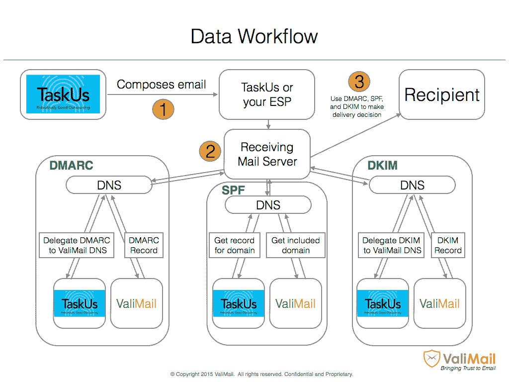

# ValiMail 为其电子邮件认证服务 融资 1200 万美元

> 原文：<https://web.archive.org/web/https://techcrunch.com/2016/11/02/valimail-raises-12m-series-a-round-for-its-email-authentication-service/>

# ValiMail 为其电子邮件认证服务融资 1200 万美元

[ValiMail](https://web.archive.org/web/20230225140830/https://www.crunchbase.com/organization/valimail#/entity) 借助 DMARC 标准和相关的开放协议，使验证收到的电子邮件变得更加容易，从而帮助企业保护他们的收件箱。其核心是，这使企业能够确保没有人能够使用自己的域名对其员工进行网络钓鱼攻击，并使企业能够更深入地了解其内部和外部电子邮件服务的使用情况。

该公司今天宣布，它已经筹集了 1200 万美元的 A 轮融资，由沙斯塔风险投资公司(Shasta Ventures)领投，随后还有 Flybridge Capital 和彭博贝塔公司(Bernstein Beta)的后续投资。这使得 ValiMail 迄今为止的资金总额达到 1350 万美元。

ValiMail 首席执行官 Alexander Garcia-Tobar 告诉我，该公司决定现在筹集资金(尽管它仍有大约 18 个月的银行跑道)，因为“这是向我们的技术平台添加新功能、教育市场有关电子邮件身份验证的正确时间，并满足新公司部署电子邮件身份验证的强劲需求。”因此，毫不奇怪，Garcia-Tobar 表示，该公司将利用这笔资金继续开发其技术平台，并为其新客户提供服务。此外，ValiMail 正在构建自己的 API，以努力成为一个生态系统。该公司目前拥有不到 20 名员工，但计划在未来 16 个月内将这一数字增加两倍。

[DMARC](https://web.archive.org/web/20230225140830/https://en.wikipedia.org/wiki/DMARC) (代表“基于域的消息认证、报告和一致性”)是电子邮件验证的标准协议。几乎每个主要的电子邮件服务现在都支持它，但 ValiMail 认为它仍然相对难以实现。该公司承诺通过一个简单的界面帮助用户自动化和管理电子邮件认证，让他们管理服务和监控威胁。

在一个复杂的鱼叉式网络钓鱼攻击不断增加的世界里(大多数攻击似乎来自内部或其他值得信任的领域)，帮助企业防范这种攻击的初创公司对风投来说是一笔有吸引力的投资。

ValiMail 告诉我，它在 2016 年初实现了盈利，称其目前的客户包括优步、Yelp、Twilio 和 Fenwick & West 等公司。该公司喜欢说，它“实现了全球 27 亿电子邮件收件箱的自动化电子邮件认证。”当然，这是一种夸张，意在使服务看起来比实际更大。今天，全球大约有 27 亿个收件箱，所以尽管这个大数字在新闻稿中看起来不错，但这仅仅意味着 ValiMail 确实使用了标准协议。ValiMail 告诉我，它现在每月认证 15 亿封电子邮件，并且有 24 个客户在生产。据说它已经保护这些客户免受 4000 万封钓鱼邮件的侵害。