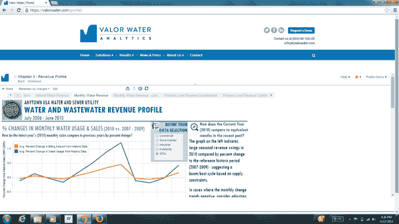

# Valor Water Analytics 帮助自来水公司在客户节约用水时保持运营 

> 原文：<https://web.archive.org/web/https://techcrunch.com/2014/09/08/valor-water-analytics-helps-water-utilities-stay-afloat-as-customers-conserve/>

随着越来越多的美国人意识到出于环境原因或由于干旱相关的用水限制而需要节约用水，供水公司发现自己难以保持财务健康，因为他们开始向客户出售更少的水。 [Valor Water Analytics](https://web.archive.org/web/20221207014946/https://valorwater.com/) 是一家进入这个基本上被忽视的领域的公司，目的是为公用事业公司提供软件，帮助他们更好地了解客户不断变化的用水模式将如何影响他们的底线，以及除了急于提高费率之外，他们还能做些什么。

该公司由克里斯汀·博伊尔创建，她拥有北卡罗来纳大学教堂山分校的水资源规划博士学位。她说，软件程序的想法实际上来自一个研究生院项目，她在那里开发了一套分析工具，以帮助那些在干旱期间客户节约能源而陷入财务困境的公用事业公司。

虽然她早在 2007 年就开始研究这些工具，但她花了一些时间才从大学获得技术许可。但现在 Valor 拥有该技术的全球独家可转让许可证，该软件目前正由北卡罗来纳州的四家公用事业公司使用，包括卡里、费耶特维尔、格林斯博罗和教堂山地区的公用事业公司。这些公用事业客户正在对该计划进行试点测试，但他们并不是第一个这样做的。

Boyle 解释说，Valor 正在与城市水财团合作，该财团指导哪些公用事业公司将在什么时间试验该计划。她指出，多年来，Valor 总共与 15 家公用事业公司合作过。

Boyle 于去年 11 月正式成立，现在正准备将 Valor Water Analytics 从更多的研究工作转变为软件即服务业务。

使用现在用更现代的编程语言重新编码的在线门户，公用事业公司可以登录并查看用水变化如何影响收入。各种各样的产品线帮助他们解决围绕保护和干旱的问题，允许企业更适当地增加收费。

例如，它可能针对那些浪费水资源的人提高利率，而不是全面提高利率，这实际上惩罚了那些适当节约水资源的人。

公用事业公司也可以用“水资源预算”这样的东西来制定价格，这些东西就像是客户用水的指南。例如，如果你超出了你的用水预算，你可能要付更多的钱。

Boyle 说，该软件不仅仅是将这些商业智能数据放入一个在线仪表板，而且还指导公用事业公司做出更好的财务决策。“我们运行分析，但我们也提供建议和见解…我们用建议分层，”她解释道。"公用事业公司非常渴望得到这些信息。"

Boyle 说，在她公司的软件出现之前，大多数公用事业公司都没有可以进行这种数字运算的程序。相反，他们有时会让数据分析师创建花哨的 Excel 电子表格，或者每隔几年就聘请外部顾问。“听起来很奇怪，他们没有关注这些东西……但他们真的没有。这就是我们感到兴奋的原因，”她说。

Valor Water Analytics 现在位于湾区，刚刚获得了第一个加州公用事业客户，并正在努力向该州和美国的其他客户销售

该公司在第一年以每个客户大约 38 美分的速度产生收入(这往往涉及与后端系统的集成工作)，然后每个客户 18 美分。

在 Disrupt，Valor 为公用事业公司推出了“干旱对话工具包”，这是一款专门用于帮助公用事业经理衡量干旱相关保护的收入影响的产品。同样在 Disrupt，Valor 宣布了与 ESRI 的合作伙伴关系，以及与索诺玛县(CA)水务公司的协议。

这家初创公司有少量天使投资，正寻求再融资 50 万美元，以便更快扩大规模。

[gallery ids="1053556，1053557，1053558，1053559，1053560，1053561"]

**评委 Q & A**

*本轮评委包括:Cyan Banister，Partner，Banister CapitalCyril Ebersweiler，HAXLR8R 加速器创始人；莱恩·斯威尼，Accel Partners 合伙人；BoxGroup 管理合伙人 David Tisch 问& A 为了简洁而转述。* 
CB:销售周期多长？我们在六月上市，第一次销售很快。我们有 10-15 个在管道中，我们不知道关闭它们需要多长时间。我知道这是政府的事，所以可能会很慢。我估计是 6 个月。

CE:市场规模？有多少公用设施，你向他们收取什么样的费用？将他们的所有数据输入你的软件会有问题吗？

答:美国有超过 5 万家水务公司。但是我们追求的是大中型公用事业公司。
提取数据–我们与公用事业 it 部门密切合作，从计费系统中提取数据。到目前为止，这是有效的。为了扩大规模，在与第三方合作方面，我们还有其他一些选择。

CE:有没有一个公用事业公司不与你合作的理由？答:[一些]不知道为什么他们需要改变他们多年来做事的方式。我们需要推动他们采用新的解决方案，因为昨天的解决方案今天已经行不通了。我们首先与一个“自愿者联盟”合作，然后在我们建立了声誉之后，我们将进行更艰苦的战斗。

DT:公共事业获得了什么好处？
答:我们帮助发现隐性收入。我们能够确定成本和效率。公用事业公司关心的是支付能力和社区问题，我们也在这方面提供帮助。