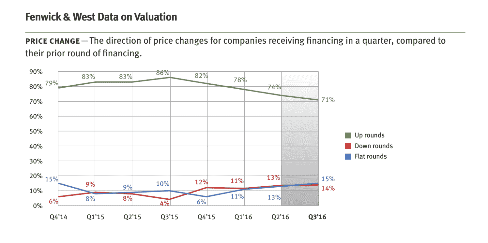

# 估值指标显示连续第四个季度疲软 

> 原文：<https://web.archive.org/web/https://techcrunch.com/2016/11/14/valuation-metrics-show-weakening-for-the-fourth-straight-quarter/>

# 估值指标显示连续第四个季度走弱

上周五，芬威克&韦斯特律师事务所悄悄发布了第三季度风险投资调查，其结果并不令人震惊。与此同时，它们也暗示了一些初创公司将面临的问题。

这项调查分析了第三季度筹集资金的 149 家湾区公司的估值和融资条款，显示 71%的融资是“向上”轮，这意味着公司的每股价格比上一轮有所上升。另外 14%是下跌轮，意味着相反的情况发生，15%是“持平”，所以公司的估值没有变化，尽管他们筹集了更多的资金。

这一情况与今年第二季度几乎完全相同，当时 74%的融资额上升，13%持平，但第三季度标志着风险投资估值指标连续第四个季度下降，这使得该调查的作者巴里·克莱默律师密切关注事态的发展。

“事情并没有急剧下降，”他周五在电话中告诉我们。“基本上，我们在 2014 年和 2015 年接近历史高点，估值现在处于 12 年平均水平，所以你可以说我们正健康地回归均值。”

克雷默更担心的是，交易数量在过去四个季度也有所下降。例如，在第二季度，芬威克能够为硅谷公司分析 195 笔融资——比第三季度多 30%。

这可能意味着只有更强大的公司才能获得融资。与此同时，它确实提出了一个问题，即所有在 2014 年和 2015 年筹集到资金但没有再次筹集资金的创业公司会发生什么情况。“它们是不是开始冒烟了，而我们再过四分之一左右就能看到更具戏剧性的东西了？”克莱默问道。"如果交易量没有下降，我会感觉更好。"

你可以点击查看整个[调查。](https://web.archive.org/web/20221203155926/https://www.fenwick.com/publications/pages/silicon-valley-venture-capital-survey-third-quarter-2016.aspx)

