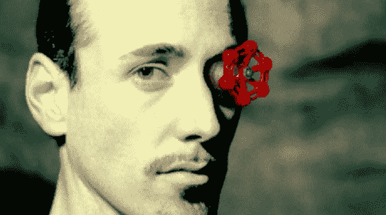

# Valve 宣布推出第二代产品，免费上市科技危机

> 原文：<https://web.archive.org/web/https://techcrunch.com/2015/03/03/valve-announces-source-2-and-itll-be-free/>

对游戏开发者来说，这是个好的一周。虚幻引擎 4 免费。Unity 5 上市后，它曾经的高端功能有很大一部分都免费了。

现在:Valve 刚刚发布了他们的下一代 Source 游戏引擎 Source 2……果然，它“对内容开发者是免费的”。

作为《半条命 2》、《团队堡垒》、《反攻:Go》、《Left 4 Dead》和《传送门 2》等游戏的引擎，Valve 最出名的原始引擎*是用于 Valve 游戏的*。虽然为数不多的第三方游戏(比如斯坦利·皮佩尔、加里的 Mod、泰坦法尔等)都是开源的，但它们从来都不是开源的谋生手段。*

 *也许有了这个消息，这种情况就会改变。

** 2004 年建成。2004 年！*

现在，需要注意的是:我们对 Source 2 还不是很了解。地狱，我们甚至不知道“自由”的确切定义。

到目前为止，Valve 就此事所做的只是说 Source 2 将“免费提供给内容开发者”。

这是 100%免费吗？还是说他们要向 la 虚幻公司(3000 美元后每 1 美元收费 5%)收取版税？究竟什么是“内容开发者”——仅仅是独立开发者，还是他们把它送给任何人或所有人？

可以说这是一个视频游戏引擎授权的黄金时代。就在不久之前，也就是 5 年前，一家大型品牌引擎(包括 Source)的授权涉及到艰难的谈判、NDAs 和少量现金。然后 Unity 出现了，改变了游戏规则。

现在你只要找到发动机与最令人满意的条款，并开始破解了。*