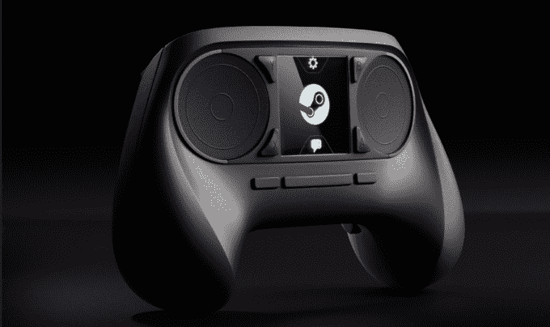

# Valve 宣布推出 Steam Link，这是一款售价 49 美元的设备，可以将电脑游戏流式传输到你家中的任何一个房间

> 原文：<https://web.archive.org/web/https://techcrunch.com/2015/03/03/valve-announces-steam-link-a-49-gadget-for-streaming-pc-games-to-any-room-in-your-house/>

# Valve 宣布推出 Steam Link，这是一款售价 49 美元的设备，可以将电脑游戏传输到你家中的任何一个房间

[Valve](https://web.archive.org/web/20221007135120/http://www.valvesoftware.com/) 继续进军硬件领域，该公司宣布计划在今年晚些时候发布一款新设备，让 Steam 用户可以将游戏从个人电脑传输到家中的任何房间。

Valve 表示，这款名为 Steam Link 的新设备将于 11 月上市，售价为 49 美元。这使得它的价格只有 Razer Forge TV T1 的一半，后者是另一款用于播放高端电脑游戏的迷你机顶盒。这款盒子将适用于 Windows、Mac、Linux 以及即将推出的 Steam Machines，这是一系列类似控制台的个人电脑，去年的[外星人阿尔法](https://web.archive.org/web/20221007135120/https://beta.techcrunch.com/2014/12/12/alienware-alpha-review-a-gaming-pc-in-a-tiny-package/)以及其他基于 Windows 的微型游戏个人电脑，当时 Valve 还没有准备好与 Steam OS 配套。该设备似乎打算放在客厅里，在 60 赫兹时最大输出功率为 1080p。

在[发布 HTC Vive](https://web.archive.org/web/20221007135120/https://beta.techcrunch.com/2015/03/01/htc-vive/) 之后，这是一款虚拟现实耳机，基于过去几年半私下进行的研究 Valve。在似乎永远没有关于 Valve 硬件的消息(包括其新颖的[控制器](https://web.archive.org/web/20221007135120/http://store.steampowered.com/livingroom/SteamController/)，Valve 宣布也将在 11 月发布)之后，Valve 正在展示它正在采取多方面的硬件方法。它致力于为那些已经拥有自己的电脑的铁杆游戏玩家，以及那些希望电脑提供广泛的选择和图形保真度，但更喜欢方便的控制台外形的人提供价值。