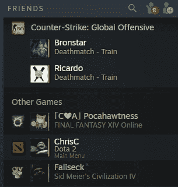

# Valve 着眼于 Steam Chat TechCrunch 的更新

> 原文：<https://web.archive.org/web/https://techcrunch.com/2018/06/12/valve-sets-sights-on-discord-with-updates-to-steam-chat/>

# Valve 着眼于 Steam Chat 的更新不和谐

不和谐已经成为游戏玩家中最常见的游戏相关交流方式。原因显而易见:它运行良好，竞争相当激烈。但 Valve 希望通过对其游戏平台 Steam 上的聊天选项进行[改革来留住用户。](https://web.archive.org/web/20221025222436/https://steamcommunity.com/updates/chatupdate)

这是一个受欢迎的变化，也是 Steam 用户一直要求的变化之一——这个平台虽然在很多方面很方便，但在其他方面却令人难以置信地过时了。朋友和通信选项也可以是 ICQ，我们不要从浏览器开始。

今天的新闻表明，Valve 没有听不到游戏玩家的呼声。改版后的聊天非常不和谐，文本和语音频道分开列出，游戏中的细节，如地图和游戏类型，列在朋友旁边，还有一个有用的快速列表，供您的游戏伙伴使用。还有一个强大的网络客户端。

语音和文本聊天都是加密的，并通过 Steam 的服务器传递，这可以防止 NSA 竞争对手在 PUBG 游戏期间监控你的球队战术，防止 griefers 跟踪你的 IP 并订购一百个披萨送到你的门口(或者更糟)。

像 Steam 这样的平台早就应该出现了，但更重要的是，它让他们可以控制不和。毕竟，后者可以想象自己成长为一个游戏商店或促销页面，以补贴其免费服务——这将是踩在 Valve 的地盘上。不可原谅。

也就是说，Steam 想要抢走 Discord 的用户已经为时太晚了——它已经被太多的社区采用，而且转换的好处并不明显。但是对于那些还没有安装 Discord 的人来说，Steam 中强大的聊天和语音客户端的存在是一个强大的威慑。

它目前处于测试阶段，但你可以在这里(网页)请求访问，在这里(蒸汽)请求访问[。没有消息表明他们是否正在基于顶部图片中那些摇摆不定的小蛋人开发一整套聊天图标系统。(拜托。)](https://web.archive.org/web/20221025222436/steam://clientbeta/publicbeta)