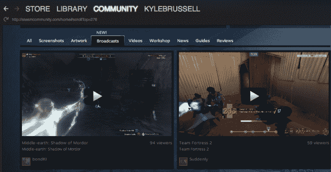

# Valve 与 Steam Broadcasting 展开较量 

> 原文：<https://web.archive.org/web/https://techcrunch.com/2014/12/02/valve-takes-on-twitch-with-steam-broadcasting/>

# 阀门随着蒸汽传播而抽动

已经竞争激烈的在线游戏流媒体领域又有了新的竞争者。游戏开发商、发行商和零售商 [Valve](https://web.archive.org/web/20221209053632/http://www.valvesoftware.com/) 刚刚发布了 [Steam Broadcasting](https://web.archive.org/web/20221209053632/https://steamcommunity.com/updates/broadcasting) 的测试版，这是一款在该公司广受欢迎的游戏商店和社区中心内观看你的朋友玩游戏的工具。

Steam 早就提供了查看你的朋友何时在电脑上玩游戏的功能。随着今天的发布，你将能够点击这些状态更新，直接观看你的朋友在[魔多阴影](https://web.archive.org/web/20221209053632/https://www.shadowofmordor.com/)中猎杀兽人或在 [DayZ](https://web.archive.org/web/20221209053632/http://dayzmod.com/) 中破坏陌生人的一天的直播。

如果你不想让每个人都看你玩，有隐私设置，从让所有朋友随时观看到只允许你请求的朋友(比如，如果你需要击败一个级别的指针)。此外，社区中心有一个新标签，可以观看人们玩流行游戏。这项功能仍然非常新，但已经有数百个活跃的流。

虽然亚马逊购买者、T2、Twitch 和 YouTube 是游戏流媒体领域的主导者，但 Valve 的市场前景却因其事实上是 PC 上的游戏市场而得到了支撑。Steam 广播只是 Steam 体验中的一个新选项，无需注册新账户或下载第三方应用。

早在 8 月份，我就写过[亚马逊的零售优势与 Twitch 的功能和受众](https://web.archive.org/web/20221209053632/https://beta.techcrunch.com/2014/08/25/amazons-twitch-acquisition-is-too-big-to-fail/)相契合的方式。这些观点中的许多也适用于 Valve 和 Steam 尽管与亚马逊不同，Valve 的游戏对于铁杆游戏玩家来说是真正的杀手级应用。