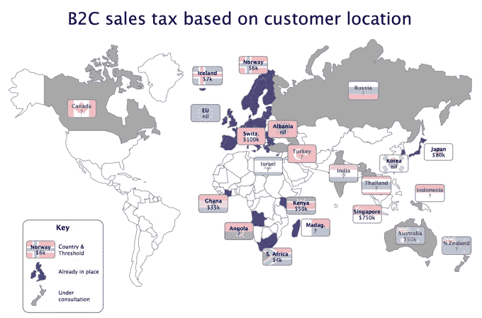

# #VATMESS 即将变得更加混乱 

> 原文：<https://web.archive.org/web/https://techcrunch.com/2015/10/10/vatmess-is-about-to-get-much-messier/>

雨果·格里姆斯顿撰稿人

雨果·格里姆斯顿是

[Paddle.com](https://web.archive.org/web/20221208032925/http://paddle.com/)

，一家总部位于伦敦的初创公司，为开发者提供结账服务和营销工具。

独立开发者对最近 B2C 销售的供应地规则的变化理所当然地感到愤怒 Twitter wags 巧妙地创造了#VATMESS。

这些规则是善意的——苹果、谷歌和亚马逊可以在卢森堡开店，从而利用税收制度，使欧盟竞争对手处于不利地位，这是不对的。然而，实施工作进展缓慢——特别是缺乏最低门槛，这意味着印度的合规负担不成比例([现在可能实施门槛，](https://web.archive.org/web/20221208032925/http://www.theguardian.com/small-business-network/2015/sep/14/eu-propose-vat-exemption-small-businesses-protests)但可能需要数年)。

我听到你说，这是旧闻，已经被 [TechCrunch、](https://web.archive.org/web/20221208032925/https://beta.techcrunch.com/2014/11/25/eus-new-vatmoss-rules-could-create-a-vatmess-for-startups/?ncid=rss&utm_source=feedburner&utm_medium=feed&utm_campaign=Feed%3A+Techcrunch+%28TechCrunch%29)和其他媒体报道过了。你可能是对的，因为欧盟的规则已经从 1 月 1 日开始实施，企业将在 10 月 20 日进行第三次增值税 MOSS 申报。

然而，增值税最低标准的“成功”推出导致其他国家按照与欧盟计划相同的路线制定计划。那只金鹅太诱人了。

欧洲花了十年的大部分时间来设计和实施 VAT MOSS，在此过程中，28 个成员国之间发生了许多自相残杀的争吵(因此无法就最低门槛达成一致，据说这是英国和其他国家推动的)。

对于他们的国际同行来说，不会有这样的延迟，因为欧盟已经铺平了道路；不需要国际谈判，各国都热衷于保护本国的科技领军企业，并征收更多税收。

因此，对于那些希望合法销售其数字服务的人来说，这意味着更多的合规性、更多的回报和增量成本(因为许多司法管辖区要求你让当地会计师提交你的回报并处理任何调查)。

因此，这里有一个欧盟增值税莫斯相似的总结；正如你将看到的，他们中的许多人没有门槛或者门槛低得可怜——再一次打击了印度。首先是已经推出的产品:

| **国家** | **税收出台** | **大约阈值(美元)** | 需要本地会计师吗？ |
| 瑞士 | 不久之前 | 10 万美元 | 是 |
| 新加坡 | 不久之前 | 75 万美元 | 是 |
| 加纳 | 不久之前 | 35000 美元 | 是 |
| 马达加斯加 | 不久之前 | ? | 是 |
| 挪威 | 2011 年 7 月 | 6000 美元 | 不 |
| 冰岛 | 2011 年 11 月 | 7000 美元 | 是 |
| 肯尼亚 | 2013 年 9 月 | 5 万美元 | 是 |
| 南非 | 2014 年 6 月 | 4k 美元 | 是 |
| 安哥拉 | 2014 年 11 月 | ? | 是 |
| 阿尔巴尼亚 | 2015 年 1 月 | 无 | 是 |
| 韩国 | 2015 年 7 月 | 无 | 是 |
| 日本 | 2015 年十月 | 8 万美元 | 是 |

正在筹备中:

| **国家** | **上市日期** | **大约阈值(美元)** | 需要本地会计师吗？ |
| 瑞士 | 2017 年 1 月 | 一家公司的全球销售额为 10 万美元 | 是 |
| 澳大利亚 | 2017 年 7 月 | 5 万美元 | ? |

加拿大、印度、印度尼西亚、以色列、新西兰、俄罗斯、泰国和土耳其也在协商类似的税收。这个名单还会继续增长。

过去，科技企业的最大好处是，向全球受众销售你的应用、游戏、电子书或 mp3 没有物理障碍。遗憾的是，国际税收制度正密谋扼杀这一点。